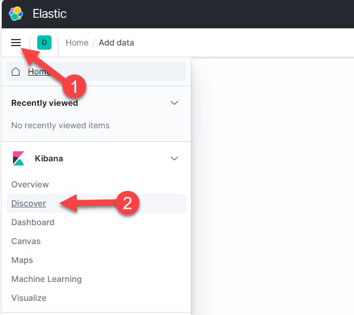
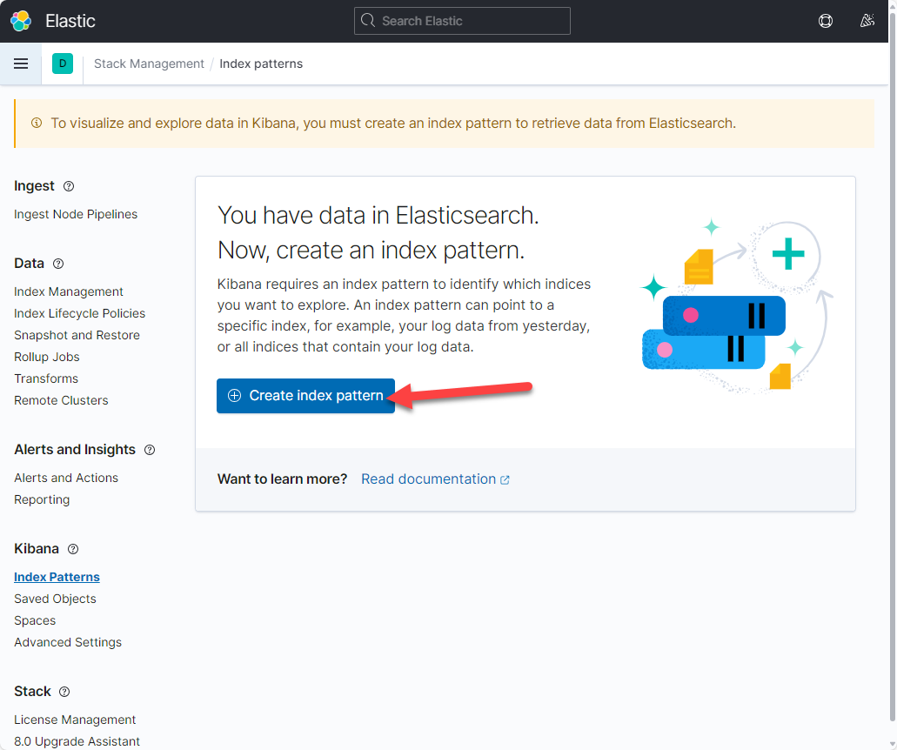
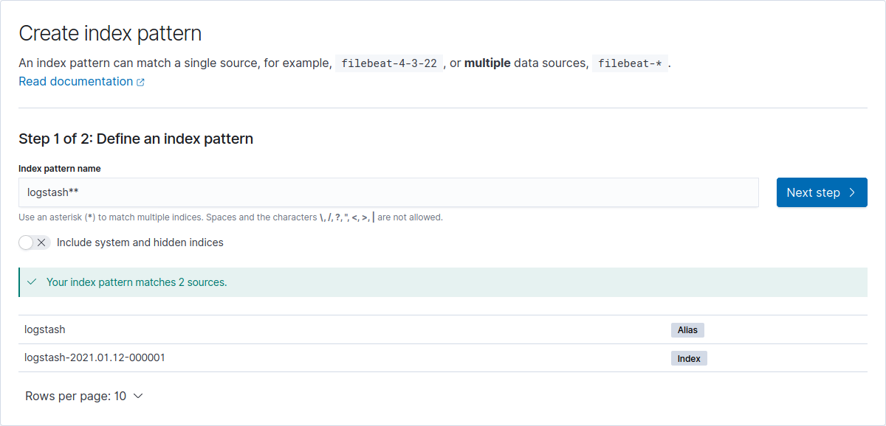
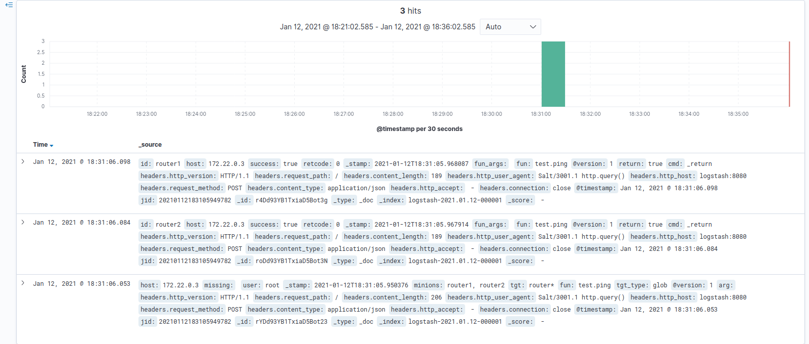

# LAB: The Salt Event Bus

As in the previous labs, for simplicity, all the Proxy Minions are started up and running.

In addition to this, in the environment, there's an instance of Elasticsearch, Logstash and Kibana (the ELK stack) running and available (the installation and setup are beyond the scope, but can be followed at [https://www.elastic.co/guide/en/elastic-stack/current/installing-elastic-stack.html](https://www.elastic.co/guide/en/elastic-stack/current/installing-elastic-stack.html))

The ELK stack will be used in the _Part-2_ section of the lab.

Elasticsearch is a distributed, open source search and analytics engine for all types of data, including textual, numerical, geospatial, structured, and unstructured. 

Logstash is an open source data collection engine with real-time pipelining capabilities. Logstash can dynamically unify data from disparate sources and normalize the data into destinations of your choice.

Kibana is an open source frontend application that sits on top of the Elastic Stack, providing search and data visualization capabilities for data indexed in Elasticsearch.

## Part-1: Exploring the Salt Event Bus

For this part, we will need to open two (2) separate terminal windows: in one window we will be executing command, in the other one we will be watching the Salt event bus.

In the terminal where we will be watching the Salt event bus, execute:

```bash
salt-run state.event pretty=True
```

The command doesn't return the prompt, so don't stop it!

In the second (2nd) terminal window, execute:

```bash
salt router1 test.ping
```

<pre>
root@salt:~# salt router1 test.ping
router1:
    True
</pre>

On the Salt bus, you should see a sequence of events similar to:

<pre>
20210112141459301829	{
    "_stamp": "2021-01-12T14:14:59.302089",
    "minions": [
        "router1"
    ]
}
salt/job/20210112141459301829/new	{
    "_stamp": "2021-01-12T14:14:59.302489",
    "arg": [],
    "fun": "test.ping",
    "jid": "20210112141459301829",
    "minions": [
        "router1"
    ],
    "missing": [],
    "tgt": "router1",
    "tgt_type": "glob",
    "user": "root"
}
salt/job/20210112141459301829/ret/router1	{
    "_stamp": "2021-01-12T14:14:59.321044",
    "cmd": "_return",
    "fun": "test.ping",
    "fun_args": [],
    "id": "router1",
    "jid": "20210112141459301829",
    "retcode": 0,
    "return": true,
    "success": true
}
</pre>

What do they represent? Repeat the exercise, running various commands and targets:

- `salt core* net.lldp`
- `salt -G role:leaf ntp.stats`
- `salt -I proxy:driver:junos route.show 0.0.0.0/0`
- `salt spine* state.apply hostname test=True`

## Part-2: Salt Engines

The Salt event bus is a pluggable component, which works bi-directional: we can both export the events and import external events on the Salt bus. This is done using the Engines subsystem. A Salt Engine is typically enabled on the Master side, which runs in the background continuously doing a specific task to either import or export events, or even transform an existing event and re-inject it.

There are several Engine module available: https://docs.saltstack.com/en/master/ref/engines/all/index.html. Examples include:

- [`slack`](https://docs.saltstack.com/en/master/ref/engines/all/salt.engines.slack.html#module-salt.engines.slack): An Engine that reads messages from Slack and can act on them. Interesting use case: execute Salt commands directly from Slack ("chat automation").
- [`webhook`](https://docs.saltstack.com/en/master/ref/engines/all/salt.engines.webhook.html#module-salt.engines.webhook): Send events from webhook API.
- [`logstash`](https://docs.saltstack.com/en/master/ref/engines/all/salt.engines.logstash_engine.html#module-salt.engines.logstash_engine): An engine that reads messages from the salt event bus and pushes them onto a logstash endpoint.
- [`script`](https://docs.saltstack.com/en/master/ref/engines/all/salt.engines.script.html#module-salt.engines.script): Send events based on an arbitrary script's stdout.

The configuration of the Engines is simple, and they can be both enabled on the Master or Minion side - depending on the use case:

<pre>
engines:
  - &lt;engine name&gt;:
      &lt;engine arguments&gt;
</pre>

In this lab we will be looking into the [`http_logstash`](https://docs.saltstack.com/en/master/ref/engines/all/salt.engines.http_logstash.html#module-salt.engines.http_logstash) Engine which is used to send the events to a Logstash endpoint, via HTTP requests. This is an excellent way to monitor the Salt activity (i.e., who executed what command and when), while it's very easy to enable it.

The Engine is easy to enable, on the Master:

```bash
grep -in engines -A 7 /etc/salt/master
```

<pre>
engines:
  - http_logstash:
      url: http://logstash:8080
      tags:
        - salt/job/*/new
        - salt/job/*/ret/*
      funs:
        - test.ping
</pre>

This simple configuration enables the `http_logstash` Engine to send the Salt events to `http://logstash:8080` (via POST requests), where Logstash is listening. But there's a lot of activity on the Salt bus - we could, of course, forward everything, but it's probably a better idea to filter out and send _only_ what's important for us to monitor. For this reasoning, we can chose to send only events whose tag match the expressions from the `tags`, and the function from `funs`. With these particular settings, we would therefore send to Kibana the execution details of any new job as well as returns invoking the `test.ping` Salt function.

In a new terminal window, execute:

```bash
salt router* test.ping
```

<pre>
root@salt:~# salt router* test.ping
router2:
    True
router1:
    True
</pre>

On the event bus, just like previously, you will notice the sequence of events:

<pre>
salt/job/20210112183105949782/new	{
    "_stamp": "2021-01-12T18:31:05.950376",
    "arg": [],
    "fun": "test.ping",
    "jid": "20210112183105949782",
    "minions": [
        "router1",
        "router2"
    ],
    "missing": [],
    "tgt": "router*",
    "tgt_type": "glob",
    "user": "root"
}
salt/job/20210112183105949782/ret/router2	{
    "_stamp": "2021-01-12T18:31:05.967914",
    "cmd": "_return",
    "fun": "test.ping",
    "fun_args": [],
    "id": "router2",
    "jid": "20210112183105949782",
    "retcode": 0,
    "return": true,
    "success": true
}
salt/job/20210112183105949782/ret/router1	{
    "_stamp": "2021-01-12T18:31:05.968087",
    "cmd": "_return",
    "fun": "test.ping",
    "fun_args": [],
    "id": "router1",
    "jid": "20210112183105949782",
    "retcode": 0,
    "return": true,
    "success": true
}
</pre>

`salt/job/20210112182537674816/new` is the new job event, while `salt/job/20210112182537674816/ret/router2` and `salt/job/20210112182537674816/ret/router1` are the return events, all part of the Job ID (JID) `20210112182537674816`.

So nothing has changed from this perspective. But behind the scenes, the `http_logstash` Engine, has also sent these events to Logstash. We can visualise this using Kibana, also part of the ELK stack. For this, we need to open a web browser and go to: **http://group00.labs.apnictraining.net:5601** (replace `group00` with the group you have been assigned).

Why look into Kibana when we are sending the messages to Logstash? Logstash only receives the logs then sends them to Elasticsearch to be indexed. The logs can then be visualised using Kibana.

On the front page, you will see the following:


As it hasn't been setup initially, we will be redirected to a _Getting started with Kibana_ page. Click on the large _Add your data_ blue button at the bottom. On the next page click on the menu icon in the top left hand corner and then click on **discover**.



Here, we will need to create a new search index, where we will be able to find our Salt logs. So let's proceed with _Create index pattern_.



At _Step 1_, _Define an index pattern_, insert `logstash*` and click _Next step_. 



At _Step 2_, _Configure settings_, from the drop-down, select `@timestamp` from the _Time field_ and click on the _Create index pattern_ button. 

Now, we have created a new Kibana index, so we can start visualising the Salt logs: go to the main page, then select on _Discover_. Here, we can see that there are three logs:




These three entries are nothing else than the three events above (one for the job creation, and another two - one for each reply from the matched devices).

If we look at the 3rd document (from top to the bottom), we can see the following details: `user: root`, `minions: router1, router2`, `tgt: router*`, `fun: test.ping`, `tgt_type: glob`. These are the event details of the job execution. 

You can click on the document to visualise it in more detail, or in JSON format.

Using this simple pattern and configuration, we can leverage advanced monitoring for our Salt environment. It is a great way to gather insights and have a deep understanding how your users use Salt.

As a free bonus, this is equally a very important security gain, as you will be able to track down exactly who has deploy a specific configuration change in your network, and when.

## Part-3: Salt Beacons

Salt Beacons are a sub-set of the Salt Engines, with one goal only: _import_ external events onto the Salt bus. In other words, Beacons help you monitor processes outside of Salt; importing those external events onto the Salt bus allows you to implement complex workflows for various entities that aren't necessarily managed by Salt. Using Beacons, you can monitor, for example: file system changes, system load, service status, network usage, shell activity, etc.

There are many Beacon modules natively available in Salt. One particularly interesting module is the NAPALM Beacon, which executes arbitrary Salt functions and compares the result with specific values, then injects events on the Salt bus. For example, let's have a look at the `ntp.stats` function:

```bash
salt spine1 ntp.stats
```

<pre>
root@salt:~# salt spine1 ntp.stats
spine1:
    ----------
    comment:
    out:
    result:
        True
</pre>

It currently returns empty, as there are not NTP associations configured. So let's configure an NTP server:

```bash
salt spine1 net.load_config text='ntp server 10.0.0.1'
```

<pre>
root@salt:~# salt spine1 net.load_config text='ntp server 10.0.0.1'
spine1:
    ----------
    already_configured:
        False
    comment:
    diff:
        @@ -8,6 +8,8 @@
         logging format hostname fqdn
         !
         hostname spine1
        +!
        +ntp server 10.0.0.1
         !
         spanning-tree mode mstp
         !
    loaded_config:
    result:
        True
</pre>

Now, running `ntp.stats`, it will report:

```bash
salt spine1 ntp.stats
```

<pre>
root@salt:~# salt spine1 ntp.stats
spine1:
    ----------
    comment:
    out:
        |_
          ----------
          delay:
              0.0
          hostpoll:
              1024
          jitter:
              0.0
          offset:
              0.0
          reachability:
              1
          referenceid:
              .INIT.
          remote:
              10.0.0.1
          stratum:
              16
          synchronized:
              False
          type:
              u
          when:
              -475439048
    result:
        True
</pre>

Notice that the `synchronized` is `False` (and `stratum` is 16), as the `10.0.0.1` NTP server is unreachable.

Using the NAPALM Beacon, we are able to have the `ntp.stats` function executed with a specific frequency, and if there's at least one peer unsynchronized, it will fire an event on the Salt bus.

The configuration (on the Minion side becomes):

```bash
grep beacons -A 5 /etc/salt/proxy
```

<pre>
beacons:
  napalm:
    - ntp.stats:
        synchronized: false
      interval: 60
</pre>

This configuration will ensure that the NAPALM Beacon is executed every 60 seconds (due to the value provided in `interval`), and it executes the `ntp.stats` function, to which it checks whether there's an unsynchronized association.

Looking at the Salt event bus, we can notice the following event:

<pre>
salt/beacon/spine1/napalm/eos/ntp.stats	{
    "_stamp": "2021-01-13T12:18:03.003368",
    "args": [],
    "data": {
        "comment": "",
        "out": [
            {
                "delay": 0.0,
                "hostpoll": 1024,
                "jitter": 0.0,
                "offset": 0.0,
                "reachability": 1,
                "referenceid": ".INIT.",
                "remote": "10.0.0.1",
                "stratum": 16,
                "synchronized": false,
                "type": "u",
                "when": "-475438209"
            }
        ],
        "result": true
    },
    "fun": "ntp.stats",
    "id": "spine1",
    "kwargs": {},
    "match": {
        "synchronized": false
    }
}
</pre>

This confirms that the Beacon is working, and we are able to be notified when the association with a specific server is lost. The event tags includes the device name, as well as the platform name and the function executed. In the event data, we notice the output from the `ntp.stats` function, and an additional field called _match_ which tells us what has triggered the event to be fired.

In a similar way, we are able to instruct the NAPALM Beacon to invoke other functions and fire events, for example, execute `net.interfaces` and send an event when one or more interfaces are down:

Compare the current **/etc/salt/proxy** file with the napalm section below.

```bash
cat /etc/salt/proxy*
```

<pre>
beacons:
  napalm:
    - ntp.stats:
        synchronized: false
    - net.interfaces:
        '*':
          is_up: false
      interval: 60
</pre>

Using this pattern, we are able to extend this functionality to endless use-cases.

---
**End of Lab**

---
