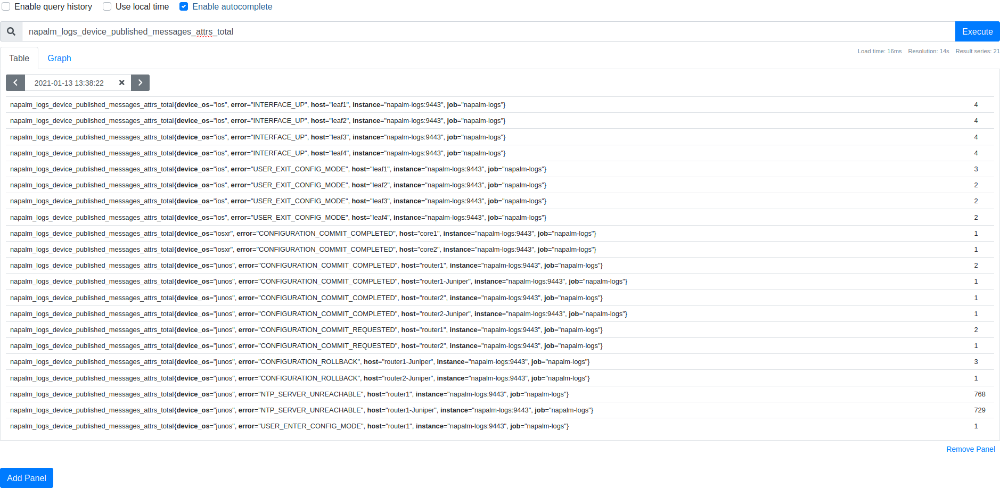
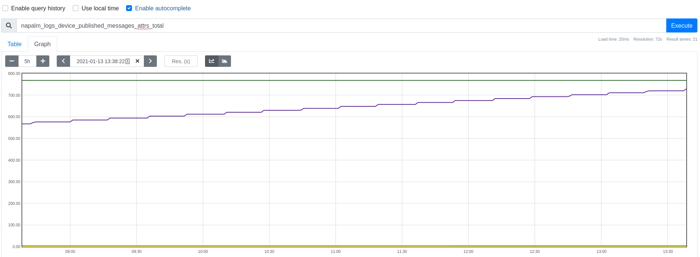
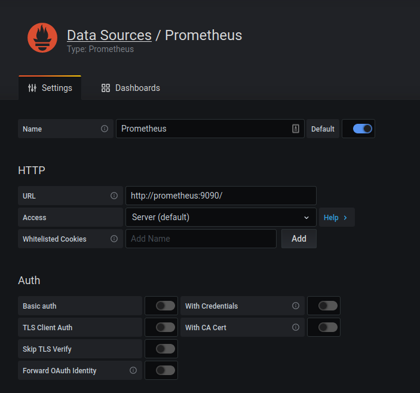
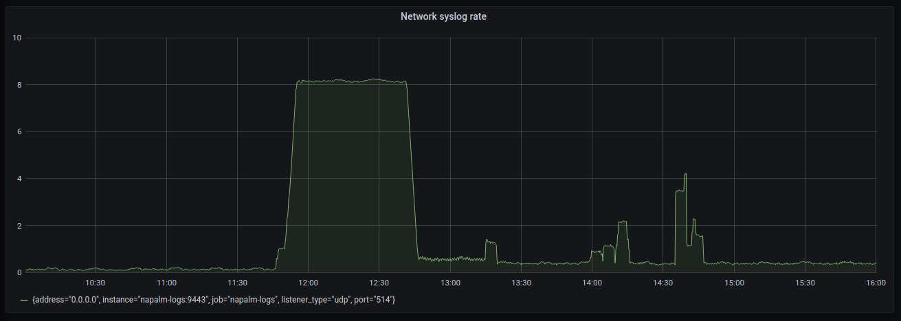
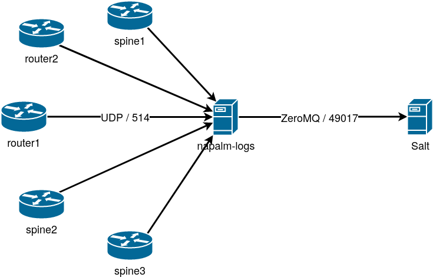

# LAB: Using napalm-logs to analyse network events

As in the previous labs, for simplicity, all the Proxy Minions are started up and running. Similarly, `napalm-logs` is already installed.

In addition to this, in the environment there's an instance of Prometheus and Grafana running, which will be used in the last section of the lab. 

Prometheus is an open-source systems monitoring and alerting. In simple words, Prometheus simply scrapes a data source (typically an HTTP endpoint) where there are metrics defined. It stores all scraped samples locally and runs rules over this data to either aggregate and record new time series from existing data or generate alerts. Grafana or other API consumers can be used to visualize the collected data.

Both Prometheus and Grafana are already installed and available for this lab, however the installation notes can be followed at [https://prometheus.io/docs/prometheus/latest/installation/](https://prometheus.io/docs/prometheus/latest/installation/) and [https://grafana.com/docs/grafana/latest/installation/](https://grafana.com/docs/grafana/latest/installation/), respectively.

## Part-1: Setting up napalm-logs to parse network syslog

`napalm-logs` can be started by simply executing `napalm-logs` from the shell, followed by a number of optional arguments. The easiest way is providing the options into the configuration file, by default located at **/etc/napalm/logs**:

```bash
cat /etc/napalm/logs
```

<pre>
log_file: cli
log_level: debug

disable_security: true

hwm: 0
device_worker_processes: 5
device_whitelist:
  - eos
  - ios
  - iosxr
  - junos

metrics_port: 9443
metrics_enabled: true
metrics_include_attributes: true

listener:
  - udp:
      port: 514
      reuse_port: true
      buffer_size: 6400

publisher:
  - prometheus: {}
  - zmq:
      port: 49117
      serializer: msgpack
</pre>

These settings would ensure `napalm-logs` will be running in debug mode, while printing the logs on the CLI directly. As this is not a production environment, the security is disabled (but this is highly discouraged in production). The security option ensures that the messages published by napalm-logs are sent over an encrypted channel. The `hwm` option ensures that napalm-logs is capable to handle unlimited number of syslog messages (no loss). Prometheus metrics export is enabled and published over port 9443. And, finally, napalm-logs is listening over the standard UDP port 514, then publishing the data to Prometheus, as well as ZeroMQ on port 49017 - where other clients can connect to and consume the structured data.

Let's start napalm-logs by running:

```bash
napalm-logs -c /etc/napalm/logs
```

As it's running in debug mode, it is quite verbose, but this is very useful when setting it up for the very first time. 

The command doesn't return the prompt, as it's meant to run as a daemon, so **don't** terminate (Ctr-C) or close the terminal. Leave this terminal like this, as we will get back to it in a bit, to watch napalm-logs starting to receive the messages.

In a new terminal window, execute:

```bash
salt router1 net.cli 'show configuration system syslog'
```

<pre>
root@salt:~# salt router1 net.cli 'show configuration system syslog'
router1:
    ----------
    comment:
    out:
        ----------
        show configuration system syslog:
            user * {
                any emergency;
            }
            host 172.22.0.4 {
                any any;
                port 514;
                source-address 10.0.0.15;
            }
            file messages {
                any notice;
                authorization info;
            }
            file interactive-commands {
                interactive-commands any;
            }
    result:
        True
</pre>

This shows that `router` sends the syslog messages to the `172.22.0.4` server. This is where a napalm-logs instance was already running (before starting the lab). The instance we manually started above is found at `172.22.0.3`, so let's configure that, so `router1` starts sending the messages there:

```bash
salt router1 net.load_config text='set system syslog host 172.22.0.3 port 514 source-address 10.0.0.15 any any'
```

<pre>
root@salt:~# salt router1 net.load_config text='set system syslog host 172.22.0.3 port 514 source-address 10.0.0.15 any any'
router1:
    ----------
    already_configured:
        False
    comment:
    diff:
        [edit system syslog]
             host 172.22.0.4 { ... }
        +    host 172.22.0.3 {
        +        any any;
        +        port 514;
        +        source-address 10.0.0.15;
        +    }
    loaded_config:
    result:
        True
</pre>

Immediately after committing this config, we can switch to the terminal where napalm-logs is running, and we can notice some activity already:

<pre>
2021-01-13 13:59:33,476,476 [napalm_logs.listener.udp][DEBUG   ] [b"<190>Jan 13 13:59:29 router1 mgd[33918]: UI_COMMIT_PROGRESS: Commit operation in progress: signaling 'Event processing process', pid 4598, signal 1, status 0 with notification errors enabled"] Received ('172.22.1.1', 60764) from 1610546373.4763005
2021-01-13 13:59:33,476,477 [napalm_logs.listener_proc][DEBUG   ] Received b"<190>Jan 13 13:59:29 router1 mgd[33918]: UI_COMMIT_PROGRESS: Commit operation in progress: signaling 'Event processing process', pid 4598, signal 1, status 0 with notification errors enabled" from 172.22.1.1. Queueing to the server.
2021-01-13 13:59:33,477,478 [napalm_logs.server][DEBUG   ] [172.22.1.1] Dequeued message from <190>Jan 13 13:59:29 router1 mgd[33918]: UI_COMMIT_PROGRESS: Commit operation in progress: signaling 'Event processing process', pid 4598, signal 1, status 0 with notification errors enabled: 1610546373.477554
</pre>

This is nothing else than the very message prompting us that there was a commit on `router1`. This is what we wanted to see.

While very helpful to ensure that napalm-logs correctly receives the syslog messages, the debug mode is rather verbose and hard to follow. Let's update the napalm-logs configuration file, by changing the `log_level` and adding another `publisher` that would print the structured messages on the command line:

Return to the open terminal window where **napalm-logs** is running. Stop `napalm-logs` by pressing **ctrl+c**, then change the configuration file:

Normally you can use **sed** to search and replace or insert the changes, but the files are shared from a mounted volume in docker and the below commands will cause an error.

```bash
sed -i 's/debug/error/' /etc/napalm/logs
sed -i '/publisher/a \ \ \- cli:' /etc/napalm/logs
sed  '/prometheus/i \ \ \ \ \ \ serializer\:\ json' /etc/napalm/logs
```

Instead just replace the whole file with the following:

```bash
cat <<EOF > /etc/napalm/logs
log_file: cli
log_level: error

disable_security: true

hwm: 0
device_worker_processes: 5
device_whitelist:
  - eos
  - ios
  - iosxr
  - junos

metrics_port: 9443
metrics_enabled: true
metrics_include_attributes: true

listener:
  - udp:
      port: 514
      reuse_port: true
      buffer_size: 6400

publisher:
  - cli:
      serializer: json
  - prometheus: {}
  - zmq:
      port: 49117
      serializer: msgpack
EOF
```

<pre>
log_level: error

...
... snip ...
...

publisher:
  - cli: 
      serializer: json
  - prometheus: {}
  - zmq:
      port: 49017
      serializer: msgpack
</pre>

The `cli` publisher simply prints the structured messages published by napalm-logs in the format specified through `serializer` - in this case JSON.

Restart napalm-logs:

```bash
napalm-logs -c /etc/napalm/logs
```

To have some activity, and force some syslog messages being sent, let's commit a configuration change:

```bash
salt router1 net.load_config text='set system ntp server 10.0.0.1'
```

<pre>
root@salt:~# salt router1 net.load_config text='set system ntp server 10.0.0.1'
router1:
    ----------
    already_configured:
        False
    comment:
    diff:
        [edit system]
        +   ntp {
        +       server 10.0.0.1;
        +   }
    loaded_config:
    result:
        True
</pre>

With this change, we will notice two napalm-logs messages being printed out:

<pre>
{
  "error": "CONFIGURATION_COMMIT_REQUESTED",
  "host": "router1",
  "ip": "172.22.1.1",
  "timestamp": 1610547054,
  "yang_message": {
    "users": {
      "user": {
        "apnic": {
          "action": {
            "comment": "none",
            "requested_commit": true
          }
        }
      }
    }
  },
  "message_details": {
    "date": "Jan 13",
    "time": "14:10:54",
    "hostPrefix": null,
    "host": "router1",
    "processName": "mgd",
    "processId": "33918",
    "tag": "UI_COMMIT",
    "pri": "189",
    "message": "User 'apnic' requested 'commit' operation (comment: none)",
    "facility": 23,
    "severity": 5
  },
  "yang_model": "NO_MODEL",
  "os": "junos",
  "facility": 23,
  "severity": 5
}
</pre>

<pre>
{
  "error": "CONFIGURATION_COMMIT_COMPLETED",
  "host": "router1",
  "ip": "172.22.1.1",
  "timestamp": 1610547055,
  "yang_message": {
    "system": {
      "operations": {
        "commit_complete": true
      }
    }
  },
  "message_details": {
    "date": "Jan 13",
    "time": "14:10:55",
    "hostPrefix": null,
    "host": "router1",
    "processName": "mgd",
    "processId": "33918",
    "tag": "UI_COMMIT_COMPLETED",
    "pri": "188",
    "message": "commit complete",
    "facility": 23,
    "severity": 4
  },
  "yang_model": "NO_MODEL",
  "os": "junos",
  "facility": 23,
  "severity": 4
}
</pre>

Take a moment to analyse the structure of these messages and what they represent.

As the newly configured NTP server `10.0.0.1` is unreachable, the device will start complaining and send syslog messages for this exception. napalm-logs intercepts the messages, and transforms into a structured document that can be seen on the screen:

<pre>
{
  "error": "NTP_SERVER_UNREACHABLE",
  "host": "router1",
  "ip": "172.22.1.1",
  "timestamp": 1610547145,
  "yang_message": {
    "system": {
      "ntp": {
        "servers": {
          "server": {
            "10.0.0.1": {
              "state": {
                "association-type": "SERVER",
                "stratum": 16
              }
            }
          }
        }
      }
    }
  },
  "message_details": {
    "date": "Jan 13",
    "time": "14:12:25",
    "hostPrefix": null,
    "host": "router1",
    "tag": "xntpd",
    "processId": "36421",
    "pri": "99",
    "message": "NTP Server 10.0.0.1 is Unreachable",
    "facility": 12,
    "severity": 3
  },
  "yang_model": "openconfig-system",
  "os": "junos",
  "facility": 12,
  "severity": 3
}
</pre>

Notice the structure and under the `yang_message` key and the data.

For the next part of the lab, we can stop the local napalm-logs by pressing **ctrl+c**.


## Part-2: Setting up napalm-logs to parse network syslog

A remote napalm-logs instance is already running, and our network devices are configured to send the syslog messages to that location.

The configuration of the remote instance is exactly the one presented as the local instance except the `cli` publisher is not required. In particular, let's remember these bits:


<pre>
...

metrics_port: 9443
metrics_enabled: true
metrics_include_attributes: true

...

publisher:
  - prometheus: {}
  - zmq:
      port: 49017
      serializer: msgpack
</pre>

The remote napalm-logs is configured to publish Prometheus metrics over port 9443. By default, it only exposes metrics regarding the actual napalm-logs usage (i.e., how many messages it has received, how many messages it has published, how many discarded etc.). These messages look like this:

<pre>
# HELP napalm_logs_listener_logs_ingested_total Multiprocess metric
# TYPE napalm_logs_listener_logs_ingested_total counter
napalm_logs_listener_logs_ingested_total{address="0.0.0.0",listener_type="udp",port="514"} 30.0
# HELP napalm_logs_listener_messages_published_total Multiprocess metric
# TYPE napalm_logs_listener_messages_published_total counter
napalm_logs_listener_messages_published_total{address="0.0.0.0",listener_type="udp",port="514"} 30.0
# HELP napalm_logs_server_messages_received_total Multiprocess metric
# TYPE napalm_logs_server_messages_received_total counter
napalm_logs_server_messages_received_total 30.0
# HELP napalm_logs_server_messages_without_identified_os_total Multiprocess metric
# TYPE napalm_logs_server_messages_without_identified_os_total counter
napalm_logs_server_messages_without_identified_os_total 0.0
# HELP napalm_logs_server_messages_unknown_queued_total Multiprocess metric
# TYPE napalm_logs_server_messages_unknown_queued_total counter
napalm_logs_server_messages_unknown_queued_total 0.0
# HELP napalm_logs_server_messages_with_identified_os_total Multiprocess metric
# TYPE napalm_logs_server_messages_with_identified_os_total counter
napalm_logs_server_messages_with_identified_os_total{device_os="junos"} 28.0
# HELP napalm_logs_server_messages_device_queued_total Multiprocess metric
# TYPE napalm_logs_server_messages_device_queued_total counter
napalm_logs_server_messages_device_queued_total{device_os="junos"} 28.0
# HELP napalm_logs_device_messages_received_total Multiprocess metric
# TYPE napalm_logs_device_messages_received_total counter
napalm_logs_device_messages_received_total{device_os="junos"} 28.0
# HELP napalm_logs_device_raw_published_messages_total Multiprocess metric
# TYPE napalm_logs_device_raw_published_messages_total counter
napalm_logs_device_raw_published_messages_total{device_os="junos"} 28.0
</pre>

Each line starting with `napalm_logs` is the metric name. Between the curly braces, there are one or more attributes (_labels_). The number that follows after, is the metric value.
For example, looking at this line: 
`napalm_logs_listener_logs_ingested_total{address="0.0.0.0",listener_type="udp",port="514"} 30.0`: the metric name is `napalm_logs_listener_logs_ingested_total`, which has three labels: `address`, `listener_type`, `port`; the metric value is `30.0`. This is the instant value at one specific moment. A few seconds later, this value may be different (higher).
Above each metric, there are two additional lines, `HELP` and `TYPE` which help you understand better the context and the type of the metric, if the naming is not explicit enough.

Using your web browser, navigate to http://group00.labs.apnictraining.net:9443 (again, replace `group00` with the group you have been assigned). Check out the value of `napalm_logs_listener_logs_ingested_total`. Refresh the page, then check this value again. You will notice an increase. Along the time, one specific metric generates a list of such value. 
Prometheus scrapes this page at specific intervals, then stores these values in a time series database (TSDB).

In addition to the default napalm-logs metrics, by setting the flag `metrics_include_attributes: true`, there will be some more metrics available, e.g.,

<pre>
napalm_logs_server_messages_attrs_total{device_os="eos",host="spine2",tag="SYS-5-CONFIG_SESSION_ABORTED"} 1.0
napalm_logs_server_messages_attrs_total{device_os="eos",host="spine3",tag="SYS-5-CONFIG_SESSION_ABORTED"} 1.0
napalm_logs_server_messages_attrs_total{device_os="eos",host="spine1",tag="SYS-5-CONFIG_SESSION_ABORTED"} 1.0
napalm_logs_server_messages_attrs_total{device_os="junos",host="router1",tag="JDID Internal version info"} 3.0
napalm_logs_server_messages_attrs_total{device_os="junos",host="router1",tag="plat_svcs_init"} 3.0
napalm_logs_server_messages_attrs_total{device_os="junos",host="router1",tag="jlaunchd"} 32.0
napalm_logs_server_messages_attrs_total{device_os="junos",host="router1",tag="sshd"} 8.0
napalm_logs_server_messages_attrs_total{device_os="junos",host="router1",tag="SSHD_LOGIN_FAILED"} 2.0
napalm_logs_server_messages_attrs_total{device_os="junos",host="router1",tag="inetd"} 2.0
napalm_logs_server_messages_attrs_total{device_os="ios",host="leaf2",tag="SYS-5-CONFIG_I"} 2.0
napalm_logs_server_messages_attrs_total{device_os="ios",host="leaf4",tag="SYS-5-CONFIG_I"} 2.0
napalm_logs_server_messages_attrs_total{device_os="ios",host="leaf3",tag="SYS-5-CONFIG_I"} 2.0
napalm_logs_server_messages_attrs_total{device_os="junos",host="router1",tag="check_regex_add"} 1.0
napalm_logs_server_messages_attrs_total{device_os="junos",host="router1",tag="UI_AUTH_EVENT"} 1.0
napalm_logs_server_messages_attrs_total{device_os="junos",host="router1",tag="UI_LOGIN_EVENT"} 1.0
napalm_logs_server_messages_attrs_total{device_os="junos",host="router1",tag="UI_CMDLINE_READ_LINE"} 1.0
</pre>

Notice that the metric name is the same, `napalm_logs_server_messages_attrs_total`, but every line has a different set of labels. Each combination of labels uniquely identifies one specific metric. This metric show how many times one type of event (`tag`) has occurred for a device.

Lastly, the other category of metrics comes from the `prometheus` Publisher which transforms the napalm-logs structured messages into Prometheus metrics. For example, a NTP server unreachable metric would look like this:


<pre>
napalm_logs_configuration_commit_completed_total{host="router1"} 1.0
# HELP napalm_logs_ntp_server_unreachable_total Multiprocess metric
# TYPE napalm_logs_ntp_server_unreachable_total counter
napalm_logs_ntp_server_unreachable_total{host="router1",ntp_server="10.0.0.1"} 3.0
</pre>

The metric name still begins with `napalm_logs` followed by the napalm-logs notification type. The labels represent the offending entity, in this case the NTP server `10.0.0.1` which is unreachable. The value is 3, as this is how many times `router1` complained about this.

Let's make this more visual. Prometheus is instructed to scrape the napalm-logs metrics, this is the configuration:

<pre>
# the global config
global:
  scrape_interval:     15s  # Set the scrape interval to every 15 seconds. Default is every 1 minute.
  evaluation_interval: 15s  # Evaluate rules every 15 seconds. The default is every 1 minute.
  # scrape_timeout is set to the global default (10s).

# A scrape configuration containing exactly one endpoint to scrape (napalm-logs)
scrape_configs:

  # Scrape napalm-logs
  # metrics_path defaults to '/metrics'
  # scheme defaults to 'http'.

  - job_name: 'napalm-logs'
    static_configs:
    - targets: ['napalm-logs:9443']
</pre>

Our Prometheus instance only scrapes the napalm-logs metrics. Using a web browser, we can open Prometheus to visualise the metrics: http://group00.labs.apnictraining.net:9090

In the _Expression_ box, if you start typing `napalm_logs_`, an autocomplete list of choices will appear from which you can select the list of metrics Prometheus is aware of. For example, selecting `napalm_logs_device_published_messages_attrs_total`, you can watch the instant value of the metrics, or a plotted on a graph, which makes it easier to understand the evolution in time:





But there's a nicer way to plot the metrics, using Grafana. Open your web browser at http://group00.labs.apnictraining.net:3000. The username and password is `admin` / `admin`. If it asks to change the password, click _Skip_. In the left hand menu bar, go to _Configuration_ (the penultimate icon to the bottom, the wheel), and click on _Data Sources_. On the new page, click on _Add data source_. In here, hover _Prometheus_ and click _Select_. 
Simply complete the _URL_ field, under the _HTTP_ section, then click _Save & Test_:



Now, Grafana knows where it can pull the Prometheus metrics from.

On the left hand menu bar now select _Create_ (the + icon) > _Dashboard_. Here, click on the _Add new panel_ button. We can give the panel a title, say, e.g., _Network syslog rate_, and select the source to be _Prometheus_ (just under the panel, in the _Query_ section). In the _Metrics_ field, type:

```
rate(napalm_logs_listener_logs_ingested_total[5m])
```

This applies the `rate()` Prometheus function on the `napalm_logs_listener_logs_ingested_total` metric scraped from napalm-logs, on a 5 minutes interval (hence the `5m`). In other words, this expression provides the average rate of syslog messages per second, received by napalm-logs, within a 5 minutes window. Click _Apply_ in the top left corner, and now we have a nice Grafana dashboard which helps us to visually analyse the amount of syslog messages per second in our network:



From a graph like this it's easy to identify when something is going on in the network, for example, when there's spike in the number of syslog messages. How to react when this happens, we will see in the next sections.

## Part-3: Importing napalm-logs events on the Salt bus

As we've seen in the _Lab 8_ (_The Salt Event Bus_), we can both import and export events to / from the Salt bus. As napalm-logs is capable to generate network events from the syslog messages, we can then import them onto the Salt bus. This can be done via the `napalm_syslog` Engine. Enabling this engine on the Master is very simple, similar to what we've seen in the previous example with the `http_logstash` Engine:

```bash
grep -A 4 -B 9 napalm_syslog /etc/salt/master
```

<pre>
engines:
  - napalm_syslog:
      disable_security: true
      transport: zmq
      address: napalm-logs
      port: 49017
</pre>

The options configured under the `napalm_syslog` key represent the exact options we have configured on the napalm-logs side:

- **disable_security: true**: as napalm-logs is started with this option, Salt must be aware as well that the communication is unencrypted.
- **address: napalm-logs**: this is the address where we can reach our napalm-logs instance, from Salt.
- **port: 49017**: this is the port we have configured the `zmq` Publisher on the napalm-logs side (see `/etc/napalm/logs` above).

The topology is depicted below:



If the Salt bus is not running. Open a new terminal window and type the following:

```bash
salt-run state.event pretty=True
```

As it's running in debug mode, it is quite verbose, but this is very useful when setting it up for the very first time. 

The command doesn't return the prompt, as it's meant to run as a daemon, so **don't** terminate (Ctr-C) or close the terminal. Leave this terminal like this, as we will get back to it in a bit, to watch the received messages.

With these options set, let's trigger some events - for example let's revert the NTP configuration we've deployed previously. In the other terminal window

```bash
salt router1 net.load_config text='delete system ntp'
```

<pre>
root@salt:~# salt router1 net.load_config text='delete system ntp'
router1:
    ----------
    already_configured:
        False
    comment:
    diff:
        [edit system]
        -   ntp {
        -       server 10.0.0.1;
        -   }
    loaded_config:
    result:
        True
</pre>


On the Salt bus we should notice the following events:


<pre>
napalm/syslog/junos/CONFIGURATION_COMMIT_REQUESTED/router1	{
    "_stamp": "2021-01-14T15:33:24.796600",
    "error": "CONFIGURATION_COMMIT_REQUESTED",
    "facility": 23,
    "host": "router1",
    "ip": "172.22.1.1",
    "message_details": {
        "date": "Jan 14",
        "facility": 23,
        "host": "router1",
        "hostPrefix": null,
        "message": "User 'apnic' requested 'commit' operation (comment: none)",
        "pri": "189",
        "processId": "33918",
        "processName": "mgd",
        "severity": 5,
        "tag": "UI_COMMIT",
        "time": "15:33:18"
    },
    "os": "junos",
    "severity": 5,
    "timestamp": 1610638398,
    "yang_message": {
        "users": {
            "user": {
                "apnic": {
                    "action": {
                        "comment": "none",
                        "requested_commit": true
                    }
                }
            }
        }
    },
    "yang_model": "NO_MODEL"
}
napalm/syslog/junos/CONFIGURATION_COMMIT_COMPLETED/router1	{
    "_stamp": "2021-01-14T15:33:25.409670",
    "error": "CONFIGURATION_COMMIT_COMPLETED",
    "facility": 23,
    "host": "router1",
    "ip": "172.22.1.1",
    "message_details": {
        "date": "Jan 14",
        "facility": 23,
        "host": "router1",
        "hostPrefix": null,
        "message": "commit complete",
        "pri": "188",
        "processId": "33918",
        "processName": "mgd",
        "severity": 4,
        "tag": "UI_COMMIT_COMPLETED",
        "time": "15:33:18"
    },
    "os": "junos",
    "severity": 4,
    "timestamp": 1610638398,
    "yang_message": {
        "system": {
            "operations": {
                "commit_complete": true
            }
        }
    },
    "yang_model": "NO_MODEL"
}
</pre>

Notice the structure of the two events. The event tag starts with `napalm/syslog`; as this is not a native Salt event, it can't be registered under the `salt/` namespace. The tag also contains the operating system name (i.e., `junos` in this case), the napalm-logs notification type (either `CONFIGURATION_COMMIT_REQUESTED` or `CONFIGURATION_COMMIT_COMPLETED` in the above), and, lastly the device name (i.e., `router1`). Using this pattern, you are able to group the events based on a number of criteria, e.g., group by OS, group by device, group by napalm-logs type, or a combination of these, and so on.

The event data is simply the napalm-logs event unchanged. Remember - or see above - the structure of the `CONFIGURATION_COMMIT_REQUESTED` and `CONFIGURATION_COMMIT_COMPLETED` napalm-logs messages from _Part-1_.

Let's re-apply the NTP configuration that will trigger an NTP server unreachable notification:

```bash
salt router1 net.load_config text='set system ntp server 10.0.0.1'
```

<pre>
root@salt:~# salt router1 net.load_config text='set system ntp server 10.0.0.1'
router1:
    ----------
    already_configured:
        False
    comment:
    diff:
        [edit system]
        +   ntp {
        +       server 10.0.0.1;
        +   }
    loaded_config:
    result:
        True
</pre>

The device will try to synchronize with `10.0.0.1` and after several seconds it will send a notification. Watch the Salt event bus and wait. You should see an event similar to the following:


<pre>
napalm/syslog/junos/NTP_SERVER_UNREACHABLE/router1	{
    "_stamp": "2021-01-14T15:46:01.243215",
    "error": "NTP_SERVER_UNREACHABLE",
    "facility": 12,
    "host": "router1",
    "ip": "172.22.1.1",
    "message_details": {
        "date": "Jan 14",
        "facility": 12,
        "host": "router1",
        "hostPrefix": null,
        "message": "NTP Server 10.0.0.1 is Unreachable",
        "pri": "99",
        "processId": "53379",
        "severity": 3,
        "tag": "xntpd",
        "time": "15:45:54"
    },
    "os": "junos",
    "severity": 3,
    "timestamp": 1610639154,
    "yang_message": {
        "system": {
            "ntp": {
                "servers": {
                    "server": {
                        "10.0.0.1": {
                            "state": {
                                "association-type": "SERVER",
                                "stratum": 16
                            }
                        }
                    }
                }
            }
        }
    },
    "yang_model": "openconfig-system"
}
</pre>

Using this simple methodology, just by configuring a few lines on the napalm-logs and Salt side, we have syslog data transformed into Salt events, imported on the Salt bus. From there, using the _Reactor_ system, which we'll explore in the next lab, we are able to trigger jobs in response to the network events reported via syslog.

---
**End of Lab**

---
