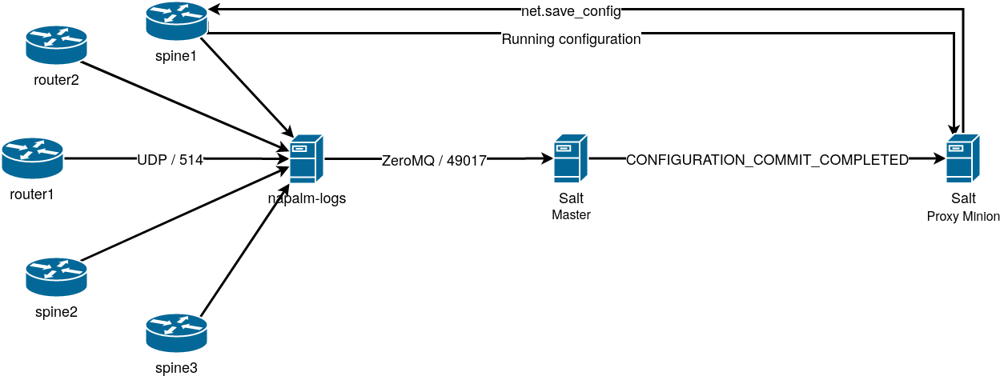

# LAB: The Salt Reactor system

As in the previous labs, the Proxy Minions are started for all the devices in the topology, as well as napalm-logs.

The main difference however is that the Salt Master is not started, and we will need to start it manually.

## Part-1: Salt Reactors 101

Before anything else, let's firstly start the Salt Master (in debug mode):

```bash
salt-master -l debug
```

<pre>
root@salt:~# salt-master -l debug
[DEBUG   ] Reading configuration from /etc/salt/master
[DEBUG   ] Using cached minion ID from /etc/salt/minion_id: salt

...
... snip ...
...
</pre>

As the Master is not started in daemon mode, it won't return the CLI, so let's leave it running. Open another terminal window where we'll be watching the Salt event bus:

```bash
salt-run state.event pretty=True
```

Similarly, as seen before, this doesn't return the command line either, so let's open a third terminal window. The other 
two windows will be helpful for us to understand what is the Salt Master doing and what events are being generated.

Execute the following command:


```bash
salt router1 test.ping
```

<pre>
root@salt:~# salt router1 test.ping
router1:
    True
</pre>

In the Master logs, you will notice the following:

<pre>
[DEBUG   ] Sending event: tag = 20210118133221334469; data = {'minions': ['router1'], '_stamp': '2021-01-18T13:32:21.335059'}
[DEBUG   ] Sending event: tag = salt/job/20210118133221334469/new; data = {'jid': '20210118133221334469', 'tgt_type': 'glob', 'tgt': 'router1', 'user': 'root', 'fun': 'test.ping', 'arg': [], 'minions': ['router1'], 'missing': [], '_stamp': '2021-01-18T13:32:21.335317'}
[DEBUG   ] Adding minions for job 20210118133221334469: ['router1']
[INFO    ] User root Published command test.ping with jid 20210118133221334469
[DEBUG   ] Published command details {'fun': 'test.ping', 'arg': [], 'tgt': 'router1', 'jid': '20210118133221334469', 'ret': '', 'tgt_type': 'glob', 'user': 'root'}
[INFO    ] Got return from router1 for job 20210118133221334469
[DEBUG   ] Sending event: tag = salt/job/20210118133221334469/ret/router1; data = {'cmd': '_return', 'id': 'router1', 'success': True, 'return': True, 'retcode': 0, 'jid': '20210118133221334469', 'fun': 'test.ping', 'fun_args': [], '_stamp': '2021-01-18T13:32:21.355350'}
</pre>

These represent a more verbose version of the events from the Salt bus. You can check the event bus:

<pre>
20210118133221334469	{
    "_stamp": "2021-01-18T13:32:21.335059",
    "minions": [
        "router1"
    ]
}
salt/job/20210118133221334469/new	{
    "_stamp": "2021-01-18T13:32:21.335317",
    "arg": [],
    "fun": "test.ping",
    "jid": "20210118133221334469",
    "minions": [
        "router1"
    ],
    "missing": [],
    "tgt": "router1",
    "tgt_type": "glob",
    "user": "root"
}
salt/job/20210118133221334469/ret/router1	{
    "_stamp": "2021-01-18T13:32:21.355350",
    "cmd": "_return",
    "fun": "test.ping",
    "fun_args": [],
    "id": "router1",
    "jid": "20210118133221334469",
    "retcode": 0,
    "return": true,
    "success": true
}
</pre>

Any of these events can be matched by the Salt Reactor and kick off jobs in response.

Let's look at the _tag_ and the _data_ of the return event. The _tag_ has the following pattern: 
`salt/job/<JID>/ret/<MINION>`. This can be translated to the following glob expression, which would match _any_ return event (from any job, any Minion): `salt/job/*/ret/*`. We can therefore configure the Reactor (in the Master configuration file):

```bash
grep reactor -A 2 /etc/salt/master
```

<pre>
reactor:
  - 'salt/job/*/ret/*':
    - /srv/salt/reactor/test.sls
</pre>

This Reactor configuration, would invoke the `/srv/salt/reactor/test.sls` Reactor SLS file, on any return event. As the Reactor file is under the Salt file system, this can also be written as:

<pre>
reactor:
  - 'salt/job/*/ret/*':
    - salt://reactor/test.sls
</pre>

In `/srv/salt/reactor/test.sls` let's simply log an error when the Reactor is invoked:

```bash
cat /srv/salt/reactor/test.sls
```

<pre>

</pre>

**ctrl+c** to stop the Master, then restart it by running:

```bash
salt-master -l debug
```

Once the Master is settled, open a new terminal window and execute a Salt command (anything), e.g., 

```bash
salt router1 test.ping
```

In the Master logs you'll notice the following sequence:

<pre>
[DEBUG   ] Sending event: tag = salt/job/20210118151211250355/ret/router1; data = {'cmd': '_return', 'id': 'router1', 'success': True, 'return': True, 'retcode': 0, 'jid': '20210118151211250355', 'fun': 'test.ping', 'fun_args': [], '_stamp': '2021-01-18T15:12:11.270550'}
[DEBUG   ] Gathering reactors for tag salt/job/20210118151211250355/ret/router1
[DEBUG   ] In saltenv 'base', looking at rel_path 'reactor/test.sls' to resolve 'salt://reactor/test.sls'
[DEBUG   ] In saltenv 'base', ** considering ** path '/var/cache/salt/master/files/base/reactor/test.sls' to resolve 'salt://reactor/test.sls'
[DEBUG   ] compile template: /var/cache/salt/master/files/base/reactor/test.sls
[DEBUG   ] Jinja search path: ['/var/cache/salt/master/files/base']
[ERROR   ] Hello world
[PROFILE ] Time (in seconds) to render '/var/cache/salt/master/files/base/reactor/test.sls' using 'jinja' renderer: 0.0018815994262695312
[DEBUG   ] Rendered data from file: /var/cache/salt/master/files/base/reactor/test.sls:
[DEBUG   ] Results of YAML rendering: 
{}
[PROFILE ] Time (in seconds) to render '/var/cache/salt/master/files/base/reactor/test.sls' using 'yaml' renderer: 0.0002777576446533203
[DEBUG   ] Gathering reactors for tag salt/auth
</pre>

These lines say that after the `salt/job/20210118151211250355/ret/router1` event, Salt is looking if there are any Reactors configured for this event. As there are, it's trying to locate `reactor/test.sls` under the Salt file system, then render the SLS file. Notice the `[ERROR   ] Hello world` log line, which confirms that the Reactor is working well.

Without stopping the Salt Master, we are able to update the Reactor SLS. Let's do more than just log. For example, invoke a number of actions, e.g., execute two functions `test.echo` and `grains.items` on the Minion.

```bash
cat <<EOF > /srv/salt/reactor/test.sls


Echo:
  local.test.echo:
    - tgt: {{ data.id }}
    - arg:
      - "Hello, here are my Grains"

Grains:
  local.grains.items:
    - tgt: {{ data.id }}


EOF
```

<pre>


Echo:
  local.test.echo:
    - tgt: {{ data.id }}
    - arg:
      - "Hello, here are my Grains"

Grains:
  local.grains.items:
    - tgt: {{ data.id }}


</pre>

This reactor would kick off two jobs whenever `test.ping` is being executed. The `if data.fun == 'test.ping'` test is important to avoid a Reaction loop: both `Echo` and `Grains` generate job events, and therefore return events, and without checking the function name, this would result in a continuous cycle. `data.fun` refers to the `fun` field in the event _data_.

Do a test ping

```bash
salt router1 test.ping
```

Return to the terminal window that is running the Salt master in debug mode. Besides the usual job events, we'd also notice the following:

<pre>
20210118144807692394	{
    "_stamp": "2021-01-18T14:48:07.693101",
    "minions": [
        "router1"
    ]
}
salt/job/20210118144807692394/new	{
    "_stamp": "2021-01-18T14:48:07.693351",
    "arg": [
       <strong>"Hello, here are my Grains"</strong>
    ],
    <strong>"fun": "test.echo" </strong>,
    "jid": "20210118144807692394",
    "minions": [
        "router1"
    ],
    "missing": [],
    "tgt": "router1",
    "tgt_type": "glob",
    "user": "root"
}
20210118144807701874	{
    "_stamp": "2021-01-18T14:48:07.702521",
    "minions": [
        "router1"
    ]
}
salt/job/20210118144807701874/new	{
    "_stamp": "2021-01-18T14:48:07.702767",
    "arg": [],
    "fun": "grains.items",
    "jid": "20210118144807701874",
    "minions": [
        "router1"
    ],
    "missing": [],
    "tgt": "router1",
    "tgt_type": "glob",
    "user": "root"
}
salt/job/20210118144807692394/ret/router1	{
    "_stamp": "2021-01-18T14:48:07.716489",
    "cmd": "_return",
    "fun": "test.echo",
    "fun_args": [
        "Hello, here are my Grains"
    ],
    "id": "router1",
    "jid": "20210118144807692394",
    "retcode": 0,
    "return": "Hello, here are my Grains",
    "success": true
}
salt/job/20210118144807701874/ret/router1	{
    "_stamp": "2021-01-18T14:48:07.729119",
    "cmd": "_return",
    "fun": "grains.items",
    "fun_args": [],
    "id": "router1",
    "jid": "20210118144807701874",
    "out": "nested",
    "retcode": 0,
    "return": {
        "cpuarch": "x86_64",
        "cwd": "/",
        "dns": {
            "domain": "",
            "ip4_nameservers": [
                "127.0.0.11"
            ],
            "ip6_nameservers": [],
            "nameservers": [
                "127.0.0.11"
            ],
            "options": [
                "ndots:0"
...
... snip ...
...
        "uptime": 173037,
        "username": "apnic",
        "vendor": "Juniper",
        "version": "17.2R1.13",
        "virtual": "physical",
        "zmqversion": "4.3.2"
    },
    "success": true
}
</pre>

There are two separate jobs, one with the JID `20210118144807692394` and another one with `20210118144807701874` - one for the _Hello_ job executing `test.echo` and the other one for the _Grains_ job respectively, executing `grains.items`, with the afferent job creation and return events.

## Part-2: Backing up the device configuration on changes

As we've seen in _Lab 7_ (_States_), we can build a chain of States that backup the configuration when executing the State and there are changes. But what if we run one of the `net.load_config` / `net.load_template` functions? We can build something similar, using the Reactor system which kicks off a job whenever either of those functions is invoked.

Let's have a look at the event data for the following:

```bash
salt router1 net.load_config text='set system ntp server 10.0.0.1' test=True
```

<pre>
root@salt:~# salt router1 net.load_config text='set system ntp server 10.0.0.1' test=True
router1:
    ----------
    already_configured:
        False
    comment:
        Configuration discarded.
    diff:
        [edit system]
        +   ntp {
        +       server 10.0.0.1;
        +   }
    loaded_config:
    result:
        True
</pre>


The return event has the following structure:

<pre>
salt/job/20210118170135487146/ret/router1	{
    "_stamp": "2021-01-18T17:01:36.028299",
    "cmd": "_return",
    "fun": "net.load_config",
    "fun_args": [
        {
            "test": true,
            "text": "set system ntp server 10.0.0.1"
        }
    ],
    "id": "router1",
    "jid": "20210118170135487146",
    "retcode": 0,
    "return": {
        "already_configured": false,
        "comment": "Configuration discarded.",
        "diff": "[edit system]\n+   ntp {\n+       server 10.0.0.1;\n+   }",
        "loaded_config": "",
        "result": true
    },
    "success": true
}
</pre>

In this, we can notice a number of key elements that will help us identify:

- `fun`: to ensure we're matching on the right Salt function.
- `fun_args`: which is a list of arguments. We can index on the `test` key which corresponds to the flag pass in from the CLI. Using this flag, we can determine whether the user actually committed the configuration change, or only requested a dry-run.
- `success`: boolean flag, tells us whether the Salt function run correctly.
- `return`: has the structure we're seeing on the command line. Using the `result` key under `return`, we can check whether the config was applied successfully.

With these elements, we can build the Reactor as follows:


```bash
cat <<EOF > /srv/salt/reactor/test.sls


Backup config:
  local.net.save_config:
    - tgt: {{ data.id }}
    - kwarg:
        source: running
        path: /tmp/{{ data.id }}.conf


EOF
```

<pre>


Backup config:
  local.net.save_config:
    - tgt: {{ data.id }}
    - kwarg:
        source: running
        path: /tmp/{{ data.id }}.conf


</pre>

Notice that the condition is more complex now, and it evaluates the flags mentioned above:

- `data.fun in ['net.load_config', 'net.load_template']` ensures the Reactor is executed only in response to those two functions.
- `data.success`: only when the execution was successful.
- `not data.fun_args[0].get('test', False)`: only when the function run _without_ `test=True`.
- `data.return.result`: only when the configuration was applied correctly.

When all of these conditions are met, the _Backup config_ Reactor would invoke the `net.save_config` Salt function on the `data.id` Minion (i.e., in this case `router1`, as this is what the event _data_ points to). The function is invoked with the following arguments:

- _source_: `running`, backup the running configuration.
- _path_: the path on the local Minion where to save the configuration.


Run `salt router1 net.load_config text='set system ntp server 10.0.0.1' test=True` (dry-run), and watch the Master logs:

```bash
salt router1 net.load_config text='set system ntp server 10.0.0.1' test=True
```

<pre>
[DEBUG   ] Sending event: tag = salt/job/20210118172717592581/ret/router1; data = {'cmd': '_return', 'id': 'router1', 'success': True, 'return': {'result': True, 'comment': 'Configuration discarded.', 'already_configured': False, 'loaded_config': '', 'diff': '[edit system]\n+   ntp {\n+       server 10.0.0.1;\n+   }'}, 'retcode': 0, 'jid': '20210118172717592581', 'fun': 'net.load_config', 'fun_args': [{'text': 'set system ntp server 10.0.0.1', 'test': True}], '_stamp': '2021-01-18T17:27:18.118264'}
[DEBUG   ] Gathering reactors for tag salt/job/20210118172717592581/ret/router1
[DEBUG   ] Compiling reactions for tag salt/job/20210118172717592581/ret/router1
[DEBUG   ] In saltenv 'base', looking at rel_path 'reactor/test.sls' to resolve 'salt://reactor/test.sls'
[DEBUG   ] In saltenv 'base', ** considering ** path '/var/cache/salt/master/files/base/reactor/test.sls' to resolve 'salt://reactor/test.sls'
[DEBUG   ] compile template: /var/cache/salt/master/files/base/reactor/test.sls
[DEBUG   ] Jinja search path: ['/var/cache/salt/master/files/base']
[PROFILE ] Time (in seconds) to render '/var/cache/salt/master/files/base/reactor/test.sls' using 'jinja' renderer: 0.003515005111694336
[DEBUG   ] Rendered data from file: /var/cache/salt/master/files/base/reactor/test.sls:


[DEBUG   ] Results of YAML rendering:
{}
[PROFILE ] Time (in seconds) to render '/var/cache/salt/master/files/base/reactor/test.sls' using 'yaml' renderer: 0.0001933574676513672
</pre>

Notice the `Results of YAML rendering:` debug log. Rendering `/var/cache/salt/master/files/base/reactor/test.sls` (which is our `/srv/salt/reactor.test.sls` cached) resulted in `{}`. This is what we wanted, as the function has been executed with `test=True` so the Reactor shouldn't do anything.

Running the same, but without _test=True_, `salt router1 net.load_config text='set system ntp server 10.0.0.1'`, we will notice that the logs are different now:

```bash
salt router1 net.load_config text='set system ntp server 10.0.0.1'
```

<pre>
[DEBUG   ] Sending event: tag = salt/job/20210118173045133722/ret/router1; data = {'cmd': '_return', 'id': 'router1', 'success': True, 'return': {'result': True, 'comment': '', 'already_configured': False, 'loaded_config': '', 'diff': '[edit system]\n+   ntp {\n+       server 10.0.0.1;\n+   }'}, 'retcode': 0, 'jid': '20210118173045133722', 'fun': 'net.load_config', 'fun_args': [{'text': 'set system ntp server 10.0.0.1'}], '_stamp': '2021-01-18T17:30:46.297320'}
[DEBUG   ] Gathering reactors for tag salt/job/20210118173045133722/ret/router1
[DEBUG   ] Compiling reactions for tag salt/job/20210118173045133722/ret/router1
[DEBUG   ] In saltenv 'base', looking at rel_path 'reactor/test.sls' to resolve 'salt://reactor/test.sls'
[DEBUG   ] In saltenv 'base', ** considering ** path '/var/cache/salt/master/files/base/reactor/test.sls' to resolve 'salt://reactor/test.sls'
[DEBUG   ] compile template: /var/cache/salt/master/files/base/reactor/test.sls
[DEBUG   ] Jinja search path: ['/var/cache/salt/master/files/base']
[PROFILE ] Time (in seconds) to render '/var/cache/salt/master/files/base/reactor/test.sls' using 'jinja' renderer: 0.003757953643798828
[DEBUG   ] Rendered data from file: /var/cache/salt/master/files/base/reactor/test.sls:


Backup config:
  local.net.save_config:
    - tgt: router1
    - kwarg:
        source: running
        path: /tmp/router1.conf

[DEBUG   ] Results of YAML rendering: 
OrderedDict([('Backup config', OrderedDict([('local.net.save_config', [OrderedDict([('tgt', 'router1')]), OrderedDict([('kwarg', OrderedDict([('source', 'running'), ('path', '/tmp/router1.conf')]))])])]))])
[PROFILE ] Time (in seconds) to render '/var/cache/salt/master/files/base/reactor/test.sls' using 'yaml' renderer: 0.0012824535369873047
</pre>

Rendering the Reactor SLS now generates a structure that would invoke `net.save_config` on `router`. This is the CLI equivalent of calling: `salt router1 net.save_config source=running path=/tmp/router1.conf`.

A few line further down in the logs, you can also see:

<pre>
[DEBUG   ] Sending event: tag = salt/job/20210118173046346179/ret/router1; data = {'cmd': '_return', 'id': 'router1', 'success': True, 'return': {'result': True, 'out': '/tmp/router1.conf', 'comment': 'running config saved to /tmp/router1.conf'}, 'retcode': 0, 'jid': '20210118173046346179', 'fun': 'net.save_config', 'fun_args': [{'source': 'running', 'path': '/tmp/router1.conf'}], '_stamp': '2021-01-18T17:30:46.401423'}
</pre>

Or on the Salt event bus:

<pre>
20210118173046346179	{
    "_stamp": "2021-01-18T17:30:46.346398",
    "minions": [
        "router1"
    ]
}
salt/job/20210118173046346179/new	{
    "_stamp": "2021-01-18T17:30:46.346742",
    "arg": [
        {
            "__kwarg__": true,
            "path": "/tmp/router1.conf",
            "source": "running"
        }
    ],
    "fun": "net.save_config",
    "jid": "20210118173046346179",
    "minions": [
        "router1"
    ],
    "missing": [],
    "tgt": "router1",
    "tgt_type": "glob",
    "user": "root"
}
salt/job/20210118173046346179/ret/router1	{
    "_stamp": "2021-01-18T17:30:46.401423",
    "cmd": "_return",
    "fun": "net.save_config",
    "fun_args": [
        {
            "path": "/tmp/router1.conf",
            "source": "running"
        }
    ],
    "id": "router1",
    "jid": "20210118173046346179",
    "retcode": 0,
    "return": {
        "comment": "running config saved to /tmp/router1.conf",
        "out": "/tmp/router1.conf",
        "result": true
    },
    "success": true
}
</pre>

This shows that `net.save_config` has been executed immediately after we've applied a configuration by running `net.load_config`. To confirm, execute `root@salt:~# salt router1 file.read /tmp/router1.conf` to display the `/tmp/router1.conf` file which is where the configuration has been backed up.

## Part-3: Reacting to napalm-logs events

While `net.load_config` and `net.load_template` are vendor-agnostic, and the methodology presented above can be used 
uniformly for whatever platform, it still has one minor disadvantage: the `net.load_config` and `net.load_template` 
function are available only for NAPALM Proxy Minions. On top of that, if someone performs a manual configuration change 
(i.e., not via Salt, but using the router / switch CLI), we are not going to be able to catch it by doing this. This is 
where the events imported from _napalm-logs_, using the `napalm_syslog` Engine may help.

Check the Salt event bus and scroll up. During the previous commit operation, there was an event telling us that there 
was a commit operation on the device:

```
napalm/syslog/junos/CONFIGURATION_COMMIT_REQUESTED/router1	{
    "_stamp": "2021-01-18T17:30:45.556427",
    "error": "CONFIGURATION_COMMIT_REQUESTED",
    "facility": 23,
    "host": "router1",
    "ip": "172.22.1.1",
    "message_details": {
        "date": "Jan 18",
        "facility": 23,
        "host": "router1",
        "hostPrefix": null,
        "message": "User 'apnic' requested 'commit' operation (comment: none)",
        "pri": "189",
        "processId": "33918",
        "processName": "mgd",
        "severity": 5,
        "tag": "UI_COMMIT",
        "time": "17:30:31"
    },
    "os": "junos",
    "severity": 5,
    "timestamp": 1610991031,
    "yang_message": {
        "users": {
            "user": {
                "apnic": {
                    "action": {
                        "comment": "none",
                        "requested_commit": true
                    }
                }
            }
        }
    },
    "yang_model": "NO_MODEL"
}

napalm/syslog/junos/CONFIGURATION_COMMIT_COMPLETED/router1	{
    "_stamp": "2021-01-18T17:30:46.206317",
    "error": "CONFIGURATION_COMMIT_COMPLETED",
    "facility": 23,
    "host": "router1",
    "ip": "172.22.1.1",
    "message_details": {
        "date": "Jan 18",
        "facility": 23,
        "host": "router1",
        "hostPrefix": null,
        "message": "commit complete",
        "pri": "188",
        "processId": "33918",
        "processName": "mgd",
        "severity": 4,
        "tag": "UI_COMMIT_COMPLETED",
        "time": "17:30:32"
    },
    "os": "junos",
    "severity": 4,
    "timestamp": 1610991032,
    "yang_message": {
        "system": {
            "operations": {
                "commit_complete": true
            }
        }
    },
    "yang_model": "NO_MODEL"
}
```

The _napalm-logs_ `CONFIGURATION_COMMIT_COMPLETED` notification type tells that there was a successful commit, and just 
above it, `CONFIGURATION_COMMIT_REQUESTED` tells us that user `apnic` has requested this commit. Using the Reactor 
system, we can make use of the `CONFIGURATION_COMMIT_COMPLETED` notifications and backup the config when this event is 
seen on the bus.

The event tag is `napalm/syslog/junos/CONFIGURATION_COMMIT_COMPLETED/router1`, and as we want to be able to match 
`CONFIGURATION_COMMIT_COMPLETED`-type events from any platform and any device, the tag match becomes: 
`napalm/syslog/*/CONFIGURATION_COMMIT_COMPLETED/*`. Let's configure this on the Master. Ctrl-C to stop the running 
Master process, and update the `reactor` configuration as follows:

`/etc/salt/master`:

```yaml
reactor:
  - 'napalm/syslog/*/CONFIGURATION_COMMIT_COMPLETED/*':
    - salt://reactor/bkup.sls
```

With this configuration Salt will call the `salt://reactor/bkup.sls` Reactor SLS on `CONFIGURATION_COMMIT_COMPLETED` 
notifications received from _napalm-logs_.

Now start the Master in debug mode and let it run in the background: `root@salt:~# salt-master -l debug`.

The Reactor SLS `/srv/salt/reactor/bkup.sls` is:

```yaml
Backup config:
  local.net.save_config:
    - tgt: {{ data.host }}
    - kwarg:
        source: running
        path: /tmp/{{ data.host }}.conf
```

This is Reactor SLS we've used previously, but minus the conditions, as now we're sure that this reactor is invoked only 
on successful commits. One particular detail has been changed: `data.id` becomes `data.host` as the _napalm-logs_ events 
don't contain an `id` field, but `host`.

The following diagram illustrates the full design and the interaction between napalm-logs, Salt and the network devices:



In the terminal window where we have the command line, run:

```
root@salt:~# salt router1 net.load_config text='set system ntp server 10.0.0.2'
router1:
    ----------
    already_configured:
        False
    comment:
    diff:
        [edit system ntp]
        +    server 10.0.0.2;
    loaded_config:
    result:
        True
```


In the Master logs, we can notice some activity and the following logs which show that our `salt://reactor/bkup.sls` is 
being invoked on the `CONFIGURATION_COMMIT_COMPLETED` _napalm-logs_ event:

```
[DEBUG   ] Sending event: tag = napalm/syslog/junos/CONFIGURATION_COMMIT_COMPLETED/router1; data = {'error': 'CONFIGURATION_COMMIT_COMPLETED', 'host': 'router1', 'ip': '172.22.1.1', 'timestamp': 1610992577, 'yang_message': {'system': {'operations': {'commit_complete': True}}}, 'message_details': {'date': 'Jan 18', 'time': '17:56:17', 'hostPrefix': None, 'host': 'router1', 'processName': 'mgd', 'processId': '33918', 'tag': 'UI_COMMIT_COMPLETED', 'pri': '188', 'message': 'commit complete', 'facility': 23, 'severity': 4}, 'yang_model': 'NO_MODEL', 'os': 'junos', 'facility': 23, 'severity': 4, '_stamp': '2021-01-18T17:56:32.127359'}
[DEBUG   ] Closing IPCMessageSubscriber instance
[DEBUG   ] Closing IPCMessageClient instance
[DEBUG   ] Waiting for napalm-logs to send anything...
[DEBUG   ] Gathering reactors for tag napalm/syslog/junos/CONFIGURATION_COMMIT_COMPLETED/router1
[DEBUG   ] Compiling reactions for tag napalm/syslog/junos/CONFIGURATION_COMMIT_COMPLETED/router1
[DEBUG   ] In saltenv 'base', looking at rel_path 'reactor/bkup.sls' to resolve 'salt://reactor/bkup.sls'
[DEBUG   ] In saltenv 'base', ** considering ** path '/var/cache/salt/master/files/base/reactor/bkup.sls' to resolve 'salt://reactor/bkup.sls'
[DEBUG   ] compile template: /var/cache/salt/master/files/base/reactor/bkup.sls
[DEBUG   ] Jinja search path: ['/var/cache/salt/master/files/base']
[PROFILE ] Time (in seconds) to render '/var/cache/salt/master/files/base/reactor/bkup.sls' using 'jinja' renderer: 0.0013096332550048828
[DEBUG   ] Rendered data from file: /var/cache/salt/master/files/base/reactor/bkup.sls:
Backup config:
  local.net.save_config:
    - tgt: router1
    - kwarg:
        source: running
        path: /tmp/router1.conf

[DEBUG   ] Results of YAML rendering:
OrderedDict([('Backup config', OrderedDict([('local.net.save_config', [OrderedDict([('tgt', 'router1')]), OrderedDict([('kwarg', OrderedDict([('source', 'running'), ('path', '/tmp/router1.conf')]))])])]))])
[PROFILE ] Time (in seconds) to render '/var/cache/salt/master/files/base/reactor/bkup.sls' using 'yaml' renderer: 0.0013186931610107422
```

On the event bus the following sequence of events can be seen:

```
napalm/syslog/junos/CONFIGURATION_COMMIT_COMPLETED/router1	{
    "_stamp": "2021-01-18T17:56:32.127359",
    "error": "CONFIGURATION_COMMIT_COMPLETED",
    "facility": 23,
    "host": "router1",
    "ip": "172.22.1.1",
    "message_details": {
        "date": "Jan 18",
        "facility": 23,
        "host": "router1",
        "hostPrefix": null,
        "message": "commit complete",
        "pri": "188",
        "processId": "33918",
        "processName": "mgd",
        "severity": 4,
        "tag": "UI_COMMIT_COMPLETED",
        "time": "17:56:17"
    },
    "os": "junos",
    "severity": 4,
    "timestamp": 1610992577,
    "yang_message": {
        "system": {
            "operations": {
                "commit_complete": true
            }
        }
    },
    "yang_model": "NO_MODEL"
}
20210118175632135438	{
    "_stamp": "2021-01-18T17:56:32.135643",
    "minions": [
        "router1"
    ]
}
salt/job/20210118175632135438/new	{
    "_stamp": "2021-01-18T17:56:32.135994",
    "arg": [
        {
            "__kwarg__": true,
            "path": "/tmp/router1.conf",
            "source": "running"
        }
    ],
    "fun": "net.save_config",
    "jid": "20210118175632135438",
    "minions": [
        "router1"
    ],
    "missing": [],
    "tgt": "router1",
    "tgt_type": "glob",
    "user": "root"
}
salt/job/20210118175631181923/ret/router1	{
    "_stamp": "2021-01-18T17:56:32.223035",
    "cmd": "_return",
    "fun": "net.load_config",
    "fun_args": [
        {
            "text": "set system ntp server 10.0.0.2"
        }
    ],
    "id": "router1",
    "jid": "20210118175631181923",
    "retcode": 0,
    "return": {
        "already_configured": false,
        "comment": "",
        "diff": "[edit system ntp]\n+    server 10.0.0.2;",
        "loaded_config": "",
        "result": true
    },
    "success": true
}
salt/job/20210118175632135438/ret/router1	{
    "_stamp": "2021-01-18T17:56:32.229042",
    "cmd": "_return",
    "fun": "net.save_config",
    "fun_args": [
        {
            "path": "/tmp/router1.conf",
            "source": "running"
        }
    ],
    "id": "router1",
    "jid": "20210118175632135438",
    "retcode": 0,
    "return": {
        "comment": "running config saved to /tmp/router1.conf",
        "out": "/tmp/router1.conf",
        "result": true
    },
    "success": true
}
```

Notice that `salt/job/20210118175632135438/new` event is actually being kicked off **before** even the Minion returns 
(`salt/job/20210118175632135438/ret/router1` is the return event). This proves that backing up the configuration through 
this methodology is more reliable as the events are being generated by the device itself. Similarly, if someone else 
performs manual changes (outside of Salt), Salt is still aware of this and will backup the config for you:

```
napalm/syslog/junos/CONFIGURATION_COMMIT_REQUESTED/router1	{
    "_stamp": "2021-01-18T18:06:40.756902",
    "error": "CONFIGURATION_COMMIT_REQUESTED",
    "facility": 23,
    "host": "router1",
    "ip": "172.22.1.1",
    "message_details": {
        "date": "Jan 18",
        "facility": 23,
        "host": "router1",
        "hostPrefix": null,
        "message": "User 'mircea' requested 'commit' operation (comment: none)",
        "pri": "189",
        "processId": "3676",
        "processName": "mgd",
        "severity": 5,
        "tag": "UI_COMMIT",
        "time": "18:06:26"
    },
    "os": "junos",
    "severity": 5,
    "timestamp": 1610993186,
    "yang_message": {
        "users": {
            "user": {
                "mircea": {
                    "action": {
                        "comment": "none",
                        "requested_commit": true
                    }
                }
            }
        }
    },
    "yang_model": "NO_MODEL"
}
napalm/syslog/junos/CONFIGURATION_COMMIT_COMPLETED/router1	{
    "_stamp": "2021-01-18T18:06:41.272328",
    "error": "CONFIGURATION_COMMIT_COMPLETED",
    "facility": 23,
    "host": "router1",
    "ip": "172.22.1.1",
    "message_details": {
        "date": "Jan 18",
        "facility": 23,
        "host": "router1",
        "hostPrefix": null,
        "message": "commit complete",
        "pri": "188",
        "processId": "3676",
        "processName": "mgd",
        "severity": 4,
        "tag": "UI_COMMIT_COMPLETED",
        "time": "18:06:27"
    },
    "os": "junos",
    "severity": 4,
    "timestamp": 1610993187,
    "yang_message": {
        "system": {
            "operations": {
                "commit_complete": true
            }
        }
    },
    "yang_model": "NO_MODEL"
}
20210118180641279826	{
    "_stamp": "2021-01-18T18:06:41.280016",
    "minions": [
        "router1"
    ]
}
salt/job/20210118180641279826/new	{
    "_stamp": "2021-01-18T18:06:41.280353",
    "arg": [
        {
            "__kwarg__": true,
            "path": "/tmp/router1.conf",
            "source": "running"
        }
    ],
    "fun": "net.save_config",
    "jid": "20210118180641279826",
    "minions": [
        "router1"
    ],
    "missing": [],
    "tgt": "router1",
    "tgt_type": "glob",
    "user": "root"
}
salt/job/20210118180641279826/ret/router1	{
    "_stamp": "2021-01-18T18:06:41.353988",
    "cmd": "_return",
    "fun": "net.save_config",
    "fun_args": [
        {
            "path": "/tmp/router1.conf",
            "source": "running"
        }
    ],
    "id": "router1",
    "jid": "20210118180641279826",
    "retcode": 0,
    "return": {
        "comment": "running config saved to /tmp/router1.conf",
        "out": "/tmp/router1.conf",
        "result": true
    },
    "success": true
}
```

---
**End of Lab**

---
