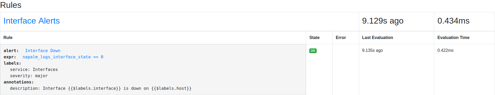
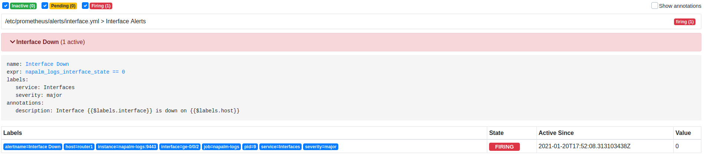
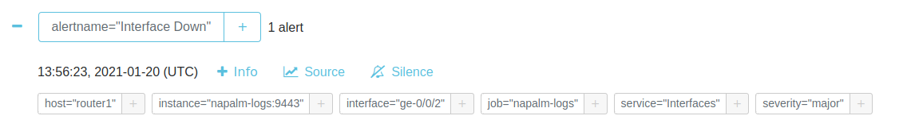
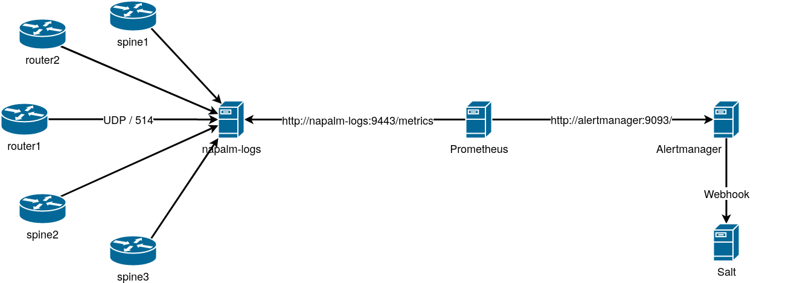

# LAB: The Salt REST API

For this lab, all the dependencies are installed, so we can start using the Salt API straight away:

- _CherryPy_ (required by the `rest_cherrypy` module), version `18.1.0`.
- _cURL_, for HTTP requests from the command line.

The following applications are also up and running:

- Proxy Minions for all the devices in the topology.
- Salt Master.
- napalm-logs.
- Prometheus.

Besides all of these, there's a new component that we'll need in _Part-2_, which is _ALertmanager_.

## Part-1: Enabling the Salt API

The Salt API requires authentication, and therefore we also need to configure the `external_auth` subsystem. In the Master configuration, let's provision and grant access to an username, e.g., `test-usr`, which will have access to run any Salt function, any Salt Runner, and any other Salt job. For testing purposes, we'll use the `auto` External Authentication which doesn't have any external dependencies to set up, but this is highly discouraged in production environments. The configuration is as simple as:

```bash
grep external_auth -A 9 /etc/salt/master
```

<pre>
external_auth:
  auto:
    test-usr:
    - '@jobs'
    - '@runner'
    - .*
</pre>

For the Salt API itself, there are similarly multiple options for the back-end system we are able to use. The most stable and production-read API is `rest_cherrypy`, which is based on _CherryPy_ (A Minimalist Python Web Framework). To enable it, we only need to provide the `rest_cherrypy` key in the Master configuration, and a set of configuration options underneath, such as address & port to listen for HTTP requests, SSL certificate and key, and so on. See the complete list of available options at: [https://docs.saltproject.io/en/latest/ref/netapi/all/salt.netapi.rest_cherrypy.html](https://docs.saltproject.io/en/latest/ref/netapi/all/salt.netapi.rest_cherrypy.html).

For our use-case, the following would suffice in order to have the Salt API listen on localhost, port 8080. For this demonstration only, we don't require SSL, so we can disable it. Again, this is discouraged in production environments:

```bash
grep cherry -A 2 /etc/salt/master
```

```yaml
rest_cherrypy:
  port: 8080
  disable_ssl: true
```

With this configuration, we can go ahead in start the Salt API process, in debug mode:

```bash
salt-api -l debug
```

<pre>
root@salt:~# salt-api -l debug
...
... snip ...
...
[INFO    ] [20/Jan/2021:15:41:24] ENGINE Listening for SIGTERM.
[INFO    ] [20/Jan/2021:15:41:24] ENGINE Listening for SIGHUP.
[INFO    ] [20/Jan/2021:15:41:24] ENGINE Listening for SIGUSR1.
[INFO    ] [20/Jan/2021:15:41:24] ENGINE Bus STARTING
[INFO    ] [20/Jan/2021:15:41:25] ENGINE Serving on http://0.0.0.0:8080
[INFO    ] [20/Jan/2021:15:41:25] ENGINE Bus STARTED
</pre>

As it's running in debug mode, it's very verbose; notice that it says the API is listening on http://0.0.0.0:8080.

As with the rest of the other Salt processes, it is mean to run continuously, so it won't return the command line. We leave this running, and open another terminal window, where we can run query http://0.0.0.0:8080, for example using _cURL_:

```bash
curl http://0.0.0.0:8080
```

<pre>
root@salt:~# curl http://0.0.0.0:8080
{"return": "Welcome", "clients": ["local", "local_async", "local_batch", "local_subset", "runner", "runner_async", "ssh", "wheel", "wheel_async"]}
</pre>

This is the main page of the Salt API, where we are invited to execute requests via HTTP, to the usual Salt clients (`local`, `runner`, `ssh`, `wheel`, as well as their asynchronous counter-parts).

Executing a request using the `local` client is the equivalent of the running a Salt command from the command line. 
Let's see how we can achieve this. First, let's remember the output of the simplest Salt command in various formats:

```bash
salt router1 test.ping
```

<pre>
root@salt:~# salt router1 test.ping
router1:
    True
</pre>

Display in JSON format

```bash
salt router1 test.ping --out=json
```
<pre>
root@salt:~# salt router1 test.ping --out=json
{
    "router1": true
}
</pre>

Display in YAML format

```bash
salt router1 test.ping --out=yaml
```
<pre>
root@salt:~# salt router1 test.ping --out=yaml
router1: true
</pre>

Through the Salt API we can similarly request the output to be returned in the desired format, by providing the `Accept` HTTP header. If no specific `Accept` MIME type is provided, Salt will default to JSON. Let's re-run the previous request, and request to return the data in YAML format:

```bash
curl -H 'Accept: application/x-yaml' http://0.0.0.0:8080
```

<pre>
root@salt:~# curl -H 'Accept: application/x-yaml' http://0.0.0.0:8080
clients:
- local
- local_async
- local_batch
- local_subset
- runner
- runner_async
- ssh
- wheel
- wheel_async
return: Welcome
</pre>

Passing the `-H` argument to _cURL_ will set the requested HTTP request header.

Now, in order to be able to execute Salt commands through any of these clients, we need to provide authentication data. 
At minimum, this represents: the External authentication system, the username and the password. To ensure the credentials work fine, we can use the `/login` endpoint of the API, and pass in the `eauth`, `username`, and `password` as HTTP POST data:

```bash
curl -d eauth=auto -d username=test-usr -d password=test http://0.0.0.0:8080/login
```

<pre>
root@salt:~# curl -d eauth=auto -d username=test-usr -d password=test http://0.0.0.0:8080/login
{"return": [{"token": "a6869a7b62e8577260e7ab66142db4364b44313b", "expire": 1611201670.408647, "start": 1611158470.4086468, "user": "test-usr", "eauth": "auto", "perms": ["@jobs", "@runner", ".*"]}]}
</pre>

Notice that the Salt API responds and provides a _token_ which we can use from now on to execute requests, as in opposite to providing the `eauth`, `username`, and `password` with every single request. For clarity, and simplicity, in order to have the CLI available for copy-paste, below we will continue to use these instead of the token which would be different for every user.

If we would try with a different set of credentials, say for an username that is not configured, or another External Authentication system, the login would fail:

```bash
curl -d eauth=auto -d username=fake -d password=test http://0.0.0.0:8080/login
```

<pre>
root@salt:~# curl -d eauth=auto -d username=fake -d password=test http://0.0.0.0:8080/login
{"return": [{"token": "9124675335753e215ec4a4bd82f2975682081ffa", "expire": 1611201604.8785644, "start": 1611158404.8785641, "user": "fake", "eauth": "auto", "perms": {}}]}
</pre>

While the request doesn't explicitly fail, there are no permissions listed under `perms`, so the username is basically unusable.

Let's start using the Salt clients through the Salt API. For this, besides the `eauth`, `username`, and `password` HTTP data we also need to provide the `client`, together with a number of details required by each client. For example, the `local` client requires, as it's similar to the `salt` CLI, a target and a function; for this, we will provide them as the `tgt` and `fun` data. The requests are now made at the `/run` endpoint:

```bash
curl http://0.0.0.0:8080/run -d eauth=auto -d username=test-usr -d password=test -d client=local -d tgt=router1 -d fun=test.ping
```

<pre>
root@salt:~# curl http://0.0.0.0:8080/run -d eauth=auto -d username=test-usr -d password=test -d client=local -d tgt=router1 -d fun=test.ping
{"return": [{"router1": true}]}
</pre>

This is the exact equivalent of running `salt router1 test.ping --out=json` from the command line, but as HTTP request.

As everything in Salt, this generates a series of events. To verify this, let's open a third terminal window and watch the event bus:

```bash
salt-run state.event pretty=True
```

Execute `curl http://0.0.0.0:8080/run -d eauth=auto -d username=test-usr -d password=test -d client=local -d tgt=router1 -d fun=test.ping` again and you should see the following events on the Salt bus:

```bash
curl http://0.0.0.0:8080/run -d eauth=auto -d username=test-usr -d password=test -d client=local -d tgt=router1 -d fun=test.ping
```

<pre>
20210120170356117584	{
    "_stamp": "2021-01-20T17:03:56.118273",
    "minions": [
        "router1"
    ]
}
salt/job/20210120170356117584/new	{
    "_stamp": "2021-01-20T17:03:56.118505",
    "arg": [],
    "fun": "test.ping",
    "jid": "20210120170356117584",
    "minions": [
        "router1"
    ],
    "missing": [],
    "tgt": "router1",
    "tgt_type": "glob",
    "user": "test-usr"
}
salt/job/20210120170356117584/ret/router1	{
    "_stamp": "2021-01-20T17:03:58.925701",
    "cmd": "_return",
    "fun": "test.ping",
    "fun_args": [],
    "id": "router1",
    "jid": "20210120170356117584",
    "retcode": 0,
    "return": true,
    "success": true
}
</pre>

Nothing has changed from this perspective apart from the `user` field which is now `test-usr`, as this is the username requesting the job execution. Everything else remains the same.

There are many other clients that can be explored and other modes the Salt API can be used, along the same lines.

## Part-2: Using the Salt API to inject events via webhooks

In the previous modules and labs we've learned that the Engines and Beacons can be used to monitor external systems, by importing events on the Salt bus. The way they work was based on polling the devices at specific intervals in order to gather the data.

But there are systems that are able to send a notification whenever they have something to communicate about. This is at the opposite end, and Salt is _informed_ where there's an event (as in opposite to continuously asking "is there an event?").

This can be done through the Salt API, but leveraging the webhooks. Essentially, this is another API endpoint, `/hook`, and the data provided is simply put on the Salt bus.

For example, executing:

```bash
curl -X POST http://0.0.0.0:8080/hook/
```

<pre>
root@salt:~# curl -X POST http://0.0.0.0:8080/hook/
{"success": true}
</pre>

We can see that the webhook succeeds. On the Salt bus, there's an event under the `salt/netapi/hook` namespace:

<pre>
salt/netapi/hook	{
    "_stamp": "2021-01-20T17:26:18.661688",
    "body": "",
    "headers": {
        "Accept": "*/*",
        "Host": "0.0.0.0:8080",
        "Remote-Addr": "127.0.0.1",
        "User-Agent": "curl/7.64.0"
    },
    "post": {}
}
</pre>

The URL path that follows after `/hook` is appended to the event tag. Any data provided with this request, will be inserted under the `post` event key:

```bash
curl -X POST http://0.0.0.0:8080/hook/custom/tag/ -d foo=bar
```

<pre>
root@salt:~# curl -X POST http://0.0.0.0:8080/hook/custom/tag/ -d foo=bar
{"success": true}
</pre>

This request puts the following event on the Salt bus:

<pre>
salt/netapi/hook/custom/tag	{
    "_stamp": "2021-01-20T17:28:11.863393",
    "body": "",
    "headers": {
        "Accept": "*/*",
        "Content-Length": "7",
        "Content-Type": "application/x-www-form-urlencoded",
        "Host": "0.0.0.0:8080",
        "Remote-Addr": "127.0.0.1",
        "User-Agent": "curl/7.64.0"
    },
    "post": {
        "foo": "bar"
    }
}
</pre>

Notice that the tag is now `salt/netapi/hook/custom/tag`, with `custom/tag` nested under `salt/netapi/hook`, and the `"foo": "bar"` into the `post` field of the event data.

One nice example of a system that invokes webhooks is Alertmanager. Alertmanager handles alerts sent by client applications such as the Prometheus server. We've worked with Prometheus in one of the previous labs, for gathering metrics from napalm-logs.

To trigger napalm-logs to generate a metric, let's disable an interface, for example:

```
salt router1 net.load_config text='set interfaces ge-0/0/2 disable'
```

<pre>
root@salt:~# salt router1 net.load_config text='set interfaces ge-0/0/2 disable'
router1:
    ----------
    already_configured:
        False
    comment:
    diff:
        [edit interfaces ge-0/0/2]
        +   disable;
    loaded_config:
    result:
        True
</pre>

This generates a syslog message on router1. To view the message ssh into router1.

```bash
ssh -o "StrictHostKeyChecking no" admin@router1
```

**password** = admin@123

Show the log message

```bash
show log messages | match ge-0/0/2 | match SNMP
```

<pre>
Jan 20 17:46:25  router1 mib2d[4745]: SNMP_TRAP_LINK_DOWN: ifIndex 520, ifAdminStatus down(2), ifOperStatus down(2), ifName ge-0/0/2
</pre>

Exit router1 session

```bash
exit
```

This syslog message is received by napalm-logs, and generates a couple of Prometheus metrics:

<pre>
# HELP napalm_logs_interface_down_total Multiprocess metric
# TYPE napalm_logs_interface_down_total counter
napalm_logs_interface_down_total{host="router1",interface="ge-0/0/2"} 1.0

# HELP napalm_logs_interface_state Multiprocess metric
# TYPE napalm_logs_interface_state gauge
napalm_logs_interface_state{host="router1",interface="ge-0/0/2",pid="9"} 0.0
</pre>

`napalm_logs_interface_down_total` counts how many times the interface has been marked as down, while `napalm_logs_interface_state` maintains the interface state (0 = DOWN, 1 = UP). Each of these metrics has two labels, `host` and `interface` which help us identify what interface is down and where (i.e., `ge-0/0/2` on `router1`).

Prometheus not only that scrapes the metrics, but also is able to generate alerts on specific conditions.
For example the following configuration would generate an alert when `napalm-logs` receives an _InterfaceDown_ notification:

<pre>
groups:

  - name: Interface Alerts
    rules:

      - alert: Interface Down
        expr: napalm_logs_interface_state == 0
        labels:
          service: Interfaces
          severity: major
        annotations:
          description: "Interface {{$labels.interface}} is down on {{$labels.host}}"
</pre>

The alert has a specific name, "Interface Down", and it is fired when Prometheus detects the condition from `expr`, which is `napalm_logs_interface_state == 0` (i.e., an interface is down). Using the `interface` and `host` labels, we are able to build a human-understandable message. For `ge-0/0/2` on `router1`, `Interface {{$labels.interface}} is down on {{$labels.host}}` becomes `Interface ge-0/0/2 is down on router1`. Together with this, adding two extra labels, `severity` and `service` - in general it is a good idea to have various labels to easily identify where and why the alert is coming from, and how severe it is.

The configuration of this alert can be inspected visually, on the Prometheus web interface. Open your browser and go to http://npnog10-vm00.labs.apnictraining.net:9090/rules. Here you should see the alert being configured as:



If you hover the `expr`, and click on it, you will be redirected to http://npnog10-vm00.labs.apnictraining.net:9090/graph?g0.expr=napalm_logs_interface_state%20%3D%3D%200&g0.tab=0&g0.stacked=0&g0.range_input=1h where you can see the evolution of the metric. As the value of the metric matches the expression, the alert is set, and this can be seen under http://npnog10-vm00.labs.apnictraining.net:9090/alerts:



Here we notice that Prometheus generates the alert for interface down, using the labels we expect.

Here comes Alertmanager into play. Alertmanager is configured to aggregate the Prometheus alerts. Go to http://npnog10-vm00.labs.apnictraining.net:9093/#/alerts using your web browser. This is where you can find the alerts in Alertmanager. Notice that there's an alert currently firing, just like we've seen earlier in Prometheus.



The biggest advantage of Alertmanager however is that it is able to "export" these alerts. For our use case, Alertmanager can invoke a webhook to send the alerts to a specific endpoint; this endpoint will be the Salt API:

Normally the Alertmanager will be configured in **/etc/alertmanager/alertmanager.yml**. For this lab it is running on an external system, but you can view the file contents below:

<pre>
route:
  group_by: ['alertname']
  group_wait: 10s
  group_interval: 10s
  repeat_interval: 1h
  receiver: 'salt'

receivers:
- name: 'salt'
  webhook_configs:
   - url: 'http://salt:8080/hook/alertmanager/'
     max_alerts: 1
     send_resolved: true
</pre>

Notice that under `webhook_configs`, the URL is the `/hook` endpoint, followed by the `/alertmanager` URL path. This would ensure that the events tags would have the following format: `salt/netapi/hook/alertmanager`.

Visually, the entire topology becomes:



As previously, napalm-logs receives the syslog messages, and exposes the data as metrics, from where Prometheus collects them, and fires alerts as needed; the alerts are sent to Alertmanager for aggregation, and then sent to Salt as events via webhooks.

Check the event bus and you should notice an event with the following structure:

<pre>
salt/netapi/hook/alertmanager	{
    "_stamp": "2021-01-20T17:52:18.317465",
    "body": "{\"receiver\":\"salt\",\"status\":\"firing\",\"alerts\":[{\"status\":\"firing\",\"labels\":{\"alertname\":\"Interface Down\",\"host\":\"router1\",\"instance\":\"napalm-logs:9443\",\"interface\":\"ge-0/0/2\",\"job\":\"napalm-logs\",\"pid\":\"9\",\"service\":\"Interfaces\",\"severity\":\"major\"},\"annotations\":{\"description\":\"Interface ge-0/0/2 is down on router1\"},\"startsAt\":\"2021-01-20T17:52:08.313103438Z\",\"endsAt\":\"0001-01-01T00:00:00Z\",\"generatorURL\":\"http://prometheus:9090/graph?g0.expr=napalm_logs_interface_state+%3D%3D+0\\u0026g0.tab=1\",\"fingerprint\":\"eff8f0b09251aeba\"}],\"groupLabels\":{\"alertname\":\"Interface Down\"},\"commonLabels\":{\"alertname\":\"Interface Down\",\"host\":\"router1\",\"instance\":\"napalm-logs:9443\",\"interface\":\"ge-0/0/2\",\"job\":\"napalm-logs\",\"pid\":\"9\",\"service\":\"Interfaces\",\"severity\":\"major\"},\"commonAnnotations\":{\"description\":\"Interface ge-0/0/2 is down on router1\"},\"externalURL\":\"http://alertmanager:9093\",\"version\":\"4\",\"groupKey\":\"{}:{alertname=\\\"Interface Down\\\"}\",\"truncatedAlerts\":0}\n",
    "headers": {
        "Content-Length": "966",
        "Content-Type": "application/json",
        "Host": "salt:8080",
        "Remote-Addr": "172.22.0.103",
        "User-Agent": "Alertmanager/0.21.0"
    },
    "post": {
        "alerts": [
            {
                "annotations": {
                    "description": "Interface ge-0/0/2 is down on router1"
                },
                "endsAt": "0001-01-01T00:00:00Z",
                "fingerprint": "eff8f0b09251aeba",
                "generatorURL": "http://prometheus:9090/graph?g0.expr=napalm_logs_interface_state+%3D%3D+0&g0.tab=1",
                "labels": {
                    "alertname": "Interface Down",
                    "host": "router1",
                    "instance": "napalm-logs:9443",
                    "interface": "ge-0/0/2",
                    "job": "napalm-logs",
                    "pid": "9",
                    "service": "Interfaces",
                    "severity": "major"
                },
                "startsAt": "2021-01-20T17:52:08.313103438Z",
                "status": "firing"
            }
        ],
        "commonAnnotations": {
            "description": "Interface ge-0/0/2 is down on router1"
        },
        "commonLabels": {
            "alertname": "Interface Down",
            "host": "router1",
            "instance": "napalm-logs:9443",
            "interface": "ge-0/0/2",
            "job": "napalm-logs",
            "pid": "9",
            "service": "Interfaces",
            "severity": "major"
        },
        "externalURL": "http://alertmanager:9093",
        "groupKey": "{}:{alertname=\"Interface Down\"}",
        "groupLabels": {
            "alertname": "Interface Down"
        },
        "receiver": "salt",
        "status": "firing",
        "truncatedAlerts": 0,
        "version": "4"
    }
}
</pre>

This event is now on the Salt bus, and we can, for example, define reactions in response to these events.

---
**End of Lab**

---
