# LAB: Building a device inventory

In this lab, we will be working with external sources of data that we can use to build a device inventory, that give us 
the list of devices we want to manage with Salt.

All the Proxy Minions are again up and running, and there are two services that we will use:

- An HTTP endpoint that returns the list of devices.
- NetBox, an IPAM (IP Address Management) and DCIM (Data Center Infrastructure Management) tool that we can use to 
  manage the pool of devices, etc.

These two services are already set up and ready to be used.

Before Starting this lab, lets cleanup any keys that we are not using (The servers)

```bash
salt-key -d srv*
```

```
root@salt:~# salt-key -d srv*
The following keys are going to be deleted:
Accepted Keys:
srv1
srv2
srv3
srv4
Proceed? [N/y] y
Key for minion srv1 deleted.
Key for minion srv2 deleted.
Key for minion srv3 deleted.
Key for minion srv4 deleted.
```


## Part-1: Using the Salt External Pillars

As we have seen in the previous labs, we can introduce data into Salt, via the Pillar subsystem, as files (in SLS 
format). While this is very simple to set up and manage, it does raise some scalability and management concerns. One of 
the most obvious reasons being that the files are physically located on the Salt Master, so if you want to update 
a file, you need to log into that specific machine and make the changes. This is not very scalable, especially in an 
environment shared by multiple users.

Using the External Pillar subsystem, Salt is capable to pull data from external systems and make it available for 
various subsystems. This data can be then be used into the State system, build inventories, generate configuration, 
simply used for targeting devices, or even used it as input data for authentication, etc.; the possibilities are 
literally endless. There are many systems you can use to retrieve the data from, and Salt provides the batteries for 
those; examples include: SQL databases (Postgres, MySQL, SQLite), NoSQL (Redis, Consul, MongoDB), git repositories, 
Vault, cloud sources (EC2, S3, Azure), HTTP APIs (in JSON or YAML format), or other systems such as NetBox and many 
others.

For this purpose, we will look into using the `http_json` External Pillar, which queries an API via HTTP, where the data 
is available in JSON format. At http://group00.labs.apnictraining.net:8888/ there's an API running, and returning a list of 
devices:

```json
{
  "devices": {
    "router1": {
      "role": "router"
    },
    "router2": {
      "role": "router"
    },
    "core1": {
      "role": "core"
    },
    "core2": {
      "role": "core"
    },
    "spine1": {
      "role": "spine"
    },
    "spine2": {
      "role": "spine"
    },
    "spine3": {
      "role": "spine"
    },
    "spine4": {
      "role": "spine"
    },
    "leaf1": {
      "role": "leaf"
    },
    "leaf2": {
      "role": "leaf"
    },
    "leaf3": {
      "role": "leaf"
    },
    "leaf4": {
      "role": "leaf"
    }
  }
}
```

We are already accustomed with this structure, which we've met before, it provides the list of devices we want to 
manage, and their roles.

Enabling the `http_json` External Pillar is simple: on the Master, this needs to be configured under the `ext_pillar` 
option:

`/etc/salt/master`

```bash
 cat /etc/salt/master | grep -A 2 ext_pillar
 ```

```yaml
ext_pillar:
  - http_json:
      url: http://http_api:8888/
```

Notice that the URL referenced is http://http_api:8888/. The port is the same as you've accessed at 
http://group00.labs.apnictraining.net:8888/ but a little bit different because internally the service is found at `http_api` 
address.

This is what it needs in order to enable the External Pillar to pull the data from our JSON API. To verify that it's 
properly configured, we can run:

```bash
salt router1 pillar.get devices
```


```
root@salt:~# salt router1 pillar.get devices
router1:
    ----------
    core1:
        ----------
        role:
            core
    core2:
        ----------
        role:
            core
    leaf1:
        ----------
        role:
            leaf
    leaf2:
        ----------
        role:
            leaf
    leaf3:
        ----------
        role:
            leaf
    leaf4:
        ----------
        role:
            leaf
    router1:
        ----------
        role:
            router
    router2:
        ----------
        role:
            router
    spine1:
        ----------
        role:
            spine
    spine2:
        ----------
        role:
            spine
    spine3:
        ----------
        role:
            spine
    spine4:
        ----------
        role:
            spine
```

As expected, the data from http://group00.labs.apnictraining.net:8888/ (or http://http_api:8888) is there.

With this data, a server such as `srv[1..4]` as we've had in the previous labs would be able to start up the Proxy 
Minion for the devices returned in that HTTP API.

In the exact same way we can configure other External Pillars. One of them is NetBox, which we'll explore in the next 
sections.

## Part-2: Introduction to NetBox

NetBox is an open source web application designed to help manage and document computer networks. Initially conceived by
the network engineering team at DigitalOcean, NetBox was developed specifically to address the needs of network and
infrastructure engineers. It encompasses the following aspects of network management:

- IP address management (IPAM) - IP networks and addresses, VRFs, and VLANs.
- Equipment racks - Organized by group and site.
- Devices - Types of devices and where they are installed.
- Connections - Network, console, and power connections among devices.
- Virtualization - Virtual machines and clusters.
- Data circuits - Long-haul communications circuits and providers.
- Secrets - Encrypted storage of sensitive credentials.

At http://group00.labs.apnictraining.net:8050/ you can find an instance of NetBox running. Click on the top right button to 
_Log In_, using the following credentials: `apnic` / `APNIC2021`. This would allow us to visualise information as well 
as updating. You should now have this view:

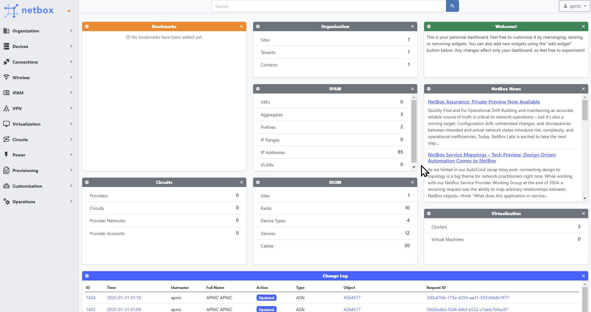

As you can see, the main page is organised into multiple panels for Organization, DCIM, IPAM, Circuits and others. 
Inside each panel, there are sub-categories, such as: Sites and Tenants for Organization; Racks, Devices and Connections 
(Cables, Interfaces, Console, Power) under DCIM, or VRFs, Aggregates, Prefixes, IP Addresses, and VLANs under IPAM, etc.
You can click on any of these to visualise the entities; for example, let's have a look at sites:

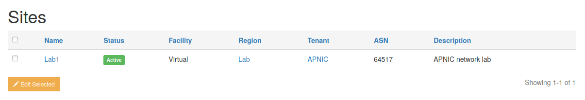

Here we see there's only one site, named _Lab1_. Usually, at this level, we see a list of sites and brief details about 
them. To see more details, we can click on the site name to open a full view page:

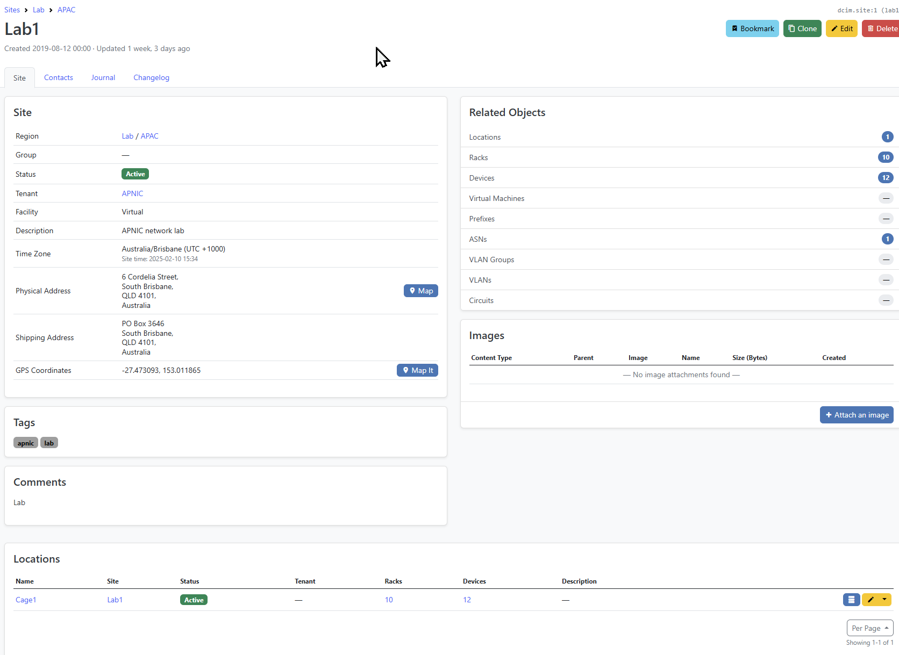

Here we can visualise and edit all the details of the _Lab1_ site, such as Region, Tenant, Address, etc. On the right 
hand side of the screen, there are also some data center information about this site, such as: devices, racks, rack groups and other data.


Let's have a look at the Rack Groups: there's a cage named _Cage1_ consisting of 10 racks:

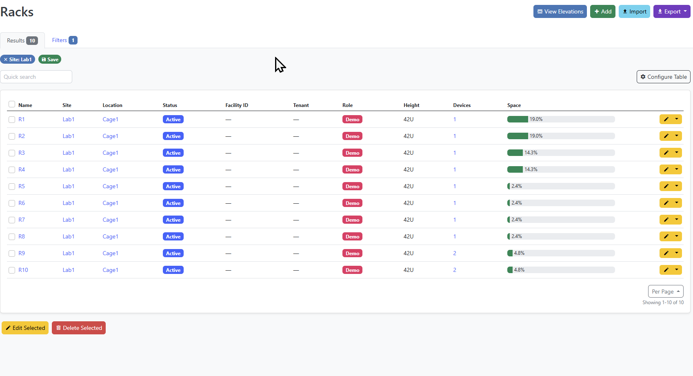

For each rack in this cage we can see its location, status, height, role, how many devices are mounted, and the 
utilization percentage (based on the total height of each device). Let's go back to the _Lab1_ site page, and have 
a look at the _Rack Group_ panel - there's another small button next to _Cage1_ where it says "View elevations". This is 
another way to see the racks in the cage, visually:

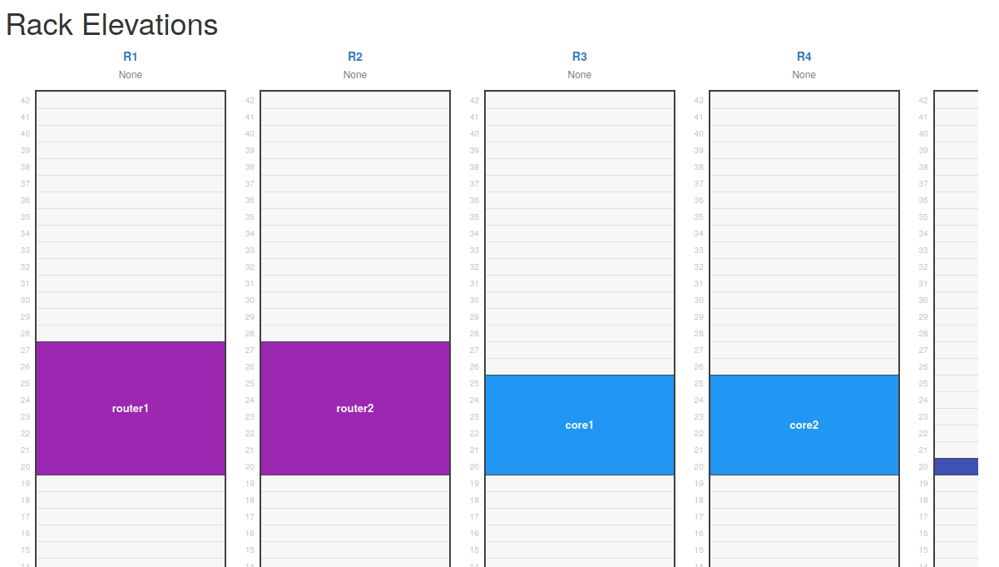

Each rack details can also be inspected individually, by clicking on the name. Inside each rack, we also see every 
device mounted, and we can click on the device to see its details as well. For example, let's have a look at `router1`:

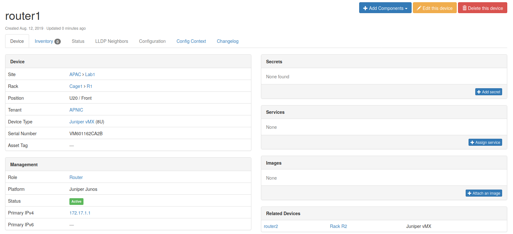

Here we can see and edit the information about this device: site, rack, rack position, tenant, device type, serial
number, role, platform, status, primary IPv4 and IPv6 addresses and so on. We also have the possibility to attach 
images, or secrets. Along the top menu we can see a tab for interfaces

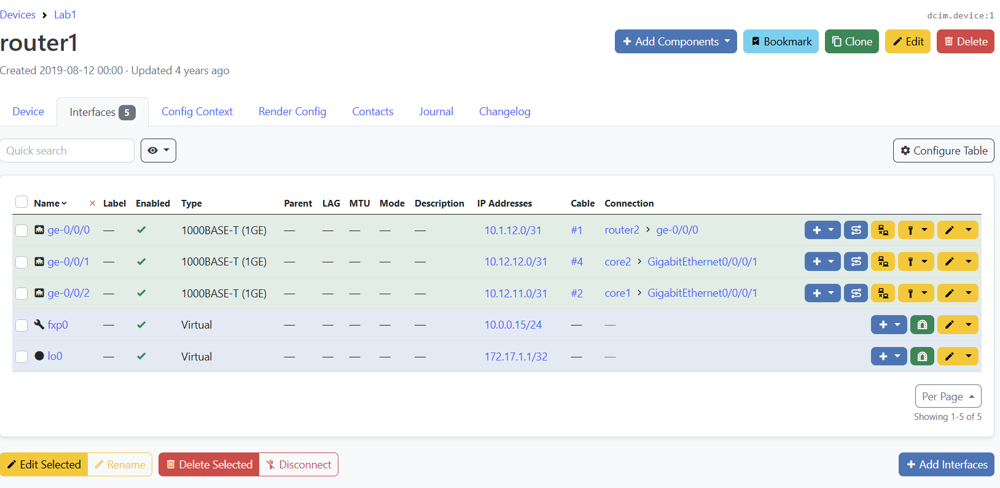

`router1` has a total of 5 interfaces: 3 Gigabit Ethernet `ge-0/0/0` ... `ge-0/0/2`, plus the management interface 
`fpx1` and `lo0` for loopback. Notice that the representation of each of these shows visually its role. An interface can 
be connected to another interface of a peer device, and this is shown in the connection details (i.e., termination 
interface name and termination device). Each connection is represented through a cable, and can be seen if we click on 
the cable ID, for example `#1`:

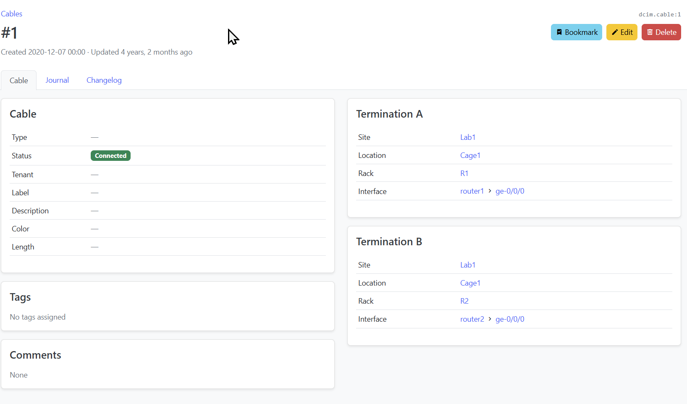

In the same way we can navigate and inspect `router2`, `core1`, `core2`, and so on. For example, the interfaces and 
their connections and IP addresses on `core2`:


Besides the DCIM part, NetBox is also an IPAM. We've seen already that the interfaces had IP addresses. These were 
allocated from two prefixes from the private RFC 1918 pools `10.0.0.0/8` and `172.17.0.0/16`. From the Left hand Menu, 
select _IPAM_ then _Prefixes_ to see them:

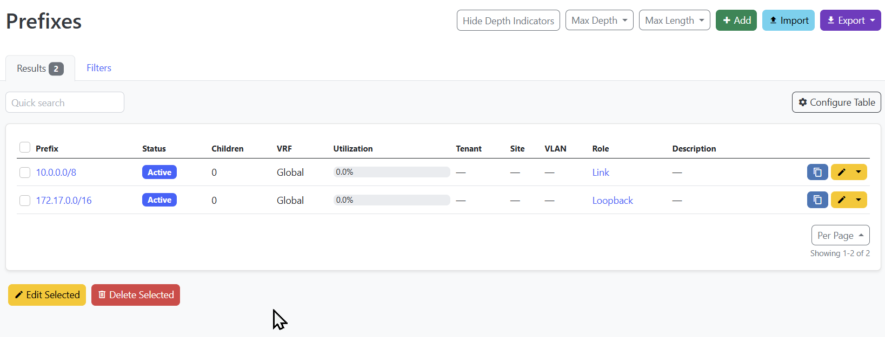

We can notice here that `10.0.0.0/8` has been allocated for _Link_ roles (i.e., connections between devices), and 
`172.17.0.0/16` for _Loopback_. Click, for example, on `172.17.0.0/16`:

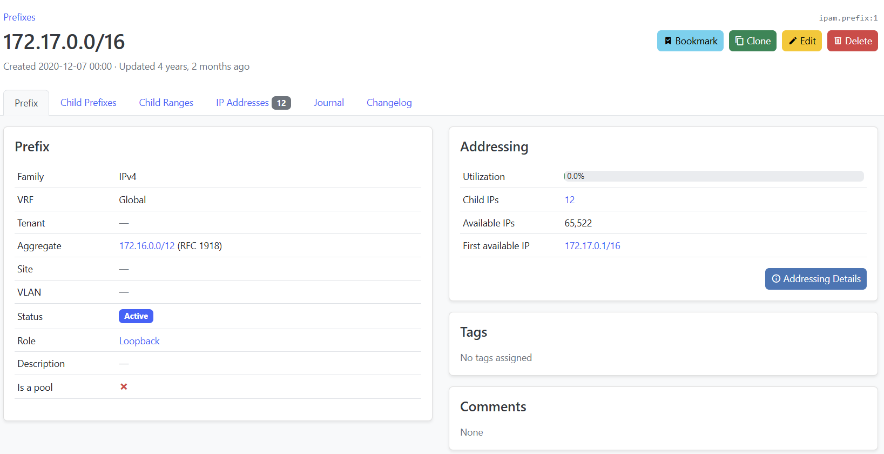

Under the _IP Addresses_ tab, it says that there are 12 individual IP addresses from this prefix:

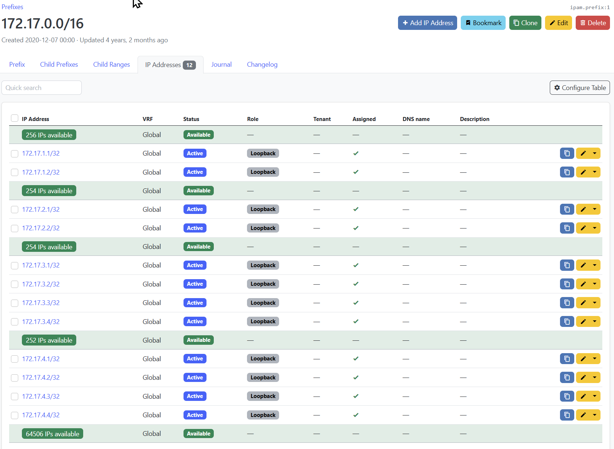

Here we see the IP addresses allocated to the `lo0` and `Loopback0` interfaces, on each device in the topology.

NetBox has **many** more components to be explored, we've only touched the surface so far. One other important element 
is the API. NetBox comes with a read-write API that allows you to gather details and update or delete them 
programatically. From the browser, you can see the API responses (for GET type HTTP requests), by appending `/api` to 
the URL. The base API URL for `group00` is: http://group00.labs.apnictraining.net:8050/api/.

To see what the API would respond to one specific element, we similarly have to just insert `/api` at the root of the 
URL -- for example, if we were looking at the details of `router`, at 
http://group00.labs.apnictraining.net:8050/dcim/devices/1/, the API response can be seen at 
http://group00.labs.apnictraining.net:8050/api/dcim/devices/1/:


```json

{
    "id": 1,
    "name": "router1",
    "display_name": "router1",
    "device_type": {
        "id": 1,
        "url": "http://group00.labs.apnictraining.net:8050/api/dcim/device-types/1/",
        "manufacturer": {
            "id": 5,
            "url": "http://group00.labs.apnictraining.net:8050/api/dcim/manufacturers/5/",
            "name": "Juniper",
            "slug": "juniper"
        },
        "model": "vMX",
        "slug": "vmx",
        "display_name": "Juniper vMX"
    },
    "device_role": {
        "id": 7,
        "url": "http://group00.labs.apnictraining.net:8050/api/dcim/device-roles/7/",
        "name": "Router",
        "slug": "router"
    },
    "tenant": {
        "id": 1,
        "url": "http://group00.labs.apnictraining.net:8050/api/tenancy/tenants/1/",
        "name": "APNIC",
        "slug": "apnic"
    },
    "platform": {
        "id": 3,
        "url": "http://group00.labs.apnictraining.net:8050/api/dcim/platforms/3/",
        "name": "Juniper Junos",
        "slug": "juniper-junos"
    },
    "serial": "VM601162CA2B",
    "asset_tag": null,
    "site": {
        "id": 1,
        "url": "http://group00.labs.apnictraining.net:8050/api/dcim/sites/1/",
        "name": "Lab1",
        "slug": "lab1"
    },
    "rack": {
        "id": 1,
        "url": "http://group00.labs.apnictraining.net:8050/api/dcim/racks/1/",
        "name": "R1",
        "display_name": "R1"
    },
    "position": 20,
    "face": {
        "value": 0,
        "label": "Front"
    },
    "parent_device": null,
    "status": {
        "value": 1,
        "label": "Active"
    },
    "primary_ip": {
        "id": 2,
        "url": "http://group00.labs.apnictraining.net:8050/api/ipam/ip-addresses/2/",
        "family": 4,
        "address": "172.17.1.1/32"
    },
    "primary_ip4": {
        "id": 2,
        "url": "http://group00.labs.apnictraining.net:8050/api/ipam/ip-addresses/2/",
        "family": 4,
        "address": "172.17.1.1/32"
    },
    "primary_ip6": null,
    "cluster": null,
    "virtual_chassis": null,
    "vc_position": null,
    "vc_priority": null,
    "comments": "",
    "local_context_data": null,
    "tags": [],
    "custom_fields": {},
    "config_context": {},
    "created": "2019-08-12",
    "last_updated": "2021-01-29T13:42:19.668741Z"
}
```

We can query this from the command line using `curl` and `jq`.<BR>
First we will install `jq`

```bash
apt update
apt install jq
```
Then we will set a Variable for our API Token (we will talk more about this in the next section).

```bash
TOKEN=59f538de888a4347f70554efc19c649defb9c7da
```

Then we can run our query:

```bash
 curl -H "Authorization: Token $TOKEN" http://group00.labs.apnictraining.net:8050/api/dcim/devices/1/ | jq .
 ```


```
root@salt:~# curl -H "Authorization: Token $TOKEN"  http://group00.labs.apnictraining.net:8050/api/dcim/devices/1/ | jq .
  % Total    % Received % Xferd  Average Speed   Time    Time     Time  Current
                                 Dload  Upload   Total   Spent    Left  Speed
100  2481  100  2481    0     0   9691      0 --:--:-- --:--:-- --:--:--  9729
{
  "id": 1,
  "url": "http://group00.labs.apnictraining.net:8050/api/dcim/devices/1/",
  "display": "router1",
  "name": "router1",
  "device_type": {
    "id": 1,
    "url": "http://group00.labs.apnictraining.net:8050/api/dcim/device-types/1/",
    "display": "vMX",
    "manufacturer": {
      "id": 5,
      "url": "http://group00.labs.apnictraining.net:8050/api/dcim/manufacturers/5/",
      "display": "Juniper",
      "name": "Juniper",
      "slug": "juniper"
    },
    "model": "vMX",
    "slug": "vmx"
  },
  "role": {
    "id": 7,
    "url": "http://group00.labs.apnictraining.net:8050/api/dcim/device-roles/7/",
    "display": "Router",
    "name": "Router",
    "slug": "router"
  },
  "device_role": {
    "id": 7,
    "url": "http://group00.labs.apnictraining.net:8050/api/dcim/device-roles/7/",
    "display": "Router",
    "name": "Router",
    "slug": "router"
  },
  "tenant": {
    "id": 1,
    "url": "http://group00.labs.apnictraining.net:8050/api/tenancy/tenants/1/",
    "display": "APNIC",
    "name": "APNIC",
    "slug": "apnic"
  },
  "platform": {
    "id": 3,
    "url": "http://group00.labs.apnictraining.net:8050/api/dcim/platforms/3/",
    "display": "Juniper Junos",
    "name": "Juniper Junos",
    "slug": "juniper-junos"
  },
  "serial": "",
  "asset_tag": null,
  "site": {
    "id": 1,
    "url": "http://group00.labs.apnictraining.net:8050/api/dcim/sites/1/",
    "display": "Lab1",
    "name": "Lab1",
    "slug": "lab1"
  },
  "location": {
    "id": 1,
    "url": "http://group00.labs.apnictraining.net:8050/api/dcim/locations/1/",
    "display": "Cage1",
    "name": "Cage1",
    "slug": "cage1",
    "_depth": 0
  },
  "rack": {
    "id": 1,
    "url": "http://group00.labs.apnictraining.net:8050/api/dcim/racks/1/",
    "display": "R1",
    "name": "R1"
  },
  "position": 20,
  "face": {
    "value": "front",
    "label": "Front"
  },
  "latitude": null,
  "longitude": null,
  "parent_device": null,
  "status": {
    "value": "active",
    "label": "Active"
  },
  "airflow": null,
  "primary_ip": {
    "id": 2,
    "url": "http://group00.labs.apnictraining.net:8050/api/ipam/ip-addresses/2/",
    "display": "172.17.1.1/32",
    "family": 4,
    "address": "172.17.1.1/32"
  },
  "primary_ip4": {
    "id": 2,
    "url": "http://group00.labs.apnictraining.net:8050/api/ipam/ip-addresses/2/",
    "display": "172.17.1.1/32",
    "family": 4,
    "address": "172.17.1.1/32"
  },
  "primary_ip6": null,
  "oob_ip": null,
  "cluster": null,
  "virtual_chassis": null,
  "vc_position": null,
  "vc_priority": null,
  "description": "",
  "comments": "",
  "config_template": null,
  "config_context": {},
  "local_context_data": null,
  "tags": [],
  "custom_fields": {},
  "created": "2019-08-12T00:00:00Z",
  "last_updated": "2021-01-29T13:42:19.668741Z",
  "console_port_count": 0,
  "console_server_port_count": 0,
  "power_port_count": 0,
  "power_outlet_count": 0,
  "interface_count": 5,
  "front_port_count": 0,
  "rear_port_count": 0,
  "device_bay_count": 0,
  "module_bay_count": 0,
  "inventory_item_count": 0
}
```

Here we notice several details we've seen in the web interface. But the interfaces are missing. This is because the 
interfaces are organised under a separate NetBox endpoint (however still under the DCIM app): 
http://group00.labs.apnictraining.net:8050/api/dcim/interfaces/?device=router1:

```bash
root@salt:~# curl -H "Authorization: Token $TOKEN" http://group00.labs.apnictraining.net:8050/api/dcim/interfaces/?device=router1 | jq .
  % Total    % Received % Xferd  Average Speed   Time    Time     Time  Current
                                 Dload  Upload   Total   Spent    Left  Speed
100  7735  100  7735    0     0  24944      0 --:--:-- --:--:-- --:--:-- 24951
{
  "count": 5,
  "next": null,
  "previous": null,
  "results": [
    {
      "id": 262,
      "url": "http://group00.labs.apnictraining.net:8050/api/dcim/interfaces/262/",
      "display": "ge-0/0/0",
      "device": {
        "id": 1,
        "url": "http://group00.labs.apnictraining.net:8050/api/dcim/devices/1/",
        "display": "router1",
        "name": "router1"
      },
      "vdcs": [],
      "module": null,
      "name": "ge-0/0/0",
      "label": "",
      "type": {
        "value": "1000base-t",
        "label": "1000BASE-T (1GE)"
      },
      "enabled": true,
      "parent": null,
      "bridge": null,
      "lag": null,
      "mtu": null,
      "mac_address": null,
      "speed": null,
      "duplex": null,
      "wwn": null,
      "mgmt_only": false,
      "description": "",
      "mode": null,
      "rf_role": null,
      "rf_channel": null,
      "poe_mode": null,
      "poe_type": null,
      "rf_channel_frequency": null,
      "rf_channel_width": null,
      "tx_power": null,
      "untagged_vlan": null,
      "tagged_vlans": [],
      "mark_connected": false,
      "cable": {
        "id": 1,
        "url": "http://group00.labs.apnictraining.net:8050/api/dcim/cables/1/",
        "display": "#1",
        "label": ""
      },
      "cable_end": "A",
      "wireless_link": null,
      "link_peers": [
        {
          "id": 359,
          "url": "http://group00.labs.apnictraining.net:8050/api/dcim/interfaces/359/",
          "display": "ge-0/0/0",
          "device": {
            "id": 2,
            "url": "http://group00.labs.apnictraining.net:8050/api/dcim/devices/2/",
            "display": "router2",
            "name": "router2"
          },
          "name": "ge-0/0/0",
          "cable": 1,
          "_occupied": true
        }
      ],
      "link_peers_type": "dcim.interface",
      "wireless_lans": [],
      "vrf": null,
      "l2vpn_termination": null,
      "connected_endpoints": [
        {
          "id": 359,
          "url": "http://group00.labs.apnictraining.net:8050/api/dcim/interfaces/359/",
          "display": "ge-0/0/0",
          "device": {
            "id": 2,
            "url": "http://group00.labs.apnictraining.net:8050/api/dcim/devices/2/",
            "display": "router2",
            "name": "router2"
          },
          "name": "ge-0/0/0",
          "cable": 1,
          "_occupied": true
        }
      ],
      "connected_endpoints_type": "dcim.interface",
      "connected_endpoints_reachable": true,
      "tags": [],
      "custom_fields": {},
      "created": "2025-01-30T00:00:00Z",
      "last_updated": "2025-01-30T05:47:01.424707Z",
      "count_ipaddresses": 1,
      "count_fhrp_groups": 0,
      "_occupied": true
    },

    --------- SNIP ------

    {
      "id": 264,
      "url": "http://group00.labs.apnictraining.net:8050/api/dcim/interfaces/264/",
      "display": "ge-0/0/1",
      "device": {
        "id": 1,
        "url": "http://group00.labs.apnictraining.net:8050/api/dcim/devices/1/",
        "display": "router1",
        "name": "router1"

      "id": 357,
      "url": "http://group00.labs.apnictraining.net:8050/api/dcim/interfaces/357/",
      "display": "lo0",
      "device": {
        "id": 1,
        "url": "http://group00.labs.apnictraining.net:8050/api/dcim/devices/1/",
        "display": "router1",
        "name": "router1"
      },
      "vdcs": [],
      "module": null,
      "name": "lo0",
      "label": "",
      "type": {
        "value": "virtual",
        "label": "Virtual"
      },
      "enabled": true,
      "parent": null,
      "bridge": null,
      "lag": null,
      "mtu": null,
      "mac_address": null,
      "speed": null,
      "duplex": null,
      "wwn": null,
      "mgmt_only": false,
      "description": "",
      "mode": null,
      "rf_role": null,
      "rf_channel": null,
      "poe_mode": null,
      "poe_type": null,
      "rf_channel_frequency": null,
      "rf_channel_width": null,
      "tx_power": null,
      "untagged_vlan": null,
      "tagged_vlans": [],
      "mark_connected": false,
      "cable": null,
      "cable_end": "",
      "wireless_link": null,
      "link_peers": [],
      "link_peers_type": null,
      "wireless_lans": [],
      "vrf": null,
      "l2vpn_termination": null,
      "connected_endpoints": null,
      "connected_endpoints_type": null,
      "connected_endpoints_reachable": null,
      "tags": [],
      "custom_fields": {},
      "created": "2025-01-30T00:00:00Z",
      "last_updated": "2025-01-30T05:47:01.424707Z",
      "count_ipaddresses": 1,
      "count_fhrp_groups": 0,
      "_occupied": false
    }
  ]
}
```

This provides the interface details, and connections, but there's still some important information missing: IP 
addresses. As we've seen previously, IP addresses belong to the IPAM app. The API URL (for the IP addresses of 
`router1`) is: http://group00.labs.apnictraining.net:8050/api/ipam/ip-addresses/?device=router1:

```json
{
    "count": 5,
    "next": null,
    "previous": null,
    "results": [
        {
            "id": 3,
            "family": {
                "value": 4,
                "label": "IPv4"
            },
            "address": "10.0.0.15/24",
            "vrf": null,
            "tenant": null,
            "status": {
                "value": 1,
                "label": "Active"
            },
            "role": null,
            "interface": {
                "id": 261,
                "url": "http://group00.labs.apnictraining.net:8050/api/dcim/interfaces/261/",
                "device": {
                    "id": 1,
                    "url": "http://group00.labs.apnictraining.net:8050/api/dcim/devices/1/",
                    "name": "router1",
                    "display_name": "router1"
                },
                "virtual_machine": null,
                "name": "fxp0"
            },
            "description": "",
            "nat_inside": null,
            "nat_outside": null,
            "tags": [],
            "custom_fields": {},
            "created": "2020-12-07",
            "last_updated": "2020-12-07T17:10:17.298216Z"
        },
        {
            "id": 5,
            "family": {
                "value": 4,
                "label": "IPv4"
            },
            "address": "10.1.12.0/31",
            "vrf": null,
            "tenant": null,
            "status": {
                "value": 1,
                "label": "Active"
            },
            "role": null,
            "interface": {
                "id": 262,
                "url": "http://group00.labs.apnictraining.net:8050/api/dcim/interfaces/262/",
                "device": {
                    "id": 1,
                    "url": "http://group00.labs.apnictraining.net:8050/api/dcim/devices/1/",
                    "name": "router1",
                    "display_name": "router1"
                },
                "virtual_machine": null,
                "name": "ge-0/0/0"
            },
            "description": "",
            "nat_inside": null,
            "nat_outside": null,
            "tags": [],
            "custom_fields": {},
            "created": "2020-12-07",
            "last_updated": "2020-12-07T17:13:49.249596Z"
        },
        {
            "id": 7,
            "family": {
                "value": 4,
                "label": "IPv4"
            },
            "address": "10.12.11.0/31",
            "vrf": null,
            "tenant": null,
            "status": {
                "value": 1,
                "label": "Active"
            },
            "role": null,
            "interface": {
                "id": 263,
                "url": "http://group00.labs.apnictraining.net:8050/api/dcim/interfaces/263/",
                "device": {
                    "id": 1,
                    "url": "http://group00.labs.apnictraining.net:8050/api/dcim/devices/1/",
                    "name": "router1",
                    "display_name": "router1"
                },
                "virtual_machine": null,
                "name": "ge-0/0/1"
            },
            "description": "",
            "nat_inside": null,
            "nat_outside": null,
            "tags": [],
            "custom_fields": {},
            "created": "2020-12-07",
            "last_updated": "2020-12-07T17:22:49.400427Z"
        },
        {
            "id": 8,
            "family": {
                "value": 4,
                "label": "IPv4"
            },
            "address": "10.12.12.0/31",
            "vrf": null,
            "tenant": null,
            "status": {
                "value": 1,
                "label": "Active"
            },
            "role": null,
            "interface": {
                "id": 264,
                "url": "http://group00.labs.apnictraining.net:8050/api/dcim/interfaces/264/",
                "device": {
                    "id": 1,
                    "url": "http://group00.labs.apnictraining.net:8050/api/dcim/devices/1/",
                    "name": "router1",
                    "display_name": "router1"
                },
                "virtual_machine": null,
                "name": "ge-0/0/2"
            },
            "description": "",
            "nat_inside": null,
            "nat_outside": null,
            "tags": [],
            "custom_fields": {},
            "created": "2020-12-07",
            "last_updated": "2020-12-07T17:23:05.358440Z"
        },
        {
            "id": 2,
            "family": {
                "value": 4,
                "label": "IPv4"
            },
            "address": "172.17.1.1/32",
            "vrf": null,
            "tenant": null,
            "status": {
                "value": 1,
                "label": "Active"
            },
            "role": {
                "value": 10,
                "label": "Loopback"
            },
            "interface": {
                "id": 357,
                "url": "http://group00.labs.apnictraining.net:8050/api/dcim/interfaces/357/",
                "device": {
                    "id": 1,
                    "url": "http://group00.labs.apnictraining.net:8050/api/dcim/devices/1/",
                    "name": "router1",
                    "display_name": "router1"
                },
                "virtual_machine": null,
                "name": "lo0"
            },
            "description": "",
            "nat_inside": null,
            "nat_outside": null,
            "tags": [],
            "custom_fields": {},
            "created": "2020-12-07",
            "last_updated": "2020-12-07T22:51:13.217785Z"
        }
    ]
}
```

This is a very high level overview of how you can navigate through the NetBox API and explore the apps and their 
endpoints to find the data. It may not always be obvious where to look, but the API comes with an automatically 
generated documentation: http://group00.labs.apnictraining.net:8050/api/docs/ where you can find out more details about every 
possible HTTP request you can make through the API.

## Part-3: Using NetBox to populate device information

Salt comes with an External Pillar module for NetBox which can be used to populate device data for each device, and make 
it available as Pillar.

Enabling it is very simple, under the same `ext_pillar` configuration option, provide the address URL where NetBox is 
found, as well as a token for authentication:

```bash
 cat /etc/salt/master | grep -A 5 ext_pillar
 ```

```yaml
ext_pillar:
  - http_json:
      url: http://http_api:8888/
  - netbox:
      api_url: http://netbox:8080/api
      api_token: 59f538de888a4347f70554efc19c649defb9c7da
```

The URL in this case is `http://netbox:8080/api`, as this is where NetBox can be found internally 
(http://group00.labs.apnictraining.net:8050/api would also work, but would have been host-specific, while 
http://netbox:8080/api is the same on every machine). The `api_token` is a generated key which can be used to 
authenticate the HTTP API requests. This is per-user based, and can be managed at 
http://group00.labs.apnictraining.net:8050/user/api-tokens/ (This can also be found under the top Right User Menu under API Tokens):

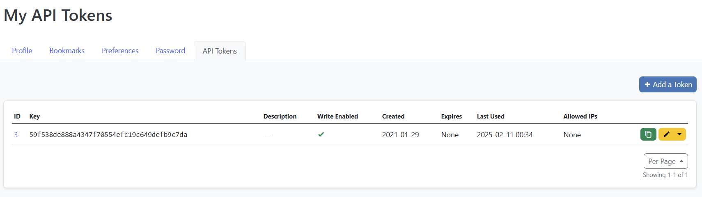

Not every user can view, add, or edit tokens: every user has a specific rights level, and, implicitly the token inherits 
the rights of the user.

Using the `netbox` External Pillar model, the device and site details are available in the Pillar, for each device, 
under the `netbox` Pillar key:

```bash
salt router1 pillar.get netbox
```

```bash
root@salt:~# salt router1 pillar.get netbox
router1:
    ----------
    asset_tag:
        None
    cluster:
        None
    comments:
    created:
        2019-08-12
    custom_fields:
        ----------
    device_role:
        ----------
        id:
            7
        name:
            Router
        slug:
            router
        url:
            http://netbox:8001/api/dcim/device-roles/7/
    device_type:
        ----------
        display_name:
            Juniper vMX
        id:
            1
        manufacturer:
            ----------
            id:
                5
            name:
                Juniper
            slug:
                juniper
            url:
                http://netbox:8001/api/dcim/manufacturers/5/
        model:
            vMX
        slug:
            vmx
        url:
            http://netbox:8001/api/dcim/device-types/1/
    display_name:
        router1
    face:
        ----------
        label:
            Front
        value:
            0
    id:
        1
    last_updated:
        2021-01-29T13:42:19.668741Z
    local_context_data:
        None
    name:
        router1
    parent_device:
        None
    platform:
        ----------
        id:
            3
        name:
            Juniper Junos
        slug:
            juniper-junos
        url:
            http://netbox:8001/api/dcim/platforms/3/
    position:
        20
    primary_ip:
        ----------
        address:
            172.17.1.1/32
        family:
            4
        id:
            2
        url:
            http://netbox:8001/api/ipam/ip-addresses/2/
    primary_ip4:
        ----------
        address:
            172.17.1.1/32
        family:
            4
        id:
            2
        url:
            http://netbox:8001/api/ipam/ip-addresses/2/
    primary_ip6:
        None
    rack:
        ----------
        display_name:
            R1
        id:
            1
        name:
            R1
        url:
            http://netbox:8001/api/dcim/racks/1/
    serial:
        VM601162CA2B
    site:
        ----------
        asn:
            64517
        comments:
        contact_email:
            helpdesk@apnic.net
        contact_name:
        contact_phone:
            +61 7 3858 3100
        count_circuits:
            0
        count_devices:
            12
        count_prefixes:
            0
        count_racks:
            10
        count_vlans:
            0
        created:
            2019-08-12
        custom_fields:
            ----------
        description:
            APNIC network lab
        facility:
            Virtual
        id:
            1
        last_updated:
            2021-01-29T13:23:40.398134Z
        latitude:
            -27.473093
        longitude:
            153.011865
        name:
            Lab1
        physical_address:
            6 Cordelia Street,
            South Brisbane,
            QLD 4101,
            Australia
        prefixes:
        region:
            ----------
            id:
                1
            name:
                APAC
            slug:
                apac
            url:
                http://netbox:8001/api/dcim/regions/1/
        shipping_address:
            PO Box 3646
            South Brisbane,
            QLD 4101,
            Australia
        slug:
            lab1
        status:
            ----------
            label:
                Active
            value:
                1
        tags:
            - apnic
            - lab
        tenant:
            ----------
            id:
                1
            name:
                APNIC
            slug:
                apnic
            url:
                http://netbox:8001/api/tenancy/tenants/1/
        time_zone:
            Australia/Brisbane
    status:
        ----------
        label:
            Active
        value:
            1
    tags:
    tenant:
        ----------
        id:
            1
        name:
            APNIC
        slug:
            apnic
        url:
            http://netbox:8001/api/tenancy/tenants/1/
    vc_position:
        None
    vc_priority:
        None
    virtual_chassis:
        None
```


This structure provides the details we've seen previously when retrieving information from the NetBox API, for the 
device itself, as well as site data. This can be used in various other Salt contexts, for example targeting:

- Target the devices with the role `Router`:

```bash
salt -I netbox:device_role:name:Router test.ping
```

```bash
root@salt:~# salt -I netbox:device_role:name:Router test.ping
router1:
    True
router2:
    True
```

- Devices in Rack `R9`:
```bash
salt -I netbox:rack:name:R9 test.ping
```

```bash
root@salt:~# salt -I netbox:rack:name:R9 test.ping
leaf1:
    True
leaf2:
    True
```

Find out which device has a specific primary IP address:

```bash
salt -I netbox:primary_ip:address:172.17.3.1/32 --preview
```

```bash
root@salt:~# salt -I netbox:primary_ip:address:172.17.3.1/32 --preview
- spine1
```

And so on, the list of possibilities can be open ended.

We are also able to use this data in Jinja templates, or SLS files, for example generate the MOTD: let's consider the 
following template (_This template does not exist yet_):

`/srv/salt/templates/motd.jinja`

```bash 
cat <<EOR> /srv/salt/templates/motd.jinja

set system login message "This device is property of {{ pillar.netbox.site.tenant.name }}"
set system login announcement "Location: {{ pillar.netbox.site.physical_address.replace('\n', ' ').replace('\r', '') }}\n"

banner login
"This device is property of {{ pillar.netbox.site.tenant.name }}"
EOF
banner motd
"Location: {{ pillar.netbox.site.physical_address.replace('\n', ' ').replace('\r', '') }}\n"
EOF

banner login "This device is property of {{ pillar.netbox.site.tenant.name }}"
banner motd "Location: {{ pillar.netbox.site.physical_address.replace('\n', ' ').replace('\r', '') }}\n"

EOR
```

This simple template covers the login and MOTD banners for all the platforms in the topology, with the syntax specifics. 
The NetBox data is referenced from the Pillar: `pillar.netbox.site.tenant.name` references the site tenant name (check 
the value by running `salt \* pillar.get netbox:site:tenant:name`).

Now, do a test deploy of the changes the changes:

```bash
salt \* net.load_template salt://templates/motd.jinja test=true
```

```bash
root@salt:~# salt \* net.load_template salt://templates/motd.jinja test=true
spine4:
    ----------
    already_configured:
        False
    comment:
        Configuration discarded.
    diff:
        +banner login
        +"This device is property of APNIC"
        +EOF
        +banner motd
        +"Location: 6 Cordelia Street, South Brisbane, QLD 4101, Australia\n"
        +EOF
    loaded_config:
    result:
        True
spine3:
    ----------
    already_configured:
        False
    comment:
        Configuration discarded.
    diff:
        +banner login
        +"This device is property of APNIC"
        +EOF
        +banner motd
        +"Location: 6 Cordelia Street, South Brisbane, QLD 4101, Australia\n"
        +EOF
    loaded_config:
    result:
        True
spine2:
    ----------
    already_configured:
        False
    comment:
        Configuration discarded.
    diff:
        +banner login
        +"This device is property of APNIC"
        +EOF
        +banner motd
        +"Location: 6 Cordelia Street, South Brisbane, QLD 4101, Australia\n"
        +EOF
    loaded_config:
    result:
        True
spine1:
    ----------
    already_configured:
        False
    comment:
        Configuration discarded.
    diff:
        +banner login
        +"This device is property of APNIC"
        +EOF
        +banner motd
        +"Location: 6 Cordelia Street, South Brisbane, QLD 4101, Australia\n"
        +EOF
    loaded_config:
    result:
        True
core2:
    ----------
    already_configured:
        False
    comment:
        Configuration discarded.
    diff:
        ---
        +++
        @@ -1,5 +1,6 @@
         !
         hostname core2
        +banner login "This device is property of APNIC"
         interface Loopback0
          ipv4 address 10.4.2.2 255.255.255.255
         !
    loaded_config:
    result:
        True
core1:
    ----------
    already_configured:
        False
    comment:
        Configuration discarded.
    diff:
        ---
        +++
        @@ -1,5 +1,6 @@
         !
         hostname core1
        +banner login "This device is property of APNIC"
         interface Loopback0
          ipv4 address 10.4.2.1 255.255.255.0
         !
    loaded_config:
    result:
        True
router1:
    ----------
    already_configured:
        False
    comment:
        Configuration discarded.
    diff:
        [edit system login]
        +   announcement "Location: 6 Cordelia Street, South Brisbane, QLD 4101, Australia\n";
        +   message "This device is property of APNIC";
    loaded_config:
    result:
        True
router2:
    ----------
    already_configured:
        False
    comment:
        Configuration discarded.
    diff:
        [edit system login]
        +   announcement "Location: 6 Cordelia Street, South Brisbane, QLD 4101, Australia\n";
        +   message "This device is property of APNIC";
    loaded_config:
    result:
        True
leaf1:
    ----------
    already_configured:
        False
    comment:
        Configuration discarded.
    diff:
        +banner login "This device is property of APNIC"
        +banner motd "Location: 6 Cordelia Street, South Brisbane, QLD 4101, Australia\n"
    loaded_config:
    result:
        True
leaf4:
    ----------
    already_configured:
        False
    comment:
        Configuration discarded.
    diff:
        +banner login "This device is property of APNIC"
        +banner motd "Location: 6 Cordelia Street, South Brisbane, QLD 4101, Australia\n"
    loaded_config:
    result:
        True
leaf2:
    ----------
    already_configured:
        False
    comment:
        Configuration discarded.
    diff:
        +banner login "This device is property of APNIC"
        +banner motd "Location: 6 Cordelia Street, South Brisbane, QLD 4101, Australia\n"
    loaded_config:
    result:
        True
leaf3:
    ----------
    already_configured:
        False
    comment:
        Configuration discarded.
    diff:
        +banner login "This device is property of APNIC"
        +banner motd "Location: 6 Cordelia Street, South Brisbane, QLD 4101, Australia\n"
    loaded_config:
    result:
        True
```

**_IF YOU GET ERRORS THESE WILL NEED TO BE RESOLVED FIRST_**

    Some Tips to resolving:
    Try and clear and refresh the pillar data for the erroring device eg for core1:
        
        salt-run cache.clear_pillar 'core1'
        salt core1 saltutil.refresh_pillar
        salt core1 pillar.items netbox
    
    then run your test again.

Once the test succeeds, remove the `test=true` flag and your MOTD banners should be updated.


To see the new banners, let's log into a couple of devices:

```bash
root@salt:~# ssh admin@router1
This device is property of APNIC
Password:
Last login: Thu Feb  4 18:29:16 2021 from 10.0.0.2
--- JUNOS 17.2R1.13 Kernel 64-bit  JNPR-10.3-20170523.350481_build

Location: 6 Cordelia Street, South Brisbane, QLD 4101, Australia
admin@router1>
```

```bash
root@salt:~# ssh admin@spine1
"This device is property of APNIC"
Password:
"Location: 6 Cordelia Street, South Brisbane, QLD 4101, Australia\n"
spine1>
```

## Part-4: Using NetBox as a Roster source for Salt SProxy

NetBox can also be used as a data source to build the list of devices we want to manage. This is particularly useful for 
systems such as Salt SProxy, where Salt needs to be told what devices it should manage. As a reminder, this is named the 
_Roster_ interface.

We have previously had the Roster defined as an SLS file (`roster: file` and with 
`roster_file: /etc/salt/roster` specifying the location of this SLS file). Changing to use a dynamic Roster, it only 
takes the following:

```bash
sed -i -e 's/roster:\ file/roster:\ netbox/g' /etc/salt/master
cat /etc/salt/master`| grep roster
```
```yaml
roster: netbox

```
As we have made a change in our master file, we need to restart the master:

```bash
pkill -9 -e -f salt-master
```

The `roster` option now points to the `netbox` Roster; in addition to this, we also need to provide the URL and the 
token so the Roster knows where to pull the data from.

To verify it is working correctly, run:

```bash
root@salt:~# salt-sproxy \* --preview
- core1
- core2
- leaf1
- leaf2
- leaf3
- leaf4
- router1
- router2
- spine1
- spine2
- spine3
- spine4
```

This returns all the devices we have in NetBox. To confirm these are retrieved from NetBox indeed, we can use the debug 
mode (`-l debug`):

```bash
salt-sproxy \* --preview -l debug
```

```
root@salt:~# salt-sproxy \* --preview -l debug
```

In the debug logs, you should notice the following lines (within many others):

```
[DEBUG   ] Starting new HTTP connection (1): netbox:8001
[DEBUG   ] http://netbox:8080 "GET /api/dcim/devices/ HTTP/1.1" 200 15702

...

[DEBUG   ] The target expression "*" (glob) matched the following:
[DEBUG   ] ['core1', 'core2', 'leaf1', 'leaf2', 'leaf3', 'leaf4', 'router1', 'router2', 'spine1', 'spine2', 'spine3', 'spine4']
```

This shows that the list of devices is retrieved from NetBox as we wanted.

## Part-5: Using NetBox to assist with configuration management.

### DO NOT PROCEED WITH THIS SECTION UNTIL ADVISED BY THE INSTRUCTOR

In previous Labs we have used the state system as well as Jijna templates to perform some simple tasks.<BR>
Lets do something a bit more interesting.  If you check the IP addresses we have assigned in Netbox, you will notice that there are some differences between our running ennvironment and our Source of Truth.  Partiularly the Loopback addresses.

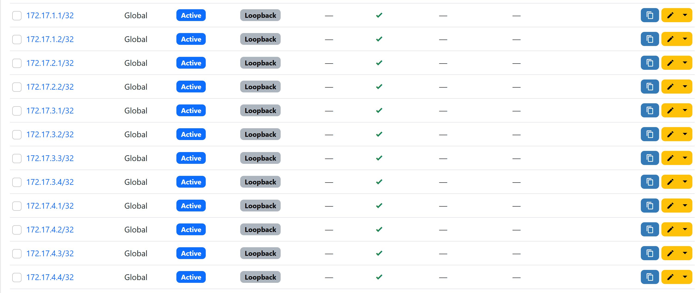

Log into a router and have alook at the IP addresses.

```bash
ssh admin@core1

```

```
RP/0/0/CPU0:core1#sh ip int br
Sun Feb 16 23:12:05.105 UTC

Interface                      IP-Address      Status          Protocol Vrf-Name
Loopback0                      10.4.2.1        Up              Up       default
MgmtEth0/0/CPU0/0              10.0.0.15       Up              Up       default
GigabitEthernet0/0/0/0         10.2.12.0       Up              Up       default
GigabitEthernet0/0/0/1         10.12.11.1      Up              Up       default
GigabitEthernet0/0/0/2         10.12.21.1      Up              Up       default
GigabitEthernet0/0/0/3         10.23.11.0      Up              Up       default
GigabitEthernet0/0/0/4         10.23.12.0      Up              Up       default
GigabitEthernet0/0/0/5         10.23.13.0      Up              Up       default
GigabitEthernet0/0/0/6         10.23.14.0      Up              Up       default
```
We can see that the Loopbacks are currnetly set to come from the `10.4.0.0/16` range

From our Pillar data above, there is some detail missing.  We don't have the interface and IP information as that is held in a different section of Netbox.  

Since Nebox version 3004.X we can now get Interface and IP information from Netbox and extract it as pillar data for the device.

To do this, we will need to edit the `master` file and enable this feature.

```bash
cat /etc/salt/master | grep -A 8 ext_pillar
```

```
root@salt:~# cat /etc/salt/master | grep -A 8 ext_pillar
ext_pillar:
  - http_json:
      url: http://http_api:8888/
  - netbox:
      api_url: http://netbox:8080/api
      api_token: 59f538de888a4347f70554efc19c649defb9c7da
      interfaces: true
      interface_ips: true
```

Your Master file should now look like the above, **IF NOT** please let the instructor know.

(We have removed the comments that were in place for `interfaces` and `interface_ips`)

Let's have a look at the pillar data now

This is an example using `spine1`

```bash
salt spine1 pillar.items
```

```
root@salt:~# salt spine1 pillar.items
spine1:
    ----------
    devices:
        ----------
        core1:
            ----------
            role:
                core
        core2:
            ----------
            role:
                core

       ------ SNIP -------
            
            
            role:
                spine
        spine4:
            ----------
            role:
                spine
    netbox:
        ----------
        airflow:
            None
        asset_tag:
            None
        cluster:
            None
        comments:
        config_context:
            ----------
        config_template:
            None
        console_port_count:
            0
        console_server_port_count:
            0
        created:
            2020-12-07T00:00:00Z
        custom_fields:
            ----------
        description:
        device_bay_count:
            0
        device_role:
            ----------
            display:
                Spine Switch
            id:
                10
            name:
                Spine Switch
            slug:
                spine-switch
            url:
                http://netbox:8080/api/dcim/device-roles/10/
        device_type:
            ----------
            display:
                vEOS
            id:
                3
            manufacturer:
                ----------
                display:
                    Arista
                id:
                    6
                name:
                    Arista
                slug:
                    arista
                url:
                    http://netbox:8080/api/dcim/manufacturers/6/
            model:
                vEOS
            slug:
                veos
            url:
                http://netbox:8080/api/dcim/device-types/3/
        display:
            spine1
        face:
            ----------
            label:
                Front
            value:
                front
        front_port_count:
            0
        id:
            11
        interface_count:
            8
        interfaces:
            |_
              ----------
              _occupied:
                  True
              bridge:
                  None
              cable:
                  ----------
                  display:
                      #8
                  id:
                      8
                  label:
                  url:
                      http://netbox:8080/api/dcim/cables/8/
              cable_end:
                  A
              connected_endpoints:
                  |_
                    ----------
                    _occupied:
                        True
                    cable:
                        8
                    device:
                        ----------
                        display:
                            core1
                        id:
                            3
                        name:
                            core1
                        url:
                            http://netbox:8080/api/dcim/devices/3/
                    display:
                        GigabitEthernet0/0/0/3
                    id:
                        6
                    name:
                        GigabitEthernet0/0/0/3
                    url:
                        http://netbox:8080/api/dcim/interfaces/6/
              connected_endpoints_reachable:
                  True
              connected_endpoints_type:
                  dcim.interface
              count_fhrp_groups:
                  0
              count_ipaddresses:
                  1
              created:
                  2025-01-30T00:00:00Z
              custom_fields:
                  ----------
              description:
              display:
                  Ethernet1/1
              duplex:
                  None
              enabled:
                  True
              id:
                  456
              ip_addresses:
                  |_
                    ----------
                    address:
                        10.23.11.1/31
                    comments:
                    created:
                        2020-12-07T00:00:00Z
                    custom_fields:
                        ----------
                    description:
                    display:
                        10.23.11.1/31
                    dns_name:
                    family:
                        ----------
                        label:
                            IPv4
                        value:
                            4
                    id:
                        38
                    last_updated:
                        2020-12-07T18:13:19.907915Z
                    nat_inside:
                        None
                    nat_outside:
                    role:
                        None
                    status:
                        ----------
                        label:
                            Active
                        value:
                            active
                    tags:
                    tenant:
                        None
                    url:
                        http://netbox:8080/api/ipam/ip-addresses/38/
                    vrf:
                        None
              l2vpn_termination:
                  None
              label:
              lag:
                  None
              last_updated:
                  2025-01-30T05:47:01.424707Z
              link_peers:
                  |_
                    ----------
                    _occupied:
                        True
                    cable:
                        8
                    device:
                        ----------
                        display:
                            core1
                        id:
                            3
                        name:

```

Notice that we now have interface information as well as the IP addresses assigned, any Tags and Roles assigned to those.

In the above format, it can be quite difficult to establish how the data is nested within our Pillar, so lets look at the output as formated JSON.

I recommend looking at a device with a lower connected interface count, such as a `router` or `core` device


```bsah
 salt router1 pillar.items --out=json
```

We can see from the output that our data is structured as:

```
Device Name
 -- Netbox
   -- Interfaces
     -- ip_addresses
```
So we can filter further using `jq`

For this we will need to install jq.

```bash
apt update && apt install -y jq
```


```bash
salt router1 pillar.items --out=json | jq  '.router1.netbox.interfaces[] | {ip_addresses}'
```

```
root@salt:~# salt router1 pillar.items --out=json | jq  '.router1.netbox.interfaces[] | {ip_addresses}'
{
  "ip_addresses": [
    {
      "id": 5,
      "url": "http://netbox:8080/api/ipam/ip-addresses/5/",
      "display": "10.1.12.0/31",
      "family": {
        "value": 4,
        "label": "IPv4"
      },
      "address": "10.1.12.0/31",
      "vrf": null,
      "tenant": null,
      "status": {
        "value": "active",
        "label": "Active"
      },
      "role": null,
      "nat_inside": null,
      "nat_outside": [],
      "dns_name": "",
      "description": "",
      "comments": "",
      "tags": [],
      "custom_fields": {},
      "created": "2020-12-07T00:00:00Z",
      "last_updated": "2020-12-07T17:13:49.249596Z"
    }
  ]
}
{
  "ip_addresses": [
    {
      "id": 8,
      "url": "http://netbox:8080/api/ipam/ip-addresses/8/",
      "display": "10.12.12.0/31",
      "family": {
        "value": 4,
        "label": "IPv4"
      },
      "address": "10.12.12.0/31",
      "vrf": null,
      "tenant": null,
      "status": {
        "value": "active",
        "label": "Active"
      },
      "role": null,
      "nat_inside": null,
      "nat_outside": [],
      "dns_name": "",
      "description": "",
      "comments": "",
      "tags": [],
      "custom_fields": {},
      "created": "2020-12-07T00:00:00Z",
      "last_updated": "2020-12-07T17:23:05.358440Z"
    }
  ]
}
{
  "ip_addresses": [
    {
      "id": 7,
      "url": "http://netbox:8080/api/ipam/ip-addresses/7/",
      "display": "10.12.11.0/31",
      "family": {
        "value": 4,
        "label": "IPv4"
      },
      "address": "10.12.11.0/31",
      "vrf": null,
      "tenant": null,
      "status": {
        "value": "active",
        "label": "Active"
      },
      "role": null,
      "nat_inside": null,
      "nat_outside": [],
      "dns_name": "",
      "description": "",
      "comments": "",
      "tags": [],
      "custom_fields": {},
      "created": "2020-12-07T00:00:00Z",
      "last_updated": "2020-12-07T17:22:49.400427Z"
    }
  ]
}
{
  "ip_addresses": [
    {
      "id": 3,
      "url": "http://netbox:8080/api/ipam/ip-addresses/3/",
      "display": "10.0.0.15/24",
      "family": {
        "value": 4,
        "label": "IPv4"
      },
      "address": "10.0.0.15/24",
      "vrf": null,
      "tenant": null,
      "status": {
        "value": "active",
        "label": "Active"
      },
      "role": null,
      "nat_inside": null,
      "nat_outside": [],
      "dns_name": "",
      "description": "",
      "comments": "",
      "tags": [],
      "custom_fields": {},
      "created": "2020-12-07T00:00:00Z",
      "last_updated": "2020-12-07T17:10:17.298216Z"
    }
  ]
}
{
  "ip_addresses": [
    {
      "id": 2,
      "url": "http://netbox:8080/api/ipam/ip-addresses/2/",
      "display": "172.17.1.1/32",
      "family": {
        "value": 4,
        "label": "IPv4"
      },
      "address": "172.17.1.1/32",
      "vrf": null,
      "tenant": null,
      "status": {
        "value": "active",
        "label": "Active"
      },
      "role": {
        "value": "loopback",
        "label": "Loopback"
      },
      "nat_inside": null,
      "nat_outside": [],
      "dns_name": "",
      "description": "",
      "comments": "",
      "tags": [],
      "custom_fields": {},
      "created": "2020-12-07T00:00:00Z",
      "last_updated": "2020-12-07T22:51:13.217785Z"
    }
  ]
}
```

So Under the `ip_addresses` tree we also have a `role` and `value` key that we can use to establish the IP address of an interface.

We can use this information to create a jinja template that can extract this information, and apply the changes to our devices.

Lets have a look at `/srv/salt/templates/update_loopback.j2`

```bash
cat /srv/salt/templates/update_loopback.j2
```

```







    
        
           
            
        
    





  
interface Loopback0

  ip address {{ ns.loopback_ip.split('/')[0] }} {{ ip_netmask['netmask'] }}
  description Renumbered Loopback Address {{ opts.id }}
  end

  

interface Loopback0
  ipv4 address {{ ns.loopback_ip.split('/')[0] }} {{ ip_netmask['netmask'] }}
  description Renumbered Loopback Address {{opts.id }}

  
interfaces {
  lo0 {
    unit 0 {
      family inet {
        address {{ ns.loopback_ip }};
      }
    }
  }
}

  
interface Loopback0
  ip address {{ ns.loopback_ip }}
  description Renumbered Loopback Address {{ opts.id }}

  
# DEBUG: Unsupported OS for {{ grains['id'] }}
  

# DEBUG: No loopback IP found for {{ grains['id'] }}

```

At first glance this may appear confusing, but lets break it down.<BR>
The first 3 lines are simplay setting some variables.  The `loopback_ip` is being set as a namespace as Python scopes variables in the context of it's loops.

```

    
        
           
            
        
    

```

In the Above, we are itterating over the interfaces.  For each IP address we retrieve, we check to see if the `role.value` combination is `loopback`.  if it is, we store the IP address we have retrieved in the namespace loopback_ip

The next line 
```

```
 
is a salt function that splits the network address out into three values.  

eg:

```bash
salt spine1 network.convert_cidr 172.17.1.1/32
```

```
root@salt:~# salt spine1 network.convert_cidr 172.17.1.1/32
spine1:
    ----------
    broadcast:
        172.17.1.1
    netmask:
        255.255.255.255
    network:
        172.17.1.1
```

we only need the netmask portion, as not all of our routers use CIDR notation (IE Cisco)

We then check to see if we have a value returned in our namespace, compare the OS grains and create the template for the appropriate OS.

The second piece to this puzzle is the state.<BR>
If we look at `/srv/salt/states/update_loopback.sls` 

```bash
cat srv/salt/states/update_loopback.sls
```

```
update_loopback:
  netconfig.managed:
    - template_name: salt://templates/update_loopback.j2
    - debug: True
```
We are using the `netconfig.managed` function and applying our templates.

Lets test against a device:

```bash
salt router1 state.apply states/update_loopback test=true
```

```
root@salt:~# salt router1 state.apply states/update_loopback test=true
router1:
----------
          ID: update_loopback
    Function: netconfig.managed
      Result: None
     Comment: Configuration discarded.

              Configuration diff:

              [edit interfaces lo0 unit 0 family inet]
                      address 10.4.1.1/32 { ... }
              +       address 172.17.1.1/32;

              Loaded config:


              interfaces {
                lo0 {
                  unit 0 {
                    family inet {
                      address 172.17.1.1/32;
                    }
                  }
                }
              }
     Started: 00:25:28.573558
    Duration: 1336.57 ms
     Changes:

Summary for router1
------------
Succeeded: 1 (unchanged=1)
Failed:    0
------------
Total states run:     1
Total run time:   1.337 s
```

We can see the proposed changes.  Test against some other devices and observe the output.  


---

**End of Lab**

---
