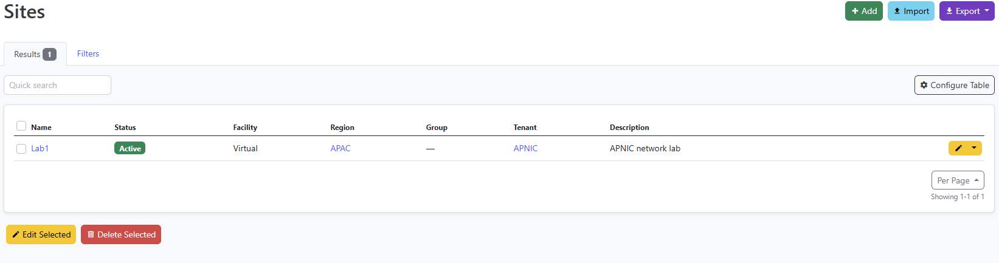
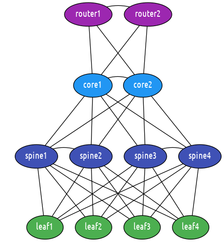
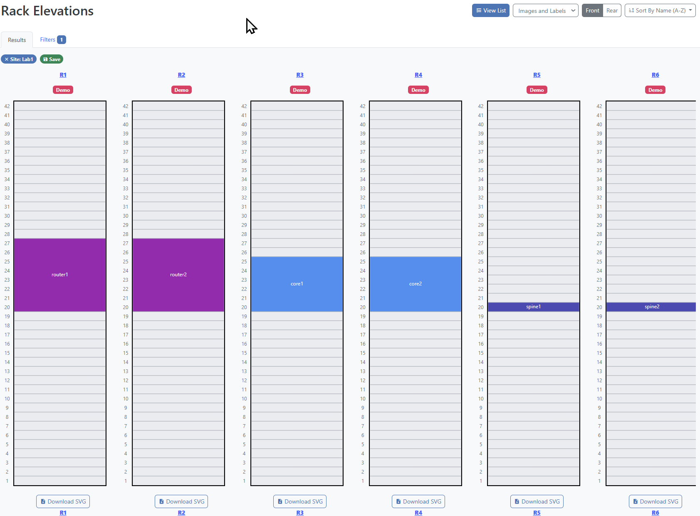
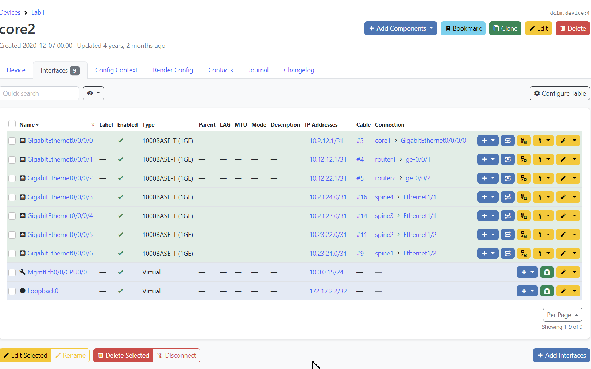

# LAB: Building a device inventory

In this lab, we will be working with external sources of data that we can use to build a device inventory, that give us the list of devices we want to manage with Salt.

All the Proxy Minions are again up and running, and there are two services that we will use:

- An HTTP endpoint that returns the list of devices.
- NetBox, an IPAM (IP Address Management) and DCIM (Data Center Infrastructure Management) tool that we can use to manage the pool of devices, etc.

These two services are already set up and ready to be used.

## Part-1: Using the Salt External Pillars

As we have seen in the previous labs, we can introduce data into Salt, via the Pillar subsystem, as files (in SLS format). While this is very simple to set up and manage, it does raise some scalability and management concerns. One of the most obvious reasons being that the files are physically located on the Salt Master, so if you want to update a file, you need to log into that specific machine and make the changes. This is not very scalable, especially in an environment shared by multiple users.

Using the External Pillar subsystem, Salt is capable to pull data from external systems and make it available for various subsystems. This data can be then be used into the State system, build inventories, generate configuration, simply used for targeting devices, or even used it as input data for authentication, etc.; the possibilities are literally endless. There are many systems you can use to retrieve the data from, and Salt provides the batteries for those; examples include: SQL databases (Postgres, MySQL, SQLite), NoSQL (Redis, Consul, MongoDB), git repositories, Vault, cloud sources (EC2, S3, Azure), HTTP APIs (in JSON or YAML format), or other systems such as NetBox and many others.

For this purpose, we will look into using the `http_json` External Pillar, which queries an API via HTTP, where the data is available in JSON format. At http://group00.labs.apnictraining.net:8888/ there's an API running, and returning a list of devices:

<pre>
{
  "devices": {
    "router1": {
      "role": "router"
    },
    "router2": {
      "role": "router"
    },
    "core1": {
      "role": "core"
    },
    "core2": {
      "role": "core"
    },
    "spine1": {
      "role": "spine"
    },
    "spine2": {
      "role": "spine"
    },
    "spine3": {
      "role": "spine"
    },
    "spine4": {
      "role": "spine"
    },
    "leaf1": {
      "role": "leaf"
    },
    "leaf2": {
      "role": "leaf"
    },
    "leaf3": {
      "role": "leaf"
    },
    "leaf4": {
      "role": "leaf"
    }
  }
}
</pre>

We are already accustomed with this structure, which we've met before, it provides the list of devices we want to manage, and their roles.

Enabling the `http_json` External Pillar is simple: on the Master, this needs to be configured under the `ext_pillar` option:

```bash
grep ext_pillar -A 2 /etc/salt/master
```

<pre>
ext_pillar:
  - http_json:
      url: http://http_api:8888/
</pre>

Notice that the URL referenced is http://http_api:8888/. The port is the same as you've accessed at http://group00.labs.apnictraining.net:8888/ but a little bit different because internally the service is found at `http_api` address.

This is what it needs in order to enable the External Pillar to pull the data from our JSON API. To verify that it's properly configured, we can run:

```bash
salt router1 pillar.get devices
```

<pre>
root@salt:~# salt router1 pillar.get devices
router1:
    ----------
    core1:
        ----------
        role:
            core
    core2:
        ----------
        role:
            core
    leaf1:
        ----------
        role:
            leaf
    leaf2:
        ----------
        role:
            leaf
    leaf3:
        ----------
        role:
            leaf
    leaf4:
        ----------
        role:
            leaf
    router1:
        ----------
        role:
            router
    router2:
        ----------
        role:
            router
    spine1:
        ----------
        role:
            spine
    spine2:
        ----------
        role:
            spine
    spine3:
        ----------
        role:
            spine
    spine4:
        ----------
        role:
            spine
</pre>

As expected, the data from http://group00.labs.apnictraining.net:8888/ (or http://http_api:8888) is there.

With this data, a server such as `srv[1..4]` as we've had in the previous labs would be able to start up the Proxy Minion for the devices returned in that HTTP API.

In the exact same way we can configure other External Pillars. One of them is NetBox, which we'll explore in the next sections.

## Part-2: Introduction to NetBox

NetBox is an open source web application designed to help manage and document computer networks. Initially conceived by the network engineering team at DigitalOcean, NetBox was developed specifically to address the needs of network and infrastructure engineers. It encompasses the following aspects of network management:

- IP address management (IPAM) - IP networks and addresses, VRFs, and VLANs.
- Equipment racks - Organized by group and site.
- Devices - Types of devices and where they are installed.
- Connections - Network, console, and power connections among devices.
- Virtualization - Virtual machines and clusters.
- Data circuits - Long-haul communications circuits and providers.
- Secrets - Encrypted storage of sensitive credentials.

At http://group00.labs.apnictraining.net:8050/ you can find an instance of NetBox running. Click on the top right button to _Log In_, using the following **credentials: apnic / APNIC2021**. This would allow us to visualise information as well as updating. You should now have this view:


As you can see, the main page is organised into multiple panels for Organization, DCIM, IPAM, Circuits and others. 
Inside each panel, there are sub-categories, such as: Sites and Tenants for Organization; Racks, Devices and Connections (Cables, Interfaces, Console, Power) under DCIM, or VRFs, Aggregates, Prefixes, IP Addresses, and VLANs under IPAM, etc. 
You can click on any of these to visualise the entities; for example, let's have a look at sites:



Here we see there's only one site, named _Lab1_. Usually, at this level, we see a list of sites and brief details about them. To see more details, we can click on the site name to open a full view page:


Here we can visualise and edit all the details of the _Lab1_ site, such as Region, Tenant, Address, etc. On the right hand side of the screen, there are also some data center information about this site, such as: devices, racks, rack groups, and topology maps. The topology map is automatically generated based on the data we have provided in NetBox (i.e., devices and cables): http://group00.labs.apnictraining.net:8050/api/extras/topology-maps/1/render/



Let's have a look at the Rack Groups: there's a cage named _Cage1_ consisting of 10 racks:


For each rack in this cage we can see its location, status, height, role, how many devices are mounted, and the utilization percentage (based on the total height of each device). Let's go back to the _Lab1_ site page, and have a look at the _Rack Group_ panel - there's another small button next to _Cage1_ where it says "View elevations". This is another way to see the racks in the cage, visually:



Each rack details can also be inspected individually, by clicking on the name. Inside each rack, we also see every device mounted, and we can click on the device to see its details as well. For example, let's have a look at `router1`:


Here we can see and edit the information about this device: site, rack, rack position, tenant, device type, serial number, role, platform, status, primary IPv4 and IPv6 addresses and so on. We also have the possibility to attach images, or secrets. Underneath, there's a panel where we can see the interfaces of this device:


`router1` has a total of 97 interfaces: 95 Gigabit Ethernet `ge-0/0/0` ... `ge-0/0/94`, plus the management interface `fpx1` and `lo0` for loopback. Notice that the representation of each of these shows visually its role. An interface can be connected to another interface of a peer device, and this is shown in the connection details (i.e., termination interface name and termination device). Each connection is represented through a cable, and can be seen if we click on the cable ID, for example `#1`:


In the same way we can navigate and inspect `router2`, `core1`, `core2`, and so on. For example, the interfaces and their connections and IP addresses on `core2`:



Besides the DCIM part, NetBox is also an IPAM. We've seen already that the interfaces had IP addresses. These were allocated from two prefixes from the private RFC 1918 pools `10.0.0.0/8` and `172.17.0.0/16`. From the top bar menu, select _IPAM_ then _Prefixes_ to see them:


We can notice here that `10.0.0.0/8` has been allocated for _Link_ roles (i.e., connections between devices), and `172.17.0.0/16` for _Loopback_. Click, for example, on `172.17.0.0/16`:


Under the _IP Addresses_ tab, it says that there are 12 individual IP addresses from this prefix:


Here we see the IP addresses allocated to the `lo0` and `Loopback0` interfaces, on each device in the topology.

NetBox has **many** more components to be explored, we've only touched the surface so far. One other important element is the API. NetBox comes with a read-write API that allows you to gather details and update or delete them programatically. From the browser, you can see the API responses (for GET type HTTP requests), by appending `/api` to the URL. The base API URL for `group00` is: http://group00.labs.apnictraining.net:8050/api/.

To see what the API would respond to one specific element, we similarly have to just insert `/api` at the root of the URL -- for example, if we were looking at the details of `router`, at http://group00.labs.apnictraining.net:8050/dcim/devices/1/, the API response can be seen at http://group00.labs.apnictraining.net:8050/api/dcim/devices/1/:


<pre>

{
    "id": 1,
    "name": "router1",
    "display_name": "router1",
    "device_type": {
        "id": 1,
        "url": "http://group00.labs.apnictraining.net:8050/api/dcim/device-types/1/",
        "manufacturer": {
            "id": 5,
            "url": "http://group00.labs.apnictraining.net:8050/api/dcim/manufacturers/5/",
            "name": "Juniper",
            "slug": "juniper"
        },
        "model": "vMX",
        "slug": "vmx",
        "display_name": "Juniper vMX"
    },
    "device_role": {
        "id": 7,
        "url": "http://group00.labs.apnictraining.net:8050/api/dcim/device-roles/7/",
        "name": "Router",
        "slug": "router"
    },
    "tenant": {
        "id": 1,
        "url": "http://group00.labs.apnictraining.net:8050/api/tenancy/tenants/1/",
        "name": "APNIC",
        "slug": "apnic"
    },
    "platform": {
        "id": 3,
        "url": "http://group00.labs.apnictraining.net:8050/api/dcim/platforms/3/",
        "name": "Juniper Junos",
        "slug": "juniper-junos"
    },
    "serial": "VM601162CA2B",
    "asset_tag": null,
    "site": {
        "id": 1,
        "url": "http://group00.labs.apnictraining.net:8050/api/dcim/sites/1/",
        "name": "Lab1",
        "slug": "lab1"
    },
    "rack": {
        "id": 1,
        "url": "http://group00.labs.apnictraining.net:8050/api/dcim/racks/1/",
        "name": "R1",
        "display_name": "R1"
    },
    "position": 20,
    "face": {
        "value": 0,
        "label": "Front"
    },
    "parent_device": null,
    "status": {
        "value": 1,
        "label": "Active"
    },
    "primary_ip": {
        "id": 2,
        "url": "http://group00.labs.apnictraining.net:8050/api/ipam/ip-addresses/2/",
        "family": 4,
        "address": "172.17.1.1/32"
    },
    "primary_ip4": {
        "id": 2,
        "url": "http://group00.labs.apnictraining.net:8050/api/ipam/ip-addresses/2/",
        "family": 4,
        "address": "172.17.1.1/32"
    },
    "primary_ip6": null,
    "cluster": null,
    "virtual_chassis": null,
    "vc_position": null,
    "vc_priority": null,
    "comments": "",
    "local_context_data": null,
    "tags": [],
    "custom_fields": {},
    "config_context": {},
    "created": "2019-08-12",
    "last_updated": "2021-01-29T13:42:19.668741Z"
}
</pre>

From the command line, we can query as:

```bash
curl http://group00.labs.apnictraining.net:8050/api/dcim/devices/1/
```

<pre>
root@salt:~# curl http://group00.labs.apnictraining.net:8050/api/dcim/devices/1/
{"id":1,"name":"router1","display_name":"router1","device_type":{"id":1,"url":"http://group00.labs.apnictraining.net:8050/api/dcim/device-types/1/","manufacturer":{"id":5,"url":"http://group00.labs.apnictraining.net:8050/api/dcim/manufacturers/5/","name":"Juniper","slug":"juniper"},"model":"vMX","slug":"vmx","display_name":"Juniper vMX"},"device_role":{"id":7,"url":"http://group00.labs.apnictraining.net:8050/api/dcim/device-roles/7/","name":"Router","slug":"router"},"tenant":{"id":1,"url":"http://group00.labs.apnictraining.net:8050/api/tenancy/tenants/1/","name":"APNIC","slug":"apnic"},"platform":{"id":3,"url":"http://group00.labs.apnictraining.net:8050/api/dcim/platforms/3/","name":"Juniper Junos","slug":"juniper-junos"},"serial":"VM601162CA2B","asset_tag":null,"site":{"id":1,"url":"http://group00.labs.apnictraining.net:8050/api/dcim/sites/1/","name":"Lab1","slug":"lab1"},"rack":{"id":1,"url":"http://group00.labs.apnictraining.net:8050/api/dcim/racks/1/","name":"R1","display_name":"R1"},"position":20,"face":{"value":0,"label":"Front"},"parent_device":null,"status":{"value":1,"label":"Active"},"primary_ip":{"id":2,"url":"http://group00.labs.apnictraining.net:8050/api/ipam/ip-addresses/2/","family":4,"address":"172.17.1.1/32"},"primary_ip4":{"id":2,"url":"http://group00.labs.apnictraining.net:8050/api/ipam/ip-addresses/2/","family":4,"address":"172.17.1.1/32"},"primary_ip6":null,"cluster":null,"virtual_chassis":null,"vc_position":null,"vc_priority":null,"comments":"","local_context_data":null,"tags":[],"custom_fields":{},"config_context":{},"created":"2019-08-12","last_updated":"2021-01-29T13:42:19.668741Z"}
</pre>

Here we notice several details we've seen in the web interface. But the interfaces are missing. This is because the interfaces are organised under a separate NetBox endpoint (however still under the DCIM app): 
http://group00.labs.apnictraining.net:8050/api/dcim/interface-connections/?device=router1:

<pre>
{
    "count": 3,
    "next": null,
    "previous": null,
    "results": [
        {
            "interface_a": {
                "id": 4,
                "url": "http://group00.labs.apnictraining.net:8050/api/dcim/interfaces/4/",
                "device": {
                    "id": 3,
                    "url": "http://group00.labs.apnictraining.net:8050/api/dcim/devices/3/",
                    "name": "core1",
                    "display_name": "core1"
                },
                "name": "GigabitEthernet0/0/0/2",
                "cable": 2,
                "connection_status": {
                    "value": true,
                    "label": "Connected"
                }
            },
            "interface_b": {
                "id": 263,
                "url": "http://group00.labs.apnictraining.net:8050/api/dcim/interfaces/263/",
                "device": {
                    "id": 1,
                    "url": "http://group00.labs.apnictraining.net:8050/api/dcim/devices/1/",
                    "name": "router1",
                    "display_name": "router1"
                },
                "name": "ge-0/0/1",
                "cable": 2,
                "connection_status": {
                    "value": true,
                    "label": "Connected"
                }
            },
            "connection_status": {
                "value": true,
                "label": "Connected"
            }
        },
        {
            "interface_a": {
                "id": 135,
                "url": "http://group00.labs.apnictraining.net:8050/api/dcim/interfaces/135/",
                "device": {
                    "id": 4,
                    "url": "http://group00.labs.apnictraining.net:8050/api/dcim/devices/4/",
                    "name": "core2",
                    "display_name": "core2"
                },
                "name": "GigabitEthernet0/0/0/3",
                "cable": 4,
                "connection_status": {
                    "value": true,
                    "label": "Connected"
                }
            },
            "interface_b": {
                "id": 264,
                "url": "http://group00.labs.apnictraining.net:8050/api/dcim/interfaces/264/",
                "device": {
                    "id": 1,
                    "url": "http://group00.labs.apnictraining.net:8050/api/dcim/devices/1/",
                    "name": "router1",
                    "display_name": "router1"
                },
                "name": "ge-0/0/2",
                "cable": 4,
                "connection_status": {
                    "value": true,
                    "label": "Connected"
                }
            },
            "connection_status": {
                "value": true,
                "label": "Connected"
            }
        },
        {
            "interface_a": {
                "id": 262,
                "url": "http://group00.labs.apnictraining.net:8050/api/dcim/interfaces/262/",
                "device": {
                    "id": 1,
                    "url": "http://group00.labs.apnictraining.net:8050/api/dcim/devices/1/",
                    "name": "router1",
                    "display_name": "router1"
                },
                "name": "ge-0/0/0",
                "cable": 1,
                "connection_status": {
                    "value": true,
                    "label": "Connected"
                }
            },
            "interface_b": {
                "id": 359,
                "url": "http://group00.labs.apnictraining.net:8050/api/dcim/interfaces/359/",
                "device": {
                    "id": 2,
                    "url": "http://group00.labs.apnictraining.net:8050/api/dcim/devices/2/",
                    "name": "router2",
                    "display_name": "router2"
                },
                "name": "ge-0/0/0",
                "cable": 1,
                "connection_status": {
                    "value": true,
                    "label": "Connected"
                }
            },
            "connection_status": {
                "value": true,
                "label": "Connected"
            }
        }
    ]
}
</pre>

This provides the interface details, and connections, but there's still some important information missing: IP addresses. As we've seen previously, IP addresses belong to the IPAM app. The API URL (for the IP addresses of `router1`) is: **http://group00.labs.apnictraining.net:8050/api/ipam/ip-addresses/?device=router1**:

<pre>
{
    "count": 5,
    "next": null,
    "previous": null,
    "results": [
        {
            "id": 3,
            "family": {
                "value": 4,
                "label": "IPv4"
            },
            "address": "10.0.0.15/24",
            "vrf": null,
            "tenant": null,
            "status": {
                "value": 1,
                "label": "Active"
            },
            "role": null,
            "interface": {
                "id": 261,
                "url": "http://group00.labs.apnictraining.net:8050/api/dcim/interfaces/261/",
                "device": {
                    "id": 1,
                    "url": "http://group00.labs.apnictraining.net:8050/api/dcim/devices/1/",
                    "name": "router1",
                    "display_name": "router1"
                },
                "virtual_machine": null,
                "name": "fxp0"
            },
            "description": "",
            "nat_inside": null,
            "nat_outside": null,
            "tags": [],
            "custom_fields": {},
            "created": "2020-12-07",
            "last_updated": "2020-12-07T17:10:17.298216Z"
        },
        {
            "id": 5,
            "family": {
                "value": 4,
                "label": "IPv4"
            },
            "address": "10.1.12.0/31",
            "vrf": null,
            "tenant": null,
            "status": {
                "value": 1,
                "label": "Active"
            },
            "role": null,
            "interface": {
                "id": 262,
                "url": "http://group00.labs.apnictraining.net:8050/api/dcim/interfaces/262/",
                "device": {
                    "id": 1,
                    "url": "http://group00.labs.apnictraining.net:8050/api/dcim/devices/1/",
                    "name": "router1",
                    "display_name": "router1"
                },
                "virtual_machine": null,
                "name": "ge-0/0/0"
            },
            "description": "",
            "nat_inside": null,
            "nat_outside": null,
            "tags": [],
            "custom_fields": {},
            "created": "2020-12-07",
            "last_updated": "2020-12-07T17:13:49.249596Z"
        },
        {
            "id": 7,
            "family": {
                "value": 4,
                "label": "IPv4"
            },
            "address": "10.12.11.0/31",
            "vrf": null,
            "tenant": null,
            "status": {
                "value": 1,
                "label": "Active"
            },
            "role": null,
            "interface": {
                "id": 263,
                "url": "http://group00.labs.apnictraining.net:8050/api/dcim/interfaces/263/",
                "device": {
                    "id": 1,
                    "url": "http://group00.labs.apnictraining.net:8050/api/dcim/devices/1/",
                    "name": "router1",
                    "display_name": "router1"
                },
                "virtual_machine": null,
                "name": "ge-0/0/1"
            },
            "description": "",
            "nat_inside": null,
            "nat_outside": null,
            "tags": [],
            "custom_fields": {},
            "created": "2020-12-07",
            "last_updated": "2020-12-07T17:22:49.400427Z"
        },
        {
            "id": 8,
            "family": {
                "value": 4,
                "label": "IPv4"
            },
            "address": "10.12.12.0/31",
            "vrf": null,
            "tenant": null,
            "status": {
                "value": 1,
                "label": "Active"
            },
            "role": null,
            "interface": {
                "id": 264,
                "url": "http://group00.labs.apnictraining.net:8050/api/dcim/interfaces/264/",
                "device": {
                    "id": 1,
                    "url": "http://group00.labs.apnictraining.net:8050/api/dcim/devices/1/",
                    "name": "router1",
                    "display_name": "router1"
                },
                "virtual_machine": null,
                "name": "ge-0/0/2"
            },
            "description": "",
            "nat_inside": null,
            "nat_outside": null,
            "tags": [],
            "custom_fields": {},
            "created": "2020-12-07",
            "last_updated": "2020-12-07T17:23:05.358440Z"
        },
        {
            "id": 2,
            "family": {
                "value": 4,
                "label": "IPv4"
            },
            "address": "172.17.1.1/32",
            "vrf": null,
            "tenant": null,
            "status": {
                "value": 1,
                "label": "Active"
            },
            "role": {
                "value": 10,
                "label": "Loopback"
            },
            "interface": {
                "id": 357,
                "url": "http://group00.labs.apnictraining.net:8050/api/dcim/interfaces/357/",
                "device": {
                    "id": 1,
                    "url": "http://group00.labs.apnictraining.net:8050/api/dcim/devices/1/",
                    "name": "router1",
                    "display_name": "router1"
                },
                "virtual_machine": null,
                "name": "lo0"
            },
            "description": "",
            "nat_inside": null,
            "nat_outside": null,
            "tags": [],
            "custom_fields": {},
            "created": "2020-12-07",
            "last_updated": "2020-12-07T22:51:13.217785Z"
        }
    ]
}
</pre>

This is a very high level overview of how you can navigate through the NetBox API and explore the apps and their endpoints to find the data. It may not always be obvious where to look, but the API comes with an automatically generated documentation: http://group00.labs.apnictraining.net:8050/api/docs/ where you can find out more details about every possible HTTP request you can make through the API.

## Part-3: Using NetBox to populate device information

Salt comes with an External Pillar module for NetBox which can be used to populate device data for each device, and make 
it available as Pillar.

Enabling it is very simple, under the same `ext_pillar` configuration option, provide the address URL where NetBox is 
found, as well as a token for authentication:

`/etc/salt/master`:

```yaml
ext_pillar:
  - netbox:
      api_url: http://netbox:8001/api
      api_token: 59f538de888a4347f70554efc19c649defb9c7da
```

The URL in this case is `http://netbox:8001/api`, as this is where NetBox can be found internally 
(http://group00.labs.apnictraining.net:8050/api would also work, but would have been host-specific, while 
http://netbox:8001/api is the same on every machine). The `api_token` is a generated key which can be used to 
authenticate the HTTP API requests. This is per-user based, and can be managed at 
http://group00.labs.apnictraining.net:8050/user/api-tokens/:


Not every user can view, add, or edit tokens: every user has a specific rights level, and, implicitly the token inherits 
the rights of the user.

Using the `netbox` External Pillar model, the device and site details are available in the Pillar, for each device, 
under the `netbox` Pillar key:

```bash
root@salt:~# salt router1 pillar.get netbox
router1:
    ----------
    asset_tag:
        None
    cluster:
        None
    comments:
    created:
        2019-08-12
    custom_fields:
        ----------
    device_role:
        ----------
        id:
            7
        name:
            Router
        slug:
            router
        url:
            http://netbox:8001/api/dcim/device-roles/7/
    device_type:
        ----------
        display_name:
            Juniper vMX
        id:
            1
        manufacturer:
            ----------
            id:
                5
            name:
                Juniper
            slug:
                juniper
            url:
                http://netbox:8001/api/dcim/manufacturers/5/
        model:
            vMX
        slug:
            vmx
        url:
            http://netbox:8001/api/dcim/device-types/1/
    display_name:
        router1
    face:
        ----------
        label:
            Front
        value:
            0
    id:
        1
    last_updated:
        2021-01-29T13:42:19.668741Z
    local_context_data:
        None
    name:
        router1
    parent_device:
        None
    platform:
        ----------
        id:
            3
        name:
            Juniper Junos
        slug:
            juniper-junos
        url:
            http://netbox:8001/api/dcim/platforms/3/
    position:
        20
    primary_ip:
        ----------
        address:
            172.17.1.1/32
        family:
            4
        id:
            2
        url:
            http://netbox:8001/api/ipam/ip-addresses/2/
    primary_ip4:
        ----------
        address:
            172.17.1.1/32
        family:
            4
        id:
            2
        url:
            http://netbox:8001/api/ipam/ip-addresses/2/
    primary_ip6:
        None
    rack:
        ----------
        display_name:
            R1
        id:
            1
        name:
            R1
        url:
            http://netbox:8001/api/dcim/racks/1/
    serial:
        VM601162CA2B
    site:
        ----------
        asn:
            64517
        comments:
        contact_email:
            helpdesk@apnic.net
        contact_name:
        contact_phone:
            +61 7 3858 3100
        count_circuits:
            0
        count_devices:
            12
        count_prefixes:
            0
        count_racks:
            10
        count_vlans:
            0
        created:
            2019-08-12
        custom_fields:
            ----------
        description:
            APNIC network lab
        facility:
            Virtual
        id:
            1
        last_updated:
            2021-01-29T13:23:40.398134Z
        latitude:
            -27.473093
        longitude:
            153.011865
        name:
            Lab1
        physical_address:
            6 Cordelia Street,
            South Brisbane,
            QLD 4101,
            Australia
        prefixes:
        region:
            ----------
            id:
                1
            name:
                APAC
            slug:
                apac
            url:
                http://netbox:8001/api/dcim/regions/1/
        shipping_address:
            PO Box 3646
            South Brisbane,
            QLD 4101,
            Australia
        slug:
            lab1
        status:
            ----------
            label:
                Active
            value:
                1
        tags:
            - apnic
            - lab
        tenant:
            ----------
            id:
                1
            name:
                APNIC
            slug:
                apnic
            url:
                http://netbox:8001/api/tenancy/tenants/1/
        time_zone:
            Australia/Brisbane
    status:
        ----------
        label:
            Active
        value:
            1
    tags:
    tenant:
        ----------
        id:
            1
        name:
            APNIC
        slug:
            apnic
        url:
            http://netbox:8001/api/tenancy/tenants/1/
    vc_position:
        None
    vc_priority:
        None
    virtual_chassis:
        None
```


This structure provides the details we've seen previously when retrieving information from the NetBox API, for the 
device itself, as well as site data. This can be used in various other Salt contexts, for example targeting:

- Target the devices with the role `Router`:

```bash
root@salt:~# salt -I netbox:device_role:name:Router test.ping
router1:
    True
router2:
    True
```

- Devices in Rack `R9`:

```bash
root@salt:~# salt -I netbox:rack:name:R9 test.ping
leaf1:
    True
leaf2:
    True
```

Find out which device has a specific primary IP address:

```bash
root@salt:~# salt -I netbox:primary_ip:address:172.17.3.1/32 --preview
- spine1
```

And so on, the list of possibilities can be open ended.

We are also able to use this data in Jinja templates, or SLS files, for example generate the MOTD: let's consider the 
following template:

`/srv/salt/templates/motd.jinja`

```jinja

set system login message "This device is property of {{ pillar.netbox.site.tenant.name }}"
set system login announcement "Location: {{ pillar.netbox.site.physical_address.replace('\n', ' ').replace('\r', '') }}\n"

banner login
"This device is property of {{ pillar.netbox.site.tenant.name }}"
EOF
banner motd
"Location: {{ pillar.netbox.site.physical_address.replace('\n', ' ').replace('\r', '') }}\n"
EOF

banner login "This device is property of {{ pillar.netbox.site.tenant.name }}"
banner motd "Location: {{ pillar.netbox.site.physical_address.replace('\n', ' ').replace('\r', '') }}\n"

```

This simple template covers the login and MOTD banners for all the platforms in the topology, with the syntax specifics. 
The NetBox data is referenced from the Pillar: `pillar.netbox.site.tenant.name` references the site tenant name (check 
the value by running `salt \* pillar.get netbox:site:tenant:name`).

Now, deploy the changes:

```bash
root@salt:~# salt \* net.load_template salt://templates/motd.jinja
router1:
    ----------
    already_configured:
        False
    comment:
    diff:
        [edit system login]
        +   announcement "Location: 6 Cordelia Street, South Brisbane, QLD 4101, Australia\n";
        +   message "This device is property of APNIC";
    loaded_config:
    result:
        True
spine2:
    ----------
    already_configured:
        False
    comment:
    diff:
        @@ -77,6 +77,13 @@
         !
         ip routing
         !
        +banner login
        +"This device is property of APNIC"
        +EOF
        +banner motd
        +"Location: 6 Cordelia Street, South Brisbane, QLD 4101, Australia\n"
        +EOF
        +!
         management api http-commands
            protocol unix-socket
            no shutdown
    loaded_config:
    result:
        True
```

To see the new banners, let's log into a couple of devices:

```bash
root@salt:~# ssh apnic@router1
This device is property of APNIC
Password:
Last login: Thu Feb  4 18:29:16 2021 from 10.0.0.2
--- JUNOS 17.2R1.13 Kernel 64-bit  JNPR-10.3-20170523.350481_build

Location: 6 Cordelia Street, South Brisbane, QLD 4101, Australia
apnic@router1>
```

```bash
root@salt:~# ssh apnic@spine1
"This device is property of APNIC"
Password:
"Location: 6 Cordelia Street, South Brisbane, QLD 4101, Australia\n"
spine1>
```

## Part-4: Using NetBox as a Roster source for Salt SProxy

NetBox can also be used as a data source to build the list of devices we want to manage. This is particularly useful for 
systems such as Salt SProxy, where Salt needs to be told what devices it should manage. As a reminder, this is named the 
_Roster_ interface.

We have previously had the Roster defined as an SLS file (`roster: file` and with 
`roster_file: /etc/salt/roster` specifying the location of this SLS file). Changing to use a dynamic Roster, it only 
takes the following:

`/etc/salt/master`

```yaml
roster: netbox

netbox:
  url: http://netbox:8001/
  token: 59f538de888a4347f70554efc19c649defb9c7da
```

The `roster` option now points to the `netbox` Roster; in addition to this, we also need to provide the URL and the 
token so the Roster knows where to pull the data from.

To verify it is working correctly, run:

```bash
root@salt:~# salt-sproxy \* --preview
- core1
- core2
- leaf1
- leaf2
- leaf3
- leaf4
- router1
- router2
- spine1
- spine2
- spine3
- spine4
```

This returns all the devices we have in NetBox. To confirm these are retrieved from NetBox indeed, we can use the debug 
mode (`-l debug`):

```
root@salt:~# salt-sproxy \* --preview -l debug
```

In the debug logs, you should notice the following lines (within many others):

```
[DEBUG   ] Starting new HTTP connection (1): netbox:8001
[DEBUG   ] http://netbox:8001 "GET /api/dcim/devices/ HTTP/1.1" 200 15702

...

[DEBUG   ] The target expression "*" (glob) matched the following:
[DEBUG   ] ['core1', 'core2', 'leaf1', 'leaf2', 'leaf3', 'leaf4', 'router1', 'router2', 'spine1', 'spine2', 'spine3', 'spine4']
```

This shows that the list of devices is retrieved from NetBox as we wanted.

--
**End of Lab**

---
