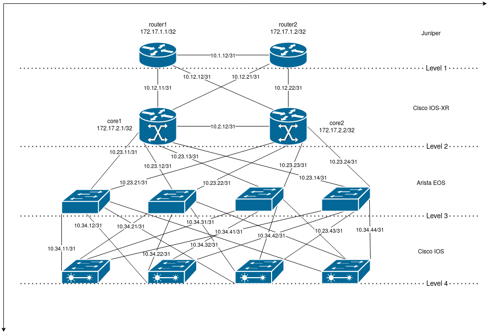

# LAB: The Salt CLI Syntax: Targeting

For this lab, there's a Proxy Minion started for every device in the topology. As a reminder, the topology can be found 
below:



## Part-1: Targeting using Minion ID

First, lets make sure that we have all of our router configs loaded.

```bash
root@salt:/# salt \* lab.restore -t 120
```

Execute commands against individual devices, using the device name / Minion ID:

```bash
root@salt:~# salt router1 test.ping
router1:
    True
root@salt:~# 
root@salt:~# salt spine1 grains.get version
spine1:
    4.18.1F-4591672.4181F
root@salt:~# 
root@salt:~# salt leaf1 pillar.get proxy
leaf1:
    ----------
    driver:
        ios
    host:
        leaf1
    password:
        APNIC2021
    proxytype:
        napalm
    username:
        apnic
```

## Part-2: Targeting against a list of devices

Given a list of known devices, using the name / Minion ID:

```bash
root@salt:~# salt -L 'router1,router2' test.ping
router1:
    True
router2:
    True
```

## Part-3: Shell-like globbing

Execute commands against a globbing expression to match multiple devices:

```bash
root@salt:~# salt 'leaf*' grains.get serial
leaf3:
    9I8N4XHDSR3
leaf1:
    9XX8EUA92Y6
leaf2:
    9Q78Z7176ZI
leaf4:
    9S1V3WVQ3OA
root@salt:~#
```

```bash
root@salt:~# salt 'spine[1,3]' grains.get version
spine3:
    4.18.1F-4591672.4181F
spine1:
    4.18.1F-4591672.4181F
root@salt:~# salt 'spine[!1,3]' grains.get version
spine2:
    4.18.1F-4591672.4181F
spine4:
    4.18.1F-4591672.4181F
```

## Part-4: Regular expressions

Target using regular expressions on the Minion ID

```bash
root@salt:~# salt -E 'spine\d+' grains.get version
spine2:
    4.18.1F-4591672.4181F
spine1:
    4.18.1F-4591672.4181F
spine4:
    4.18.1F-4591672.4181F
spine3:
    4.18.1F-4591672.4181F
```

## Part-5: Targeting using Grains

Reminder: Grains represents data collected by Salt and made available to you. Can be used to select groups of devices 
based on their properties:

```bash
root@salt:~# salt -G vendor:Cisco grains.get os
leaf3:
    ios
leaf4:
    ios
leaf2:
    ios
leaf1:
    ios
core1:
    iosxr
core2:
    iosxr
```

## Part-6: Targeting using Grains PCRE

Matching using regular expressions on Grains:

```bash
root@salt:~# salt -P 'os:ios.*' net.cli 'show version | include Version'
Executing job with jid 20210105181624808521
-------------------------------------------

leaf4:
    ----------
    comment:
    out:
        ----------
        show version | include Version:
            Cisco IOS XE Software, Version 03.15.00.S - Standard Support Release
            Cisco IOS Software, CSR1000V Software (X86_64_LINUX_IOSD-UNIVERSALK9-M), Version 15.5(2)S, RELEASE SOFTWARE (fc3)
            licensed under the GNU General Public License ("GPL") Version 2.0.  The
            software code licensed under GPL Version 2.0 is free software that comes
            GPL code under the terms of GPL Version 2.0.  For more details, see the
    result:
        True
core1:
    ----------
    comment:
    out:
        ----------
        show version | include Version:
            Cisco IOS XR Software, Version 6.0.0[Default]
            ROM: GRUB, Version 1.99(0), DEV RELEASE
    result:
        True
leaf1:
    ----------
    comment:
    out:
        ----------
        show version | include Version:
            Cisco IOS XE Software, Version 03.15.00.S - Standard Support Release
            Cisco IOS Software, CSR1000V Software (X86_64_LINUX_IOSD-UNIVERSALK9-M), Version 15.5(2)S, RELEASE SOFTWARE (fc3)
            licensed under the GNU General Public License ("GPL") Version 2.0.  The
            software code licensed under GPL Version 2.0 is free software that comes
            GPL code under the terms of GPL Version 2.0.  For more details, see the
    result:
        True
core2:
    ----------
    comment:
    out:
        ----------
        show version | include Version:
            Cisco IOS XR Software, Version 6.0.0[Default]
            ROM: GRUB, Version 1.99(0), DEV RELEASE
    result:
        True
leaf3:
    ----------
    comment:
    out:
        ----------
        show version | include Version:
            Cisco IOS XE Software, Version 03.15.00.S - Standard Support Release
            Cisco IOS Software, CSR1000V Software (X86_64_LINUX_IOSD-UNIVERSALK9-M), Version 15.5(2)S, RELEASE SOFTWARE (fc3)
            licensed under the GNU General Public License ("GPL") Version 2.0.  The
            software code licensed under GPL Version 2.0 is free software that comes
            GPL code under the terms of GPL Version 2.0.  For more details, see the
    result:
        True
leaf2:
    ----------
    comment:
    out:
        ----------
        show version | include Version:
            Cisco IOS XE Software, Version 03.15.00.S - Standard Support Release
            Cisco IOS Software, CSR1000V Software (X86_64_LINUX_IOSD-UNIVERSALK9-M), Version 15.5(2)S, RELEASE SOFTWARE (fc3)
            licensed under the GNU General Public License ("GPL") Version 2.0.  The
            software code licensed under GPL Version 2.0 is free software that comes
            GPL code under the terms of GPL Version 2.0.  For more details, see the
    result:
        True
root@salt:~# 
```


## Part-7: Targeting using Pillar

```bash
root@salt:~# salt -I proxy:driver:iosxr net.load_config text='ntp server 10.0.0.1'
core2:
    ----------
    already_configured:
        False
    comment:
    diff:
        --- 
        +++ 
        @@ -1,6 +1,9 @@
         !! Last configuration change at Tue Jan  5 18:13:23 2021 by apnic
         !
         hostname core2
        +ntp
        + server 10.0.0.1
        +!
         interface MgmtEth0/0/CPU0/0
          ipv4 address 10.0.0.15 255.255.255.0
         !
    loaded_config:
    result:
        True
core1:
    ----------
    already_configured:
        False
    comment:
    diff:
        --- 
        +++ 
        @@ -1,6 +1,9 @@
         !! Last configuration change at Tue Jan  5 18:13:23 2021 by apnic
         !
         hostname core1
        +ntp
        + server 10.0.0.1
        +!
         interface Loopback0
         !
         interface MgmtEth0/0/CPU0/0
    loaded_config:
    result:
        True
root@salt:~# 
```

## Part-8: Targeting using Pillar PCRE

Apply regular expression on Pillar data:

```bash
root@salt:~# salt -J 'proxy:host:spine[1|2]' net.mac --out=yaml
spine1:
  comment: ''
  out:
  - active: true
    interface: Ethernet1
    last_move: 1609870868.989729
    mac: '52:54:00:06:24:02'
    moves: 1
    static: false
    vlan: 1
  - active: true
    interface: Ethernet7
    last_move: 1609870868.976326
    mac: 52:54:00:26:D7:01
    moves: 1
    static: false
    vlan: 1
  result: true
spine2:
  comment: ''
  out:
  - active: true
    interface: Ethernet7
    last_move: 1609870868.419326
    mac: '52:54:00:06:24:02'
    moves: 1
    static: false
    vlan: 1
  - active: true
    interface: Ethernet1
    last_move: 1609870868.432837
    mac: 52:54:00:26:D7:01
    moves: 1
    static: false
    vlan: 1
  result: true
```

---
**End of Lab**

---
